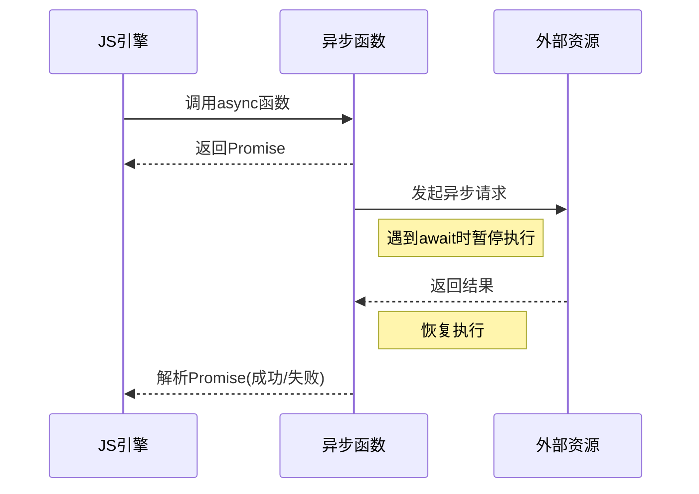

# JavaScript异步编程

## 异步编程基础

JavaScript最初被设计为单线程执行模型，这意味着JavaScript引擎同一时间只能执行一个任务。然而，为了提高性能和用户体验，JavaScript通过异步编程解决了这一限制。

### 同步与异步的概念

```
同步执行 → 任务A → 任务B → 任务C → 结果
                                    
异步执行 → 任务A ─────────────────→ 结果A
       ├→ 任务B ─────→ 结果B
       └→ 任务C → 结果C
```

- **同步执行**：代码按照编写顺序一步一步执行，每个操作必须等待前一个操作完成。
- **异步执行**：代码的执行不必等待某些操作完成，而是在这些操作进行的同时，继续执行后续代码。

同步执行示例：
```javascript
console.log("步骤1");
console.log("步骤2");
console.log("步骤3");
// 输出顺序一定是: 步骤1, 步骤2, 步骤3
```

异步执行示例：
```javascript
console.log("步骤1");
setTimeout(() => {
  console.log("步骤2");
}, 1000);
console.log("步骤3");
// 输出顺序是: 步骤1, 步骤3, 步骤2
```

### JavaScript事件循环机制

JavaScript的事件循环是实现异步编程的核心机制，它由以下几个关键部分组成：

```
┌─────────────────────────┐
│        调用栈            │
│ Call Stack              │
└───────────┬─────────────┘
            │ 
            ↓            ┌───────────────────┐
┌─────────────────────┐  │                   │
│     事件循环         │←─┤  Web APIs         │
│  Event Loop         │  │  (DOM, AJAX,      │
└─────┬───────┬───────┘  │   setTimeout...)  │
      │       │          │                   │
      ↓       │          └───────────────────┘
┌─────────────────────┐          ↑
│   微任务队列         │          │
│ Microtask Queue     │          │
└─────────────────────┘          │
      │                           │
      ↓                           │
┌─────────────────────┐          │
│   宏任务队列         │          │
│ Macrotask Queue     │──────────┘
└─────────────────────┘
```

1. **调用栈(Call Stack)**：用于跟踪当前正在执行的函数。当函数被调用时，它会被添加到栈顶；当函数执行完毕，它会从栈中弹出。

2. **任务队列(Task Queue)**：
   - **宏任务队列(Macrotask Queue)**：存储setTimeout、setInterval、I/O、UI渲染等操作的回调。
   - **微任务队列(Microtask Queue)**：存储Promise的回调、MutationObserver等操作的回调。

3. **事件循环(Event Loop)**：不断检查调用栈是否为空，如果为空，则先执行所有微任务，然后取出一个宏任务执行。

事件循环执行顺序：
1. 执行同步代码（调用栈中的任务）
2. 调用栈清空后，检查微任务队列，执行所有微任务
3. 执行一个宏任务
4. 重复步骤2-3

示例代码：
```javascript
console.log('1'); // 同步代码

setTimeout(() => {
  console.log('2'); // 宏任务
}, 0);

Promise.resolve().then(() => {
  console.log('3'); // 微任务
});

console.log('4'); // 同步代码

// 输出顺序：1, 4, 3, 2
```

### JavaScript中的异步场景

JavaScript中常见的异步操作场景包括：

1. **网络请求**：使用AJAX、Fetch API进行数据获取
2. **定时器**：setTimeout、setInterval
3. **事件监听**：用户交互事件（点击、滚动等）
4. **文件操作**：在Node.js环境中进行的文件读写
5. **动画效果**：requestAnimationFrame

## 传统异步解决方案

在ES6之前，JavaScript主要通过回调函数来处理异步操作。

### 回调函数

回调函数是作为参数传递给另一个函数，并在特定事件发生或条件满足时被执行的函数。

```javascript
// 基本回调示例
function fetchData(callback) {
  setTimeout(() => {
    const data = { name: "张三", age: 30 };
    callback(data);
  }, 1000);
}

fetchData((data) => {
  console.log("获取到的数据:", data);
});
```

回调函数的优点：
- 简单直观，容易理解
- 支持所有JavaScript环境

回调函数的缺点：
- **回调地狱(Callback Hell)**：多层嵌套的回调函数导致代码难以维护
- **错误处理复杂**：每个回调都需要独立的错误处理
- **控制流难以管理**：难以实现条件执行、并行操作等复杂流程

回调地狱示例：
```javascript
fetchUserData(userId, (userData) => {
  fetchUserPosts(userData.id, (posts) => {
    fetchPostComments(posts[0].id, (comments) => {
      fetchCommentAuthor(comments[0].authorId, (author) => {
        // 代码嵌套过深，难以阅读和维护
        console.log(author);
      }, handleError);
    }, handleError);
  }, handleError);
}, handleError);
```

### 事件监听

事件监听是另一种处理异步操作的方式，特别适用于处理用户交互和自定义事件。

```javascript
// 基本事件监听示例
document.getElementById('button').addEventListener('click', function() {
  console.log('按钮被点击了');
});

// 自定义事件示例
class DataFetcher {
  constructor() {
    this.events = {};
  }
  
  on(event, callback) {
    if (!this.events[event]) this.events[event] = [];
    this.events[event].push(callback);
  }
  
  trigger(event, data) {
    if (this.events[event]) {
      this.events[event].forEach(callback => callback(data));
    }
  }
  
  fetchData() {
    setTimeout(() => {
      const data = { name: "李四", age: 25 };
      this.trigger('data', data);
    }, 1000);
  }
}

const fetcher = new DataFetcher();
fetcher.on('data', data => console.log('获取到数据:', data));
fetcher.fetchData();
```

### 发布/订阅模式

发布/订阅模式是一种更加松耦合的事件处理方式，它允许多个订阅者监听特定的事件。

```javascript
// 简单的发布/订阅模式实现
class PubSub {
  constructor() {
    this.subscribers = {};
  }
  
  subscribe(event, callback) {
    if (!this.subscribers[event]) {
      this.subscribers[event] = [];
    }
    this.subscribers[event].push(callback);
    return {
      unsubscribe: () => {
        this.subscribers[event] = this.subscribers[event].filter(cb => cb !== callback);
      }
    };
  }
  
  publish(event, data) {
    if (!this.subscribers[event]) return;
    this.subscribers[event].forEach(callback => callback(data));
  }
}

const pubsub = new PubSub();
const subscription = pubsub.subscribe('dataReceived', data => {
  console.log('收到数据:', data);
});

// 发布事件
pubsub.publish('dataReceived', { message: '这是一条新消息' });

// 取消订阅
subscription.unsubscribe();
```

## 现代异步解决方案

ES6及以后的版本引入了更加优雅和强大的异步处理方式。

### Promise

Promise是ES6引入的异步编程解决方案，它代表一个异步操作的最终结果（成功或失败）。

```javascript
// 基本Promise示例
const fetchData = () => {
  return new Promise((resolve, reject) => {
    setTimeout(() => {
      const success = true;
      if (success) {
        resolve({ name: "王五", age: 28 });
      } else {
        reject(new Error("数据获取失败"));
      }
    }, 1000);
  });
};

fetchData()
  .then(data => console.log("成功:", data))
  .catch(error => console.error("失败:", error));
```

Promise特点：
- **状态**：Promise有三种状态
  - Pending（进行中）
  - Fulfilled（已成功）
  - Rejected（已失败）
- **状态不可逆**：一旦状态改变（从Pending到Fulfilled或Rejected），就不会再变化
- **链式调用**：支持通过`.then()`和`.catch()`进行链式操作

改写回调地狱：
```javascript
fetchUserData(userId)
  .then(userData => fetchUserPosts(userData.id))
  .then(posts => fetchPostComments(posts[0].id))
  .then(comments => fetchCommentAuthor(comments[0].authorId))
  .then(author => console.log(author))
  .catch(error => console.error("操作失败:", error));
```

Promise常用方法：

1. **Promise.resolve()**：返回一个状态为fulfilled的Promise
   ```javascript
   Promise.resolve('直接成功').then(data => console.log(data));
   ```

2. **Promise.reject()**：返回一个状态为rejected的Promise
   ```javascript
   Promise.reject(new Error('直接失败')).catch(err => console.error(err));
   ```

3. **Promise.all()**：并行执行多个Promise，全部成功才成功，有一个失败则失败
   ```javascript
   Promise.all([
     fetch('/api/users'),
     fetch('/api/posts'),
     fetch('/api/comments')
   ])
   .then(([users, posts, comments]) => {
     // 所有请求都成功
   })
   .catch(error => {
     // 任何一个请求失败
   });
   ```

4. **Promise.race()**：返回最先完成（成功或失败）的Promise结果
   ```javascript
   Promise.race([
     fetch('/api/timeout'),
     new Promise((_, reject) => setTimeout(() => reject(new Error('请求超时')), 5000))
   ])
   .then(result => console.log(result))
   .catch(error => console.error(error));
   ```

5. **Promise.allSettled()**：等待所有Promise完成（无论成功或失败）
   ```javascript
   Promise.allSettled([
     Promise.resolve('成功1'),
     Promise.reject('失败'),
     Promise.resolve('成功2')
   ])
   .then(results => {
     // results是一个数组，包含所有Promise的结果和状态
     // [
     //   {status: "fulfilled", value: "成功1"},
     //   {status: "rejected", reason: "失败"},
     //   {status: "fulfilled", value: "成功2"}
     // ]
   });
   ```

6. **Promise.any()**：返回第一个成功的Promise结果，全部失败才失败
   ```javascript
   Promise.any([
     Promise.reject('错误1'),
     Promise.resolve('成功'),
     Promise.reject('错误2')
   ])
   .then(value => console.log(value)) // 输出: "成功"
   .catch(errors => console.log(errors)); // 如果全部失败，errors是一个AggregateError对象
   ```

### Generator函数

Generator函数是ES6引入的一种特殊函数，它可以被暂停和恢复执行，非常适合处理异步操作。

```javascript
// 基本Generator函数示例
function* simpleGenerator() {
  console.log('开始执行');
  yield '第一次暂停';
  console.log('继续执行');
  yield '第二次暂停';
  console.log('最后执行');
  return '结束';
}

const generator = simpleGenerator();
console.log(generator.next()); // {value: "第一次暂停", done: false}
console.log(generator.next()); // {value: "第二次暂停", done: false}
console.log(generator.next()); // {value: "结束", done: true}
```

使用Generator处理异步操作：
```javascript
function fetchUser(userId) {
  return new Promise(resolve => {
    setTimeout(() => resolve({ id: userId, name: "用户" + userId }), 1000);
  });
}

function fetchPosts(userId) {
  return new Promise(resolve => {
    setTimeout(() => resolve([
      { id: 1, title: "文章1", userId },
      { id: 2, title: "文章2", userId }
    ]), 1000);
  });
}

function* fetchUserAndPosts(userId) {
  try {
    const user = yield fetchUser(userId);
    const posts = yield fetchPosts(user.id);
    return { user, posts };
  } catch (error) {
    console.error("获取数据失败:", error);
  }
}

// 手动执行Generator
const generator = fetchUserAndPosts(1);
generator.next().value.then(user => {
  generator.next(user).value.then(posts => {
    const result = generator.next(posts).value;
    console.log(result);
  });
});

// 自动执行Generator的辅助函数
function runGenerator(generatorFn) {
  const generator = generatorFn();
  
  function handle(result) {
    if (result.done) return Promise.resolve(result.value);
    
    return Promise.resolve(result.value).then(
      res => handle(generator.next(res)),
      err => handle(generator.throw(err))
    );
  }
  
  return handle(generator.next());
}

runGenerator(function* () {
  const user = yield fetchUser(1);
  const posts = yield fetchPosts(user.id);
  console.log({ user, posts });
});
```

Generator函数的特点：
- **可暂停执行**：通过`yield`关键字暂停函数执行
- **双向通信**：可以通过`next()`方法向Generator传递值，也可以从Generator获取值
- **错误处理**：支持通过`try/catch`捕获异常 

## async/await

async/await是ES2017（ES8）引入的语法糖，建立在Promise之上，让异步代码更接近同步代码的写法，提高了可读性和可维护性。

### 基本语法与工作原理

`async`关键字用于声明一个异步函数，而`await`关键字只能在`async`函数内部使用，用于等待Promise对象的结果。

```javascript
// 声明一个异步函数
async function fetchData() {
  // await后面通常跟一个Promise对象
  const response = await fetch('https://api.example.com/data');
  const data = await response.json();
  return data; // 返回值会被自动包装成Promise
}

// 调用异步函数
fetchData()
  .then(data => console.log(data))
  .catch(error => console.error(error));
```

#### 工作原理



**重要特点：**
- `async`函数始终返回一个Promise
- `await`关键字会暂停函数执行，直到Promise状态改变
- `await`后跟非Promise值会自动转换为Promise.resolve(值)
- 在`async`函数中的错误会导致返回的Promise进入rejected状态

### async/await的错误处理

使用`try/catch`是处理async/await错误的标准方式：

```javascript
async function fetchUserData(userId) {
  try {
    // 尝试执行异步操作
    const response = await fetch(`https://api.example.com/users/${userId}`);
    
    // 检查响应状态
    if (!response.ok) {
      throw new Error(`HTTP错误：${response.status}`);
    }
    
    const userData = await response.json();
    return userData;
  } catch (error) {
    // 捕获所有错误（网络错误、解析错误、自定义错误等）
    console.error('获取用户数据失败:', error);
    // 可以返回默认数据或重新抛出错误
    throw error; // 将错误传播给调用者
  }
}

// 使用
async function displayUserInfo() {
  try {
    const user = await fetchUserData(123);
    console.log(user);
  } catch (error) {
    console.log('显示用户信息失败:', error);
    // 向用户显示错误信息
  }
}
```

### 并行执行多个异步操作

当多个异步操作之间没有依赖关系时，可以并行执行以提高性能：

```javascript
async function fetchMultipleResources() {
  try {
    // 并行执行多个异步操作
    const [users, products, orders] = await Promise.all([
      fetch('https://api.example.com/users').then(res => res.json()),
      fetch('https://api.example.com/products').then(res => res.json()),
      fetch('https://api.example.com/orders').then(res => res.json())
    ]);
    
    return { users, products, orders };
  } catch (error) {
    console.error('获取资源失败:', error);
    throw error;
  }
}
```

**串行与并行对比：**

```
串行执行（顺序等待）:
┌───────────┐   ┌───────────┐   ┌───────────┐
│ 请求用户   │→→→│ 请求产品   │→→→│ 请求订单   │
└───────────┘   └───────────┘   └───────────┘
总耗时 = 用户请求 + 产品请求 + 订单请求

并行执行:
┌───────────┐
│ 请求用户   │
└───────────┘
┌───────────┐
│ 请求产品   │
└───────────┘
┌───────────┐
│ 请求订单   │
└───────────┘
总耗时 = Max(用户请求, 产品请求, 订单请求)
```

### 高级使用技巧

#### 1. 自定义超时处理

```javascript
function timeout(ms) {
  return new Promise((_, reject) => {
    setTimeout(() => reject(new Error('请求超时')), ms);
  });
}

async function fetchWithTimeout(url, ms) {
  try {
    const result = await Promise.race([
      fetch(url).then(res => res.json()),
      timeout(ms)
    ]);
    return result;
  } catch (error) {
    if (error.message === '请求超时') {
      console.log('请求超时，请稍后重试');
    }
    throw error;
  }
}

// 使用示例：5秒超时的API请求
fetchWithTimeout('https://api.example.com/data', 5000)
  .then(data => console.log(data))
  .catch(error => console.error(error));
```

#### 2. 循环中的异步操作

**顺序执行：**

```javascript
async function processItemsSequentially(items) {
  const results = [];
  
  for (const item of items) {
    // 等待每个异步操作完成后再进行下一个
    const result = await processItem(item);
    results.push(result);
  }
  
  return results;
}
```

**并行执行：**

```javascript
async function processItemsInParallel(items) {
  // 创建Promise数组，不等待完成
  const promises = items.map(item => processItem(item));
  
  // 等待所有Promise完成
  const results = await Promise.all(promises);
  return results;
}
```

#### 3. 异步函数的立即执行表达式

```javascript
// 自执行异步函数
(async () => {
  try {
    const data = await fetchData();
    console.log(data);
  } catch (error) {
    console.error(error);
  }
})();
```

## JavaScript异步编程最佳实践

### 错误处理策略

1. **统一错误处理：**

```javascript
// 创建一个错误处理包装函数
function handleAsyncError(asyncFn) {
  return async (...args) => {
    try {
      return await asyncFn(...args);
    } catch (error) {
      // 统一错误处理逻辑
      console.error('操作失败:', error);
      // 可以根据错误类型进行不同处理
      if (error.name === 'TypeError') {
        // 处理类型错误
      } else if (error.response && error.response.status === 404) {
        // 处理API 404错误
      }
      throw error; // 继续向上传递错误
    }
  };
}

// 使用包装函数
const safeGetUser = handleAsyncError(async (id) => {
  const response = await fetch(`/api/users/${id}`);
  return response.json();
});

// 调用安全版本的函数
safeGetUser(123).then(user => {
  // 只处理成功的情况
}).catch(error => {
  // 处理剩余特定错误
});
```

2. **重试机制：**

```javascript
async function fetchWithRetry(url, options = {}, retries = 3, delay = 1000) {
  try {
    return await fetch(url, options);
  } catch (error) {
    if (retries <= 1) throw error;
    
    // 等待一段时间再重试
    await new Promise(resolve => setTimeout(resolve, delay));
    
    // 递归调用自身，减少重试次数
    return fetchWithRetry(url, options, retries - 1, delay * 2);
  }
}

// 使用带重试的请求
fetchWithRetry('https://api.example.com/data')
  .then(response => response.json())
  .then(data => console.log('数据:', data))
  .catch(error => console.error('最终失败:', error));
```

### 异步流程控制模式

#### 1. 瀑布流（顺序执行）

```javascript
async function waterfall() {
  // 每一步都依赖前一步的结果
  const userData = await fetchUser(userId);
  const permissions = await fetchUserPermissions(userData.permissionId);
  const content = await fetchContentBasedOnPermissions(permissions);
  return content;
}
```

#### 2. 并行处理

```javascript
async function parallel() {
  // 开始多个并行请求
  const usersPromise = fetchUsers();
  const productsPromise = fetchProducts();
  const settingsPromise = fetchSettings();
  
  // 同时等待所有结果
  const [users, products, settings] = await Promise.all([
    usersPromise, productsPromise, settingsPromise
  ]);
  
  return { users, products, settings };
}
```

#### 3. 并行有限制

控制并发数量的异步操作执行器：

```javascript
async function processQueue(items, concurrency = 2, processorFn) {
  // 跟踪所有任务
  const results = [];
  // 活跃任务计数
  let active = 0;
  // 待处理项目的索引
  let index = 0;
  
  return new Promise((resolve, reject) => {
    // 开始执行任务的函数
    async function startNext() {
      // 当前要处理的项目索引
      const currentIndex = index++;
      
      // 如果所有项目都已开始处理，则返回
      if (currentIndex >= items.length) {
        return;
      }
      
      // 增加活跃任务计数
      active++;
      
      try {
        // 处理当前项目
        const currentItem = items[currentIndex];
        const result = await processorFn(currentItem, currentIndex);
        
        // 存储结果
        results[currentIndex] = result;
      } catch (error) {
        // 出错时拒绝整个Promise
        return reject(error);
      } finally {
        // 无论成功失败，减少活跃任务计数
        active--;
        
        // 检查是否所有任务都已完成
        if (active === 0 && index >= items.length) {
          // 所有任务完成，解析Promise
          resolve(results);
        } else {
          // 否则，启动下一个任务
          startNext();
        }
      }
      
      // 继续启动更多任务，直到达到并发限制
      if (active < concurrency && index < items.length) {
        startNext();
      }
    }
    
    // 初始启动，最多并发数量的任务
    for (let i = 0; i < Math.min(concurrency, items.length); i++) {
      startNext();
    }
  });
}

// 使用并发控制器处理一组URL
const urls = [
  'https://api.example.com/users',
  'https://api.example.com/products',
  'https://api.example.com/orders',
  'https://api.example.com/settings',
  'https://api.example.com/analytics'
];

// 最多3个并发请求
processQueue(urls, 3, async (url) => {
  const response = await fetch(url);
  return response.json();
}).then(results => {
  console.log('所有数据已获取:', results);
}).catch(error => {
  console.error('处理队列出错:', error);
});
```

### 实际应用案例

#### 案例1：基于异步操作的数据加载与缓存

```javascript
// 简单的内存缓存
const cache = new Map();

async function fetchWithCache(url, ttl = 60000) { // ttl: 缓存生存时间(ms)
  // 检查缓存中是否有有效数据
  const cacheKey = `data:${url}`;
  const cachedData = cache.get(cacheKey);
  
  if (cachedData && (Date.now() - cachedData.timestamp < ttl)) {
    console.log('从缓存获取数据:', url);
    return cachedData.data;
  }
  
  // 缓存未命中，从API获取数据
  console.log('从API获取数据:', url);
  try {
    const response = await fetch(url);
    if (!response.ok) throw new Error(`HTTP错误: ${response.status}`);
    
    const data = await response.json();
    
    // 更新缓存
    cache.set(cacheKey, {
      data,
      timestamp: Date.now()
    });
    
    return data;
  } catch (error) {
    console.error('获取数据失败:', error);
    
    // 如果有过期缓存，在失败时仍返回过期数据
    if (cachedData) {
      console.log('返回过期的缓存数据');
      return cachedData.data;
    }
    
    throw error;
  }
}

// 使用示例
async function loadUserDashboard(userId) {
  try {
    // 并行加载多个数据源
    const [user, recentActivity, recommendations] = await Promise.all([
      fetchWithCache(`/api/users/${userId}`),
      fetchWithCache(`/api/users/${userId}/activity`),
      fetchWithCache(`/api/users/${userId}/recommendations`)
    ]);
    
    // 处理获取的数据
    updateUserProfile(user);
    displayActivityFeed(recentActivity);
    showRecommendations(recommendations);
    
  } catch (error) {
    console.error('加载用户仪表板失败:', error);
    showErrorMessage('无法加载数据，请稍后再试');
  }
}
```

#### 案例2：异步数据批处理与限流

```javascript
/**
 * 批量处理API请求以减少网络调用
 * @param {Array} items 要处理的项目数组
 * @param {Function} processFn 处理单个批次的函数
 * @param {Object} options 配置选项
 */
async function batchProcessor(items, processFn, options = {}) {
  const {
    batchSize = 50,         // 每批处理的项目数
    delayBetweenBatches = 300,  // 批次间延迟(ms)
    maxConcurrent = 3,      // 最大并发批次
    onBatchComplete = null, // 批次完成回调
    onProgress = null       // 进度回调
  } = options;
  
  // 将项目分组成批次
  const batches = [];
  for (let i = 0; i < items.length; i += batchSize) {
    batches.push(items.slice(i, i + batchSize));
  }
  
  let processedItems = 0;
  const totalItems = items.length;
  
  // 处理单个批次
  async function processBatch(batch, batchIndex) {
    try {
      // 调用处理函数
      const result = await processFn(batch, batchIndex);
      
      // 更新进度
      processedItems += batch.length;
      if (onProgress) {
        onProgress({
          processed: processedItems,
          total: totalItems,
          percent: Math.round((processedItems / totalItems) * 100)
        });
      }
      
      // 批次完成回调
      if (onBatchComplete) {
        onBatchComplete(result, batchIndex, batch);
      }
      
      return result;
    } catch (error) {
      console.error(`批次 ${batchIndex} 处理失败:`, error);
      throw error;
    }
  }
  
  // 使用有限并发执行所有批次
  return processQueue(batches, maxConcurrent, async (batch, index) => {
    // 第一个批次不需要等待
    if (index > 0 && delayBetweenBatches > 0) {
      await new Promise(resolve => setTimeout(resolve, delayBetweenBatches));
    }
    return processBatch(batch, index);
  });
}

// 使用示例：批量更新用户数据
async function updateUserStatuses(userIds) {
  const progressBar = document.getElementById('progress-bar');
  const statusElement = document.getElementById('status');
  
  try {
    statusElement.textContent = '开始处理...';
    
    const results = await batchProcessor(userIds, async (batchUserIds) => {
      // 处理一批用户ID
      const response = await fetch('/api/users/batch-update', {
        method: 'POST',
        headers: { 'Content-Type': 'application/json' },
        body: JSON.stringify({ userIds: batchUserIds, status: 'active' })
      });
      return response.json();
    }, {
      batchSize: 100,
      delayBetweenBatches: 500,
      onProgress: (progress) => {
        // 更新UI进度
        progressBar.style.width = `${progress.percent}%`;
        statusElement.textContent = `处理中: ${progress.processed}/${progress.total} (${progress.percent}%)`;
      },
      onBatchComplete: (result, index) => {
        console.log(`批次 ${index+1} 完成，成功: ${result.success}, 失败: ${result.failed}`);
      }
    });
    
    statusElement.textContent = '所有用户已更新!';
    return results;
  } catch (error) {
    statusElement.textContent = '处理过程中出错';
    console.error('批量更新失败:', error);
    throw error;
  }
}
```

#### 案例3：基于异步迭代器的数据流处理

```javascript
/**
 * 创建一个异步迭代器来处理大型数据集
 * @param {Function} fetchFn 获取数据的函数，返回{data, nextPageToken}
 * @returns {AsyncIterator} 异步迭代器
 */
function createAsyncDataIterator(fetchFn) {
  let currentPage = 1;
  let nextPageToken = null;
  let isDone = false;
  
  return {
    [Symbol.asyncIterator]() {
      return {
        async next() {
          if (isDone) {
            return { done: true };
          }
          
          try {
            // 获取下一页数据
            const result = await fetchFn(currentPage, nextPageToken);
            
            // 更新状态
            currentPage++;
            nextPageToken = result.nextPageToken;
            
            // 检查是否还有更多数据
            if (!result.data || result.data.length === 0 || !nextPageToken) {
              isDone = true;
            }
            
            return {
              value: result.data || [],
              done: isDone && (!result.data || result.data.length === 0)
            };
          } catch (error) {
            console.error('迭代数据出错:', error);
            isDone = true;
            throw error;
          }
        }
      };
    }
  };
}

// 使用示例：处理大型数据集
async function processLargeDataSet() {
  // 创建数据迭代器
  const dataIterator = createAsyncDataIterator(async (page, token) => {
    const params = new URLSearchParams({
      page: page,
      limit: 100,
      token: token || ''
    });
    
    const response = await fetch(`/api/large-data?${params}`);
    return response.json();
  });
  
  // 存储所有处理过的数据
  const processedItems = [];
  
  // 使用for-await-of循环处理数据
  try {
    for await (const batch of dataIterator) {
      console.log(`处理第${processedItems.length / 100 + 1}批数据...`);
      
      // 处理当前批次数据
      for (const item of batch) {
        const processedItem = await processItem(item);
        processedItems.push(processedItem);
      }
      
      // 每批次后提供进度更新
      updateProgress(processedItems.length);
    }
    
    console.log('所有数据处理完成!');
    return processedItems;
  } catch (error) {
    console.error('处理数据集时出错:', error);
    throw error;
  }
}

// 辅助函数
async function processItem(item) {
  // 模拟处理单个项目
  await new Promise(resolve => setTimeout(resolve, 5));
  return {
    ...item,
    processed: true,
    timestamp: Date.now()
  };
}

function updateProgress(count) {
  console.log(`已处理 ${count} 个项目`);
}
```

## 总结

JavaScript异步编程已经从最初的回调函数经历了显著的演变，现代JavaScript提供了更强大、更易于使用的异步处理工具：

1. **回调函数**：最基本的异步处理方式，但容易导致回调地狱问题
2. **Promise**：改进的异步编程模型，提供链式调用和更好的错误处理
3. **Generator**：提供暂停和恢复执行的能力，可用于复杂异步流程
4. **async/await**：建立在Promise之上的语法糖，使异步代码更接近同步代码的写法

在现代JavaScript应用中，推荐的异步编程最佳实践包括：

- 使用async/await处理基本异步流程
- 使用Promise.all()进行并行操作
- 实现适当的错误处理策略
- 根据需要控制并发级别
- 为复杂应用场景创建专用的异步工具函数

通过掌握这些异步编程技术和模式，开发者可以创建高效、可维护且性能卓越的JavaScript应用程序。 