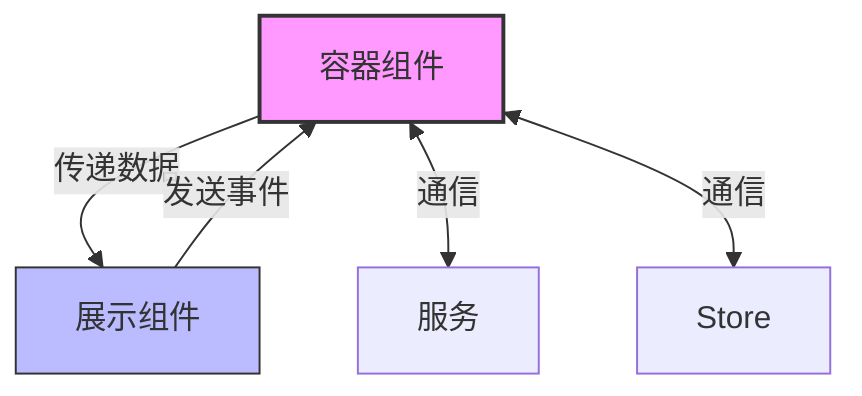
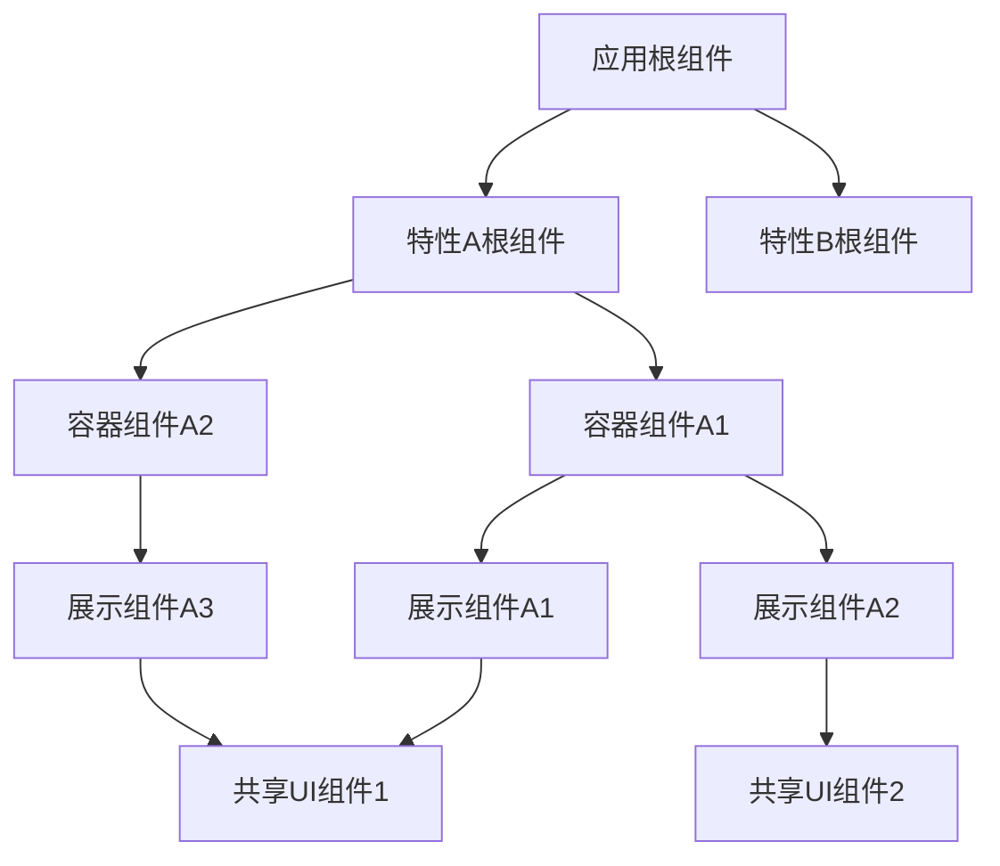
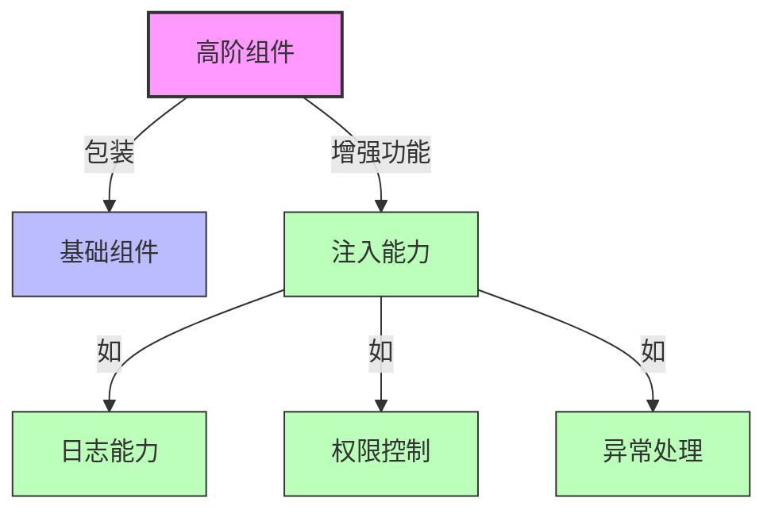
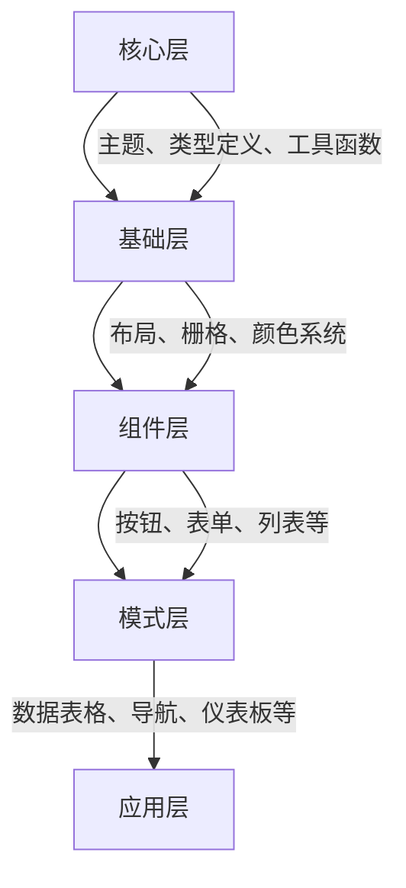

# Angular组件设计模式

在Angular企业级应用开发中，合理的组件设计模式对于构建可维护、可扩展和高性能的应用至关重要。本文深入探讨Angular中的组件设计模式，从基础概念到高级应用，帮助开发者构建更加健壮的组件架构。

## 目录

- [容器与展示组件](#容器与展示组件)
- [组件层级设计](#组件层级设计)
- [高阶组件](#高阶组件)
- [可重用组件库搭建](#可重用组件库搭建)
- [组件通信模式](#组件通信模式)
- [组件性能优化](#组件性能优化)
- [最佳实践与常见问题](#最佳实践与常见问题)

## 容器与展示组件

容器与展示组件模式（也称为"聪明组件与傻瓜组件"）是Angular应用中最基础也最强大的组件设计模式之一，它将组件按照职责进行清晰分离。

### 基本概念

#### 容器组件（Container Components）

容器组件主要负责：

- 获取和管理数据
- 处理业务逻辑
- 状态管理
- 与服务通信
- 将数据传递给展示组件

容器组件通常"聪明"，它们知道如何获取数据、如何处理用户交互及其结果。

#### 展示组件（Presentational Components）

展示组件主要负责：

- 接收Input数据并显示
- 发送用户交互事件（通过Output）
- 不依赖特定服务
- 不关心数据来源
- 专注于UI渲染

展示组件通常"傻瓜"，它们不知道数据来自哪里，也不知道用户交互会导致什么结果。

### 代码示例

以下是一个典型的容器与展示组件实现：

#### 容器组件

```typescript
// user-list-container.component.ts
@Component({
  selector: 'app-user-list-container',
  template: `
    <app-user-list
      [users]="users$ | async"
      [loading]="loading$ | async"
      (userSelected)="onUserSelected($event)"
      (deleteUser)="onDeleteUser($event)">
    </app-user-list>
  `
})
export class UserListContainerComponent implements OnInit {
  // 使用可观察对象管理状态
  users$: Observable<User[]>;
  loading$: Observable<boolean>;
  
  constructor(private userService: UserService) {}
  
  ngOnInit() {
    // 加载数据
    this.loading$ = this.userService.loading$;
    this.users$ = this.userService.getUsers();
  }
  
  // 处理用户交互
  onUserSelected(user: User) {
    this.userService.selectUser(user);
  }
  
  onDeleteUser(userId: number) {
    this.userService.deleteUser(userId).subscribe();
  }
}
```

#### 展示组件

```typescript
// user-list.component.ts
@Component({
  selector: 'app-user-list',
  templateUrl: './user-list.component.html',
  styleUrls: ['./user-list.component.scss'],
  changeDetection: ChangeDetectionStrategy.OnPush // 优化性能
})
export class UserListComponent {
  // 输入数据
  @Input() users: User[] = [];
  @Input() loading = false;
  
  // 输出事件
  @Output() userSelected = new EventEmitter<User>();
  @Output() deleteUser = new EventEmitter<number>();
  
  // 处理UI交互
  selectUser(user: User): void {
    this.userSelected.emit(user);
  }
  
  confirmDelete(userId: number): void {
    this.deleteUser.emit(userId);
  }
}
```

```html
<!-- user-list.component.html -->
<div class="user-list">
  <div *ngIf="loading" class="loading-spinner">
    <mat-spinner diameter="40"></mat-spinner>
  </div>
  
  <div *ngIf="!loading && users.length === 0" class="no-users">
    没有找到用户数据
  </div>
  
  <mat-list *ngIf="!loading && users.length > 0">
    <mat-list-item *ngFor="let user of users" (click)="selectUser(user)">
      
      <h3 matLine>{{user.name}}</h3>
      <p matLine>{{user.email}}</p>
      <button mat-icon-button (click)="confirmDelete(user.id); $event.stopPropagation()">
        <mat-icon>delete</mat-icon>
      </button>
    </mat-list-item>
  </mat-list>
</div>
```

### 容器与展示组件模式的优势



**图表文本版**:
```
容器组件 ----传递数据---> 展示组件
展示组件 ----发送事件---> 容器组件
容器组件 <---通信---> 服务
容器组件 <---通信---> Store
```

#### 1. 关注点分离
容器组件处理逻辑，展示组件处理UI，各司其职。

#### 2. 可重用性提高
展示组件不依赖于特定数据源，可以在不同场景下重用。

#### 3. 测试更容易
- 展示组件可以独立测试，无需模拟服务
- 容器组件可以独立测试业务逻辑

#### 4. 团队协作更顺畅
UI设计师可以专注于展示组件，而无需关心业务逻辑。

#### 5. 代码维护性提升
当业务逻辑变更时，只需修改容器组件；当UI变更时，只需修改展示组件。

### 使用场景

这种模式适合大多数Angular应用场景，特别是：
- 复杂的表单处理
- 数据列表和表格
- 仪表板和控制面板
- 需要频繁重用UI组件的场景 

## 组件层级设计

组件层级设计是构建复杂Angular应用的关键部分，它关注如何组织和结构化应用中的组件树，以实现最佳的可维护性、性能和用户体验。

### 组件树原则

#### 组件分层架构

Angular应用通常可分为以下层级：

1. **应用根组件** - 提供全局布局和路由出口
2. **特性模块根组件** - 管理特定功能域的组件集合
3. **容器组件** - 获取和处理数据，协调子组件
4. **展示组件** - 负责UI呈现
5. **公共UI组件** - 可在整个应用中重用的基础组件



**图表文本版**:
```
应用根组件 ──┬── 特性A根组件 ──┬── 容器组件A1 ──┬── 展示组件A1 ── 共享UI组件1
             │                 │               └── 展示组件A2 ── 共享UI组件2
             │                 │
             │                 └── 容器组件A2 ──── 展示组件A3 ── 共享UI组件1
             │
             └── 特性B根组件
```

### LIFT原则

遵循LIFT原则进行组件层级设计：

- **L**ocate（定位）：快速定位代码
- **I**dentify（识别）：一目了然地识别组件功能
- **F**lattest（扁平）：保持扁平的组件结构
- **T**ry DRY（尝试不重复）：避免重复，提取共享组件

### 组件树深度控制

过深的组件树可能导致性能问题和复杂的数据流。一般建议：

1. 将组件树控制在5-7层以内
2. 使用状态管理降低组件间通信复杂度
3. 合理使用路由分割应用，避免单一组件树过于复杂

### 代码示例：产品管理应用的组件层级

#### 应用根组件

```typescript
// app.component.ts
@Component({
  selector: 'app-root',
  template: `
    <app-header></app-header>
    <div class="main-content">
      <router-outlet></router-outlet>
    </div>
    <app-footer></app-footer>
  `
})
export class AppComponent { }
```

#### 特性模块根组件

```typescript
// products.component.ts
@Component({
  selector: 'app-products',
  template: `
    <div class="products-layout">
      <app-product-filters (filterChange)="onFilterChange($event)"></app-product-filters>
      <app-product-list-container [filters]="currentFilters"></app-product-list-container>
    </div>
  `
})
export class ProductsComponent {
  currentFilters: ProductFilters = { category: null, priceRange: null };
  
  onFilterChange(filters: ProductFilters): void {
    this.currentFilters = filters;
  }
}
```

#### 容器组件

```typescript
// product-list-container.component.ts
@Component({
  selector: 'app-product-list-container',
  template: `
    <app-loading-indicator *ngIf="loading$ | async"></app-loading-indicator>
    <app-error-message *ngIf="error$ | async as error" [message]="error"></app-error-message>
    
    <app-product-list 
      *ngIf="(products$ | async) as products"
      [products]="products"
      (productSelected)="onProductSelected($event)">
    </app-product-list>
    
    <app-pagination 
      [totalPages]="totalPages$ | async"
      [currentPage]="currentPage$ | async"
      (pageChange)="onPageChange($event)">
    </app-pagination>
  `
})
export class ProductListContainerComponent implements OnInit {
  @Input() set filters(value: ProductFilters) {
    this.filtersSubject.next(value);
  }
  
  private filtersSubject = new BehaviorSubject<ProductFilters>({});
  
  products$: Observable<Product[]>;
  loading$: Observable<boolean>;
  error$: Observable<string | null>;
  totalPages$: Observable<number>;
  currentPage$: Observable<number>;
  
  constructor(
    private productService: ProductService,
    private router: Router
  ) { }
  
  ngOnInit(): void {
    // 组合筛选器、页码等，创建数据流
    this.products$ = combineLatest([
      this.filtersSubject.asObservable(),
      this.productService.currentPage$
    ]).pipe(
      switchMap(([filters, page]) => 
        this.productService.getProducts(filters, page)
      )
    );
    
    this.loading$ = this.productService.loading$;
    this.error$ = this.productService.error$;
    this.totalPages$ = this.productService.totalPages$;
    this.currentPage$ = this.productService.currentPage$;
  }
  
  onProductSelected(productId: number): void {
    this.router.navigate(['/products', productId]);
  }
  
  onPageChange(page: number): void {
    this.productService.setPage(page);
  }
}
```

### 组件层级设计的最佳实践

1. **单一职责**：每个组件只有一个改变的理由

2. **限制组件大小**：
   - 模板行数应小于100行
   - 组件类应小于400行
   - 超过上限时考虑拆分组件

3. **组件分类策略**：
   - 按功能域分组（产品、用户、订单等）
   - 或按组件类型分组（页面、容器、展示等）

4. **保持组件间低耦合**：
   - 通过层级关系传递数据和事件
   - 复杂应用使用状态管理服务
   - 避免组件间直接调用方法

5. **惰性加载组件树**：
   - 使用路由的惰性加载模块
   - 使用动态组件加载延迟渲染 

## 高阶组件

高阶组件（HOC）是一种组件设计模式，它接收现有组件并返回增强版组件，为其添加额外功能而不修改原组件代码。虽然Angular不像React那样直接支持高阶组件模式，但我们可以通过指令、服务注入或组合组件的方式实现类似功能。

### 高阶组件的实现方式



**图表文本版**:
```
高阶组件 ──┬── 包装 ──> 基础组件
           │
           └── 增强功能 ──> 注入能力 ──┬── 日志能力
                                     ├── 权限控制
                                     └── 异常处理
```

### 高阶组件的应用场景

高阶组件模式适合以下场景：

1. **横切关注点**：
   - 性能监控
   - 日志记录
   - 访问控制
   - 分析追踪

2. **UI行为扩展**：
   - 动画效果
   - 主题应用
   - 响应式调整
   - 辅助功能增强

3. **数据处理层**：
   - 缓存包装
   - 错误处理
   - 数据转换
   - 分页逻辑

### 高阶组件的最佳实践

1. **保持透明性**：高阶组件应该尽可能透明地传递所有props和事件

2. **不要修改原始组件**：遵循组合而非修改的原则

3. **命名约定**：使用命名约定表明组件关系（如withLoading, HasPermission等前缀）

4. **限制使用层级**：避免过多嵌套高阶组件

5. **文档化**：明确记录高阶组件的功能和使用方式

### 高阶组件 vs 指令

Angular中高阶组件模式和指令有什么区别？

| 高阶组件模式 | 指令 |
|------------|------|
| 基于组件包装和组合 | 基于属性或元素增强 |
| 可以完全控制模板结构 | 主要添加行为或修改元素 |
| 可以管理内部状态 | 通常更轻量级 |
| 适合复杂逻辑封装 | 适合DOM操作和UI增强 |
| 可能导致组件树加深 | 不会改变组件树结构 | 

## 可重用组件库搭建

构建可重用的企业级组件库是规模化Angular开发的关键策略。良好设计的组件库可以提升开发效率、保持应用一致性并减少维护成本。

### 组件库规划与设计

#### 组件库架构

一个完整的Angular组件库架构通常包含以下层次：



**图表文本版**:
```
核心层 ──> 基础层 ──> 组件层 ──> 模式层 ──> 应用层
  |          |          |          |
  |          |          |          └──"数据表格、导航、仪表板等"──> 应用层
  |          |          |
  |          |          └──"按钮、表单、列表等"──> 模式层
  |          |
  |          └──"布局、栅格、颜色系统"──> 组件层
  |
  └──"主题、类型定义、工具函数"──> 基础层
```

#### 组件分类

组件库中的组件通常可分为：

1. **基础组件**：按钮、输入框、卡片等基础UI元素
2. **复合组件**：由多个基础组件组合的功能单元
3. **布局组件**：管理页面结构和内容排列
4. **功能组件**：实现特定业务功能的组件
5. **工具组件**：提供辅助功能的非可视组件

### 创建组件库步骤

#### 1. 初始设置

使用Angular CLI创建组件库项目：

```bash
# 创建工作区
ng new my-workspace --create-application=false

# 进入工作区
cd my-workspace

# 创建组件库项目
ng generate library my-components

# 创建演示应用
ng generate application demo-app
```

#### 2. 组件库项目结构

```
my-workspace/
├── projects/
│   ├── my-components/         # 组件库项目
│   │   ├── src/
│   │   │   ├── lib/           # 组件实现
│   │   │   │   ├── button/
│   │   │   │   ├── card/
│   │   │   │   ├── input/
│   │   │   │   ├── core/      # 核心功能
│   │   │   │   └── public-api.ts
│   │   │   ├── testing/       # 测试工具
│   │   │   └── public-api.ts  # 公共API导出
│   │   ├── ng-package.json    # ng-packagr配置
│   │   └── package.json       # 库配置
│   └── demo-app/              # 演示应用
└── package.json               # 工作区配置
```

#### 3. 设计组件API

以按钮组件为例：

```typescript
// projects/my-components/src/lib/button/button.component.ts
@Component({
  selector: 'mc-button',
  templateUrl: './button.component.html',
  styleUrls: ['./button.component.scss'],
  encapsulation: ViewEncapsulation.None,
  changeDetection: ChangeDetectionStrategy.OnPush,
  host: {
    '[class.mc-button]': 'true',
    '[class.mc-button-primary]': 'color === "primary"',
    '[class.mc-button-accent]': 'color === "accent"',
    '[class.mc-button-warn]': 'color === "warn"',
    '[class.mc-button-flat]': 'appearance === "flat"',
    '[class.mc-button-raised]': 'appearance === "raised"',
    '[class.mc-button-disabled]': 'disabled'
  }
})
export class McButtonComponent {
  /** 按钮颜色变体 */
  @Input() color: 'primary' | 'accent' | 'warn' | '' = '';
  
  /** 按钮外观样式 */
  @Input() appearance: 'flat' | 'raised' | 'stroked' | 'icon' = 'flat';
  
  /** 按钮是否禁用 */
  @Input() disabled = false;
  
  /** 按钮大小 */
  @Input() size: 'small' | 'medium' | 'large' = 'medium';
  
  /** 按钮点击事件 */
  @Output() buttonClick = new EventEmitter<MouseEvent>();
  
  /** 处理按钮点击 */
  onClick(event: MouseEvent) {
    if (!this.disabled) {
      this.buttonClick.emit(event);
    }
  }
}
```

```html
<!-- projects/my-components/src/lib/button/button.component.html -->
<button
  class="mc-button-content"
  [disabled]="disabled"
  [attr.aria-disabled]="disabled"
  [ngClass]="'mc-button-' + size"
  (click)="onClick($event)">
  <span class="mc-button-icon" *ngIf="isIconVisible">
    <ng-content select="[mcButtonIcon]"></ng-content>
  </span>
  <span class="mc-button-label">
    <ng-content></ng-content>
  </span>
</button>
```

#### 4. 实现主题系统

创建主题管理系统：

```scss
// projects/my-components/src/lib/core/styles/_theming.scss

// 主题配置接口
@function mc-define-theme($primary, $accent, $warn, $is-dark: false) {
  @return (
    primary: $primary,
    accent: $accent,
    warn: $warn,
    is-dark: $is-dark,
    foreground: if($is-dark, $mc-dark-theme-foreground, $mc-light-theme-foreground),
    background: if($is-dark, $mc-dark-theme-background, $mc-light-theme-background)
  );
}

// 组件主题混入
@mixin mc-button-theme($theme) {
  $primary: map-get($theme, primary);
  $accent: map-get($theme, accent);
  $warn: map-get($theme, warn);
  $is-dark: map-get($theme, is-dark);
  
  .mc-button {
    // 基础样式
    &.mc-button-primary {
      background-color: mc-color($primary);
      color: mc-contrast($primary);
    }
    
    &.mc-button-accent {
      background-color: mc-color($accent);
      color: mc-contrast($accent);
    }
    
    &.mc-button-warn {
      background-color: mc-color($warn);
      color: mc-contrast($warn);
    }
    
    // ... 其他样式 ...
  }
}

// 应用所有组件主题
@mixin mc-components-theme($theme) {
  @include mc-button-theme($theme);
  // ... 其他组件主题 ...
}
```

#### 5. 导出公共API

定义清晰的公共API:

```typescript
// projects/my-components/src/public-api.ts
export * from './lib/button/button.module';
export * from './lib/button/button.component';
export * from './lib/card/card.module';
export * from './lib/card/card.component';
// ... 其他导出 ...

// 主题系统
export * from './lib/core/theming/public-api';
```

### 组件库开发最佳实践

#### 1. API设计原则

- **一致性**：保持命名和参数模式一致
- **渐进式复杂性**：简单用例简单实现，复杂功能通过配置启用
- **明确的默认值**：合理的默认值减少配置负担
- **完整的类型定义**：使用TypeScript接口定义所有输入和事件

#### 2. 组件文档生成

使用Storybook或Compodoc创建组件文档：

```bash
# 安装Storybook
npx sb init

# 组件故事示例
// projects/my-components/src/lib/button/button.stories.ts
import { Story, Meta } from '@storybook/angular';
import { McButtonComponent } from './button.component';

export default {
  title: '组件/按钮',
  component: McButtonComponent,
  argTypes: {
    color: {
      control: { type: 'select', options: ['', 'primary', 'accent', 'warn'] }
    },
    appearance: {
      control: { type: 'select', options: ['flat', 'raised', 'stroked', 'icon'] }
    }
  }
} as Meta;

const Template: Story<McButtonComponent> = (args: McButtonComponent) => ({
  props: args,
  template: `<mc-button 
    [color]="color" 
    [appearance]="appearance"
    [disabled]="disabled">
    {{label}}
  </mc-button>`
});

export const Primary = Template.bind({});
Primary.args = {
  color: 'primary',
  appearance: 'raised',
  label: '主要按钮'
};

export const Secondary = Template.bind({});
Secondary.args = {
  color: 'accent',
  appearance: 'flat',
  label: '次要按钮'
};
```

#### 3. 组件测试策略

组件库应有全面的测试覆盖：

```typescript
// projects/my-components/src/lib/button/button.component.spec.ts
describe('McButtonComponent', () => {
  let component: McButtonComponent;
  let fixture: ComponentFixture<McButtonComponent>;
  let buttonEl: HTMLButtonElement;

  beforeEach(async () => {
    await TestBed.configureTestingModule({
      declarations: [McButtonComponent]
    }).compileComponents();
    
    fixture = TestBed.createComponent(McButtonComponent);
    component = fixture.componentInstance;
    buttonEl = fixture.nativeElement.querySelector('button');
    fixture.detectChanges();
  });

  it('应该创建按钮组件', () => {
    expect(component).toBeTruthy();
  });
  
  it('应该应用正确的CSS类', () => {
    component.color = 'primary';
    component.appearance = 'raised';
    fixture.detectChanges();
    
    expect(fixture.nativeElement.classList).toContain('mc-button-primary');
    expect(fixture.nativeElement.classList).toContain('mc-button-raised');
  });
  
  it('禁用时不应该触发点击事件', () => {
    spyOn(component.buttonClick, 'emit');
    component.disabled = true;
    fixture.detectChanges();
    
    buttonEl.click();
    expect(component.buttonClick.emit).not.toHaveBeenCalled();
  });
  
  // 更多测试...
});
```

#### 4. 版本控制与发布

遵循语义化版本控制：

```json
// projects/my-components/package.json
{
  "name": "@myorg/components",
  "version": "1.0.0",
  "peerDependencies": {
    "@angular/common": "^15.0.0",
    "@angular/core": "^15.0.0"
  },
  "publishConfig": {
    "access": "public"
  }
}
```

发布流程：

```bash
# 构建库
ng build my-components --prod

# 进入构建目录
cd dist/my-components

# 发布到npm
npm publish
```

### 组件库与应用集成

#### 导入和使用

```typescript
// app.module.ts
import { McButtonModule, McCardModule } from '@myorg/components';

@NgModule({
  imports: [
    // ... 其他导入
    McButtonModule,
    McCardModule
  ]
})
export class AppModule { }
```

```html
<!-- app.component.html -->
<mc-button color="primary" appearance="raised">
  开始使用
</mc-button>

<mc-card>
  <mc-card-header>卡片标题</mc-card-header>
  <mc-card-content>
    这是卡片内容...
  </mc-card-content>
</mc-card>
```

#### 自定义主题集成

```scss
// styles.scss
@import '@myorg/components/theming';

// 定义自定义主题
$my-primary: mc-palette($mc-blue, 700, 300);
$my-accent: mc-palette($mc-orange, 800, 300);
$my-warn: mc-palette($mc-red, 600, 100);

// 创建主题对象
$my-theme: mc-define-theme($my-primary, $my-accent, $my-warn);

// 应用主题到组件
@include mc-components-theme($my-theme);
```

### 企业级组件库案例研究

#### 内部组件库优势

建立企业内部组件库的关键优势：

1. **一致的用户体验**：跨应用统一UI
2. **开发效率提升**：减少重复开发
3. **集中管理UI标准**：便于标准更新
4. **共享业务逻辑**：封装常见业务规则
5. **提高代码质量**：集中测试和优化 