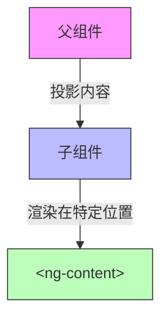

# Angular内容投影技术

内容投影是Angular中一种强大的组件通信机制，允许父组件将内容"投影"到子组件的指定位置。它是构建灵活、可重用组件的关键技术，类似于其他框架中的"插槽"概念。本文深入讲解Angular内容投影的各种技术和最佳实践。

## 目录

- [基本概念](#基本概念)
- [单插槽投影](#单插槽投影)
- [多插槽投影](#多插槽投影)
- [条件内容投影](#条件内容投影)
- [动态模板](#动态模板)
- [高级应用场景](#高级应用场景)
- [性能优化](#性能优化)
- [最佳实践](#最佳实践)

## 基本概念

内容投影允许将父组件的内容（HTML、组件等）"投影"到子组件模板的特定位置。这种技术提高了组件的灵活性和可重用性，避免了过度使用输入属性传递复杂内容。



**图表文本版**:
```
父组件 ──> 投影内容 ──> 子组件 ──> 渲染在特定位置 ──> <ng-content>
```

## 单插槽投影

最基本的内容投影形式是单插槽投影，使用`<ng-content>`标签在子组件中创建一个插槽，父组件内容将被投影到这个位置。

### 基本用法

#### 子组件

```typescript
// card.component.ts
@Component({
  selector: 'app-card',
  template: `
    <div class="card">
      <div class="card-header">{{title}}</div>
      <div class="card-body">
        <!-- 内容将被投影到这里 -->
        <ng-content></ng-content>
      </div>
    </div>
  `,
  styles: [`
    .card {
      border: 1px solid #ddd;
      border-radius: 4px;
      margin-bottom: 20px;
    }
    .card-header {
      background-color: #f5f5f5;
      padding: 10px 15px;
      border-bottom: 1px solid #ddd;
    }
    .card-body {
      padding: 15px;
    }
  `]
})
export class CardComponent {
  @Input() title: string = '卡片标题';
}
```

#### 父组件使用

```html
<!-- parent.component.html -->
<app-card title="用户信息">
  <h3>张三</h3>
  <p>前端开发工程师</p>
  <button>查看详情</button>
</app-card>

<app-card title="系统公告">
  <p>系统将于本周六凌晨2点进行升级维护。</p>
  <p>预计停机时间：2小时</p>
</app-card>
```

### 单插槽投影工作原理

1. Angular编译器在父组件模板中识别出子组件标签及其内部内容
2. 创建子组件时，将父组件提供的内容投影到子组件模板中的`<ng-content>`位置
3. 投影的内容保留其在父组件中定义的绑定关系和事件处理器

### 投影内容样式管理

投影内容的样式作用域需要注意：

```typescript
// card.component.ts (样式管理示例)
@Component({
  // ...
  styles: [`
    /* 这会应用于卡片组件本身 */
    .card { /* ... */ }
    
    /* 这会应用于投影内容，但受限于组件的封装模式 */
    ::ng-deep h3 {
      color: #333;
      margin-top: 0;
    }
  `],
  // ViewEncapsulation.None将禁用样式封装，慎用
  encapsulation: ViewEncapsulation.Emulated
})
export class CardComponent { /* ... */ }
```

## 多插槽投影

多插槽投影允许将父组件内容分配到子组件的多个不同位置，通过`select`属性进行选择。

### 基本用法

#### 子组件定义

```typescript
// dashboard-tile.component.ts
@Component({
  selector: 'app-dashboard-tile',
  template: `
    <div class="tile">
      <div class="tile-header">
        <!-- 标题内容投影 -->
        <ng-content select="[tile-header]"></ng-content>
      </div>
      <div class="tile-body">
        <!-- 主体内容投影 -->
        <ng-content select="[tile-body]"></ng-content>
      </div>
      <div class="tile-footer">
        <!-- 底部内容投影 -->
        <ng-content select="[tile-footer]"></ng-content>
      </div>
    </div>
  `,
  styles: [/* ... */]
})
export class DashboardTileComponent {}
```

#### 父组件使用

```html
<!-- parent.component.html -->
<app-dashboard-tile>
  <div tile-header>
    <h3>销售统计</h3>
    <div class="controls">
      <button>刷新</button>
      <button>设置</button>
    </div>
  </div>
  
  <div tile-body>
    <app-sales-chart [data]="salesData"></app-sales-chart>
  </div>
  
  <div tile-footer>
    <p>最后更新时间: {{lastUpdated | date:'yyyy-MM-dd HH:mm'}}</p>
  </div>
</app-dashboard-tile>
```

### select选择器的多种方式

`ng-content`的select属性支持多种选择器：

```typescript
@Component({
  selector: 'app-complex-projection',
  template: `
    <!-- 1. 按元素选择器投影 -->
    <div class="section">
      <ng-content select="header"></ng-content>
    </div>
    
    <!-- 2. 按CSS类选择器投影 -->
    <div class="section">
      <ng-content select=".content"></ng-content>
    </div>
    
    <!-- 3. 按属性选择器投影 -->
    <div class="section">
      <ng-content select="[footer]"></ng-content>
    </div>
    
    <!-- 4. 按元素+类组合选择器投影 -->
    <div class="section">
      <ng-content select="div.special"></ng-content>
    </div>
    
    <!-- 5. 默认插槽（无select属性） -->
    <div class="section">
      <ng-content></ng-content>
    </div>
  `
})
export class ComplexProjectionComponent {}
```

使用示例：

```html
<app-complex-projection>
  <header>这是标题</header>
  
  <div class="content">这是主要内容</div>
  
  <div footer>这是底部</div>
  
  <div class="special">这是特殊内容</div>
  
  <p>这是默认插槽内容</p>
</app-complex-projection>
```

### 多插槽投影注意事项

1. **匹配优先级**：当内容可以匹配多个插槽时，Angular使用"先到先得"原则
2. **默认插槽**：不带select属性的`<ng-content>`作为默认插槽，接收所有未匹配的内容
3. **未匹配内容**：如果内容没有匹配任何插槽且没有默认插槽，该内容将不会渲染

## 条件内容投影

条件内容投影结合了内容投影和结构型指令，可以根据条件显示或隐藏投影内容。

### 使用ng-template和ngTemplateOutlet

```typescript
// conditional-panel.component.ts
@Component({
  selector: 'app-conditional-panel',
  template: `
    <div class="panel">
      <div class="panel-header">
        {{title}}
        <button (click)="expanded = !expanded">
          {{expanded ? '收起' : '展开'}}
        </button>
      </div>
      
      <div class="panel-body" *ngIf="expanded">
        <!-- 条件显示内容 -->
        <ng-content></ng-content>
      </div>
    </div>
  `
})
export class ConditionalPanelComponent {
  @Input() title: string = '面板';
  expanded: boolean = false;
}
```

### 组合ngIf与ng-content

当使用`*ngIf`包裹`<ng-content>`时，需要注意一个重要的行为：即使`*ngIf`条件为false，内容也会被投影（创建），只是不会被显示。这意味着投影内容中的组件仍会被实例化和初始化。

### 使用ng-template进行延迟加载

如果希望条件为false时完全不创建投影内容，需要使用更复杂的模式：

```typescript
// lazy-panel.component.ts
@Component({
  selector: 'app-lazy-panel',
  template: `
    <div class="panel">
      <div class="panel-header">
        {{title}}
        <button (click)="expanded = !expanded">
          {{expanded ? '收起' : '展开'}}
        </button>
      </div>
      
      <!-- 使用ng-container和ngTemplateOutlet -->
      <ng-container *ngIf="expanded">
        <ng-container *ngTemplateOutlet="contentTpl"></ng-container>
      </ng-container>
    </div>
  `
})
export class LazyPanelComponent implements AfterContentInit {
  @Input() title: string = '面板';
  expanded: boolean = false;
  
  // 获取投影的ng-template
  @ContentChild('content') contentTpl: TemplateRef<any>;
}
```

使用方式：

```html
<app-lazy-panel title="性能优化面板">
  <ng-template #content>
    <!-- 这部分内容只有在面板展开时才会被创建 -->
    <app-heavy-component></app-heavy-component>
  </ng-template>
</app-lazy-panel>
```

## 动态模板

动态模板允许更灵活地控制内容的渲染方式，通过向投影内容传递上下文数据，实现类似插槽作用域的功能。

### 使用ng-template和ngTemplateOutlet

```typescript
// item-list.component.ts
@Component({
  selector: 'app-item-list',
  template: `
    <div class="list">
      <div *ngFor="let item of items" class="list-item">
        <!-- 使用ngTemplateOutlet渲染模板，并传递上下文 -->
        <ng-container *ngTemplateOutlet="itemTemplate; context: {$implicit: item, index: i}">
        </ng-container>
      </div>
      
      <!-- 如果没有自定义模板，使用默认模板 -->
      <div *ngIf="!itemTemplate && items.length === 0" class="empty-message">
        没有数据
      </div>
    </div>
  `
})
export class ItemListComponent {
  @Input() items: any[] = [];
  
  // 获取自定义模板
  @ContentChild('itemTemplate') itemTemplate: TemplateRef<any>;
}
```

使用方式：

```html
<app-item-list [items]="users">
  <!-- 定义如何渲染每个项 -->
  <ng-template #itemTemplate let-user let-i="index">
    <div class="user-item">
      <span class="index">{{i+1}}.</span>
      
      <div class="info">
        <h4>{{user.name}}</h4>
        <p>{{user.email}}</p>
      </div>
      <button (click)="viewUser(user)">查看</button>
    </div>
  </ng-template>
</app-item-list>
```

### 传递复杂上下文

可以传递更复杂的上下文对象，包括事件处理函数：

```typescript
// data-grid.component.ts
@Component({
  selector: 'app-data-grid',
  template: `
    <table class="data-grid">
      <thead>
        <tr>
          <th *ngFor="let col of columns">{{col.title}}</th>
        </tr>
      </thead>
      <tbody>
        <tr *ngFor="let row of data; let rowIndex = index">
          <td *ngFor="let col of columns">
            <!-- 使用单元格模板 -->
            <ng-container *ngTemplateOutlet="
              cellTemplate; 
              context: {
                $implicit: row[col.field],
                row: row,
                column: col,
                rowIndex: rowIndex,
                edit: (row) => editRow(row)
              }">
            </ng-container>
          </td>
        </tr>
      </tbody>
    </table>
  `
})
export class DataGridComponent {
  @Input() data: any[] = [];
  @Input() columns: {field: string, title: string}[] = [];
  
  @ContentChild('cell') cellTemplate: TemplateRef<any>;
  
  editRow(row: any) {
    console.log('编辑行', row);
    // 编辑逻辑...
  }
}
```

使用方式：

```html
<app-data-grid [data]="employees" [columns]="columns">
  <ng-template #cell let-value let-row="row" let-edit="edit">
    <!-- 根据数据类型自定义单元格渲染 -->
    <span *ngIf="row.type === 'text'">{{value}}</span>
    
    <span *ngIf="row.type === 'date'" class="date-cell">
      {{value | date:'yyyy-MM-dd'}}
    </span>
    
    <div *ngIf="row.type === 'actions'" class="actions">
      <button (click)="edit(row)">编辑</button>
      <button (click)="deleteRow(row)">删除</button>
    </div>
  </ng-template>
</app-data-grid>
```

### 动态组件投影

结合ComponentFactoryResolver，可以实现更动态的组件投影：

```typescript
// dynamic-container.component.ts
@Component({
  selector: 'app-dynamic-container',
  template: `
    <div class="container">
      <ng-container #container></ng-container>
    </div>
  `
})
export class DynamicContainerComponent implements OnInit {
  @Input() componentType: Type<any>;
  @Input() componentData: any;
  
  @ViewChild('container', {read: ViewContainerRef}) container: ViewContainerRef;
  
  constructor(private cfr: ComponentFactoryResolver) {}
  
  ngOnInit() {
    if (this.componentType) {
      this.loadComponent();
    }
  }
  
  loadComponent() {
    this.container.clear();
    const factory = this.cfr.resolveComponentFactory(this.componentType);
    const componentRef = this.container.createComponent(factory);
    
    // 设置组件输入属性
    Object.assign(componentRef.instance, this.componentData);
  }
}
```

## 高级应用场景

### 构建灵活的布局系统

内容投影可用于构建灵活的布局组件，如仪表板、网格系统等。

```typescript
// grid-layout.component.ts
@Component({
  selector: 'app-grid-layout',
  template: `
    <div class="grid" [style.grid-template-columns]="gridTemplateColumns">
      <ng-content select="app-grid-item"></ng-content>
    </div>
  `,
  styles: [`
    .grid {
      display: grid;
      grid-gap: 20px;
    }
  `]
})
export class GridLayoutComponent {
  @Input() columns: number = 4;
  
  get gridTemplateColumns(): string {
    return `repeat(${this.columns}, 1fr)`;
  }
}

// grid-item.component.ts
@Component({
  selector: 'app-grid-item',
  template: `
    <div class="grid-item" 
         [style.grid-column]="span ? 'span ' + span : ''"
         [style.grid-row]="rowSpan ? 'span ' + rowSpan : ''">
      <ng-content></ng-content>
    </div>
  `,
  styles: [`
    .grid-item {
      background: #f5f5f5;
      border-radius: 4px;
      padding: 20px;
    }
  `]
})
export class GridItemComponent {
  @Input() span: number;
  @Input() rowSpan: number;
}
```

使用方式：

```html
<app-grid-layout [columns]="3">
  <app-grid-item [span]="2">
    <h3>销售统计</h3>
    <app-sales-chart></app-sales-chart>
  </app-grid-item>
  
  <app-grid-item>
    <h3>订单统计</h3>
    <app-order-stats></app-order-stats>
  </app-grid-item>
  
  <app-grid-item>
    <h3>用户增长</h3>
    <app-user-growth></app-user-growth>
  </app-grid-item>
  
  <app-grid-item [span]="3">
    <h3>产品销量排行</h3>
    <app-product-ranking></app-product-ranking>
  </app-grid-item>
</app-grid-layout>
```

### 构建组合组件

通过内容投影构建复杂的组合组件，如表单控件：

```typescript
// form-field.component.ts
@Component({
  selector: 'app-form-field',
  template: `
    <div class="form-field" [class.has-error]="error">
      <label *ngIf="label">{{label}}</label>
      
      <!-- 表单控件投影 -->
      <div class="control">
        <ng-content select="[formControl]"></ng-content>
      </div>
      
      <!-- 辅助内容投影 -->
      <div class="hint" *ngIf="!error">
        <ng-content select="[hint]"></ng-content>
      </div>
      
      <!-- 错误信息 -->
      <div class="error" *ngIf="error">{{error}}</div>
    </div>
  `
})
export class FormFieldComponent {
  @Input() label: string;
  @Input() error: string;
}
```

使用方式：

```html
<app-form-field label="用户名" [error]="usernameError">
  <input formControl type="text" [(ngModel)]="username">
  <span hint>请输入3-20个字符的用户名</span>
</app-form-field>

<app-form-field label="密码">
  <input formControl type="password" [(ngModel)]="password">
  <span hint>密码必须包含字母和数字，长度8-20位</span>
</app-form-field>
```

## 性能优化

### 减少不必要的内容更新

使用OnPush变更检测策略可以优化投影内容的更新：

```typescript
@Component({
  selector: 'app-optimized-card',
  template: `
    <div class="card">
      <div class="card-header">{{title}}</div>
      <div class="card-body">
        <ng-content></ng-content>
      </div>
    </div>
  `,
  changeDetection: ChangeDetectionStrategy.OnPush
})
export class OptimizedCardComponent {
  @Input() title: string;
}
```

### 大量投影内容的虚拟滚动

当需要投影大量内容时，结合虚拟滚动技术：

```typescript
// virtual-container.component.ts
@Component({
  selector: 'app-virtual-container',
  template: `
    <cdk-virtual-scroll-viewport itemSize="50" class="viewport">
      <ng-container *cdkVirtualFor="let item of items; let i = index">
        <!-- 使用模板渲染每个项 -->
        <ng-container 
          *ngTemplateOutlet="itemTemplate; context: {$implicit: item, index: i}">
        </ng-container>
      </ng-container>
    </cdk-virtual-scroll-viewport>
  `,
  styles: [`
    .viewport {
      height: 500px;
      width: 100%;
    }
  `]
})
export class VirtualContainerComponent {
  @Input() items: any[] = [];
  @ContentChild('itemTemplate') itemTemplate: TemplateRef<any>;
}
```

## 最佳实践

### 1. 明确内容投影职责

- 使用内容投影传递UI结构和模板
- 使用输入属性传递数据
- 使用输出事件传递操作

### 2. 提供合理的默认值

在没有投影内容时提供合理的默认内容：

```typescript
@Component({
  selector: 'app-card-with-default',
  template: `
    <div class="card">
      <div class="card-header">
        <ng-content select="[header]">
          <!-- 默认标题 -->
          <h3>{{defaultTitle}}</h3>
        </ng-content>
      </div>
      <div class="card-body">
        <ng-content>
          <!-- 默认内容 -->
          <p>暂无内容</p>
        </ng-content>
      </div>
    </div>
  `
})
export class CardWithDefaultComponent {
  @Input() defaultTitle: string = '卡片';
}
```

### 3. 内容检查与访问

使用ContentChild和ContentChildren查询和访问投影内容：

```typescript
@Component({
  selector: 'app-tab-container',
  template: `
    <div class="tabs">
      <div class="tab-headers">
        <div *ngFor="let tab of tabComponents; let i = index"
             class="tab-header"
             [class.active]="i === activeTabIndex"
             (click)="selectTab(i)">
          {{tab.title}}
        </div>
      </div>
      <div class="tab-body">
        <ng-content></ng-content>
      </div>
    </div>
  `
})
export class TabContainerComponent implements AfterContentInit {
  @ContentChildren(TabComponent) tabComponents: QueryList<TabComponent>;
  activeTabIndex = 0;
  
  ngAfterContentInit() {
    // 设置初始激活状态
    this.updateActiveStates();
    
    // 监听添加/删除选项卡
    this.tabComponents.changes.subscribe(() => {
      this.updateActiveStates();
    });
  }
  
  selectTab(index: number) {
    this.activeTabIndex = index;
    this.updateActiveStates();
  }
  
  private updateActiveStates() {
    this.tabComponents.forEach((tab, index) => {
      tab.active = index === this.activeTabIndex;
    });
  }
}

@Component({
  selector: 'app-tab',
  template: `
    <div class="tab-content" *ngIf="active">
      <ng-content></ng-content>
    </div>
  `
})
export class TabComponent {
  @Input() title: string;
  @Input() active: boolean = false;
}
```

### 4. 避免循环投影

避免创建投影循环，这可能导致无限递归：

```
A组件 -> 投影B组件 -> 投影C组件 -> 投影A组件 -> ...
```

### 5. 文档投影接口

为使用内容投影的组件编写清晰的文档，说明投影插槽及其选择器：

```typescript
/**
 * 卡片组件
 * 
 * 投影插槽:
 * - `[card-header]`: 卡片头部内容
 * - `[card-body]`: 卡片主体内容
 * - `[card-footer]`: 卡片底部内容
 * - 无选择器: 默认投影到卡片主体
 */
@Component({/*...*/})
export class CardComponent {/*...*/}
```

## 总结

Angular的内容投影技术是构建灵活可复用组件的强大工具。从简单的单插槽投影到复杂的动态模板，它提供了多种方式来构建组件接口，使组件既能保持内部实现的封装性，又能适应多种使用场景。掌握这些技术对于构建高质量的企业级Angular应用至关重要。 