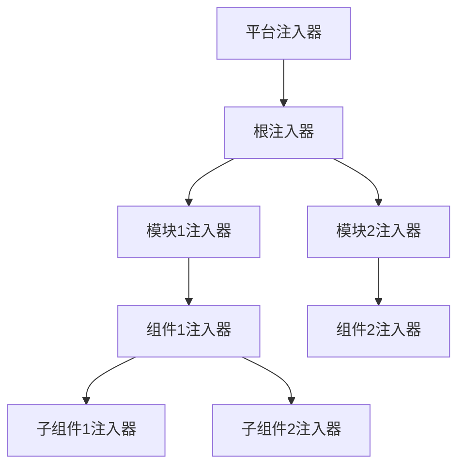

# Angular依赖注入系统

依赖注入(DI)是Angular的核心特性之一，它是一种设计模式，允许类从外部源获取依赖，而不是自行创建它们。Angular的DI系统强大而灵活，为创建松耦合、可测试和可维护的应用提供了基础。

## 目录

- [依赖注入基础](#依赖注入基础)
- [注入器层级](#注入器层级)
- [提供者配置](#提供者配置)
- [服务单例与多实例](#服务单例与多实例)
- [令牌与工厂提供者](#令牌与工厂提供者)
- [高级技巧](#高级技巧)
- [最佳实践](#最佳实践)

## 依赖注入基础

### 什么是依赖注入？

依赖注入是一种设计模式，它允许一个对象接收它所依赖的其他对象，而不是在对象内部创建这些依赖。

**不使用DI的代码示例**：

```typescript
// 紧耦合，难以测试
class UserService {
  private httpClient = new HttpClient();
  private logger = new Logger();
  
  getUsers() {
    this.logger.log('获取用户列表');
    return this.httpClient.get('/api/users');
  }
}
```

**使用DI的代码示例**：

```typescript
// 松耦合，易于测试和维护
@Injectable()
class UserService {
  constructor(
    private httpClient: HttpClient,
    private logger: LoggerService
  ) {}
  
  getUsers() {
    this.logger.log('获取用户列表');
    return this.httpClient.get('/api/users');
  }
}
```

### Angular DI的核心概念

Angular的依赖注入系统基于几个关键概念：

1. **令牌(Token)**: 用于标识和请求依赖的唯一标识符
2. **提供者(Provider)**: 告诉注入器如何创建或获取依赖的对象
3. **注入器(Injector)**: 维护一个依赖实例的容器，并负责创建服务实例
4. **依赖(Dependency)**: 一个服务需要的对象或值

## 注入器层级

Angular的依赖注入系统采用层级结构，形成一个与组件树平行的注入器树。这种层级结构是Angular DI系统的核心特性之一，它允许我们精确控制服务的作用域和生命周期。

### 注入器树

Angular的注入器树主要包含以下层级：

1. **平台注入器**: 由平台浏览器创建，包含平台特定的依赖
2. **根注入器**: 在应用启动时创建，包含应用级别的依赖
3. **NgModule注入器**: 由NgModule创建的注入器
4. **元素注入器**: 由组件和指令创建的注入器



**图表文本版**:
```
平台注入器
   │
   └── 根注入器 ──┬── 模块1注入器 ── 组件1注入器 ──┬── 子组件1注入器
                  │                              └── 子组件2注入器
                  │
                  └── 模块2注入器 ── 组件2注入器
```

### 依赖解析规则

当组件请求一个依赖时，Angular按照以下步骤解析依赖：

1. 首先，检查组件自身的注入器
2. 如果没有找到，检查父组件的注入器
3. 继续向上查找，直到根注入器
4. 如果仍未找到，检查平台注入器
5. 如果所有注入器都没有提供依赖，则抛出错误

这种解析机制允许我们创建不同作用域的服务实例：

```typescript
// app.module.ts - 全局单例服务
@NgModule({
  providers: [GlobalService]
})
export class AppModule {}

// feature.module.ts - 模块级服务
@NgModule({
  providers: [FeatureService]
})
export class FeatureModule {}

// parent.component.ts - 组件级服务
@Component({
  providers: [ComponentService]
})
export class ParentComponent {}
```

### 自定义解析规则

可以使用`@Optional()`、`@Self()`、`@SkipSelf()`和`@Host()`装饰器修改默认的依赖解析行为：

```typescript
@Component({
  selector: 'app-child',
  providers: [{ provide: LogService, useClass: ChildLogService }]
})
export class ChildComponent {
  constructor(
    // 仅在当前注入器查找，找不到则返回null
    @Optional() @Self() private selfLogger: LogService,
    
    // 跳过当前注入器，从父级开始查找
    @SkipSelf() private parentLogger: LogService,
    
    // 仅在视图层级的Host组件或更高级查找
    @Host() private hostLogger: LogService
  ) {
    if (this.selfLogger) {
      this.selfLogger.log('从自身注入器获取的服务');
    }
    
    this.parentLogger.log('从父级注入器获取的服务');
    this.hostLogger.log('从Host或更高级注入器获取的服务');
  }
}
```

### 多级注入器示例

下面是一个完整的示例，演示了不同层级注入器的工作方式：

```typescript
// 创建三种不同的日志服务实现
@Injectable()
class BaseLoggerService {
  log(message: string) {
    console.log(`Base Logger: ${message}`);
  }
}

@Injectable()
class ModuleLoggerService {
  log(message: string) {
    console.log(`Module Logger: ${message}`);
  }
}

@Injectable()
class ComponentLoggerService {
  log(message: string) {
    console.log(`Component Logger: ${message}`);
  }
}

// 全局提供BaseLogger
@NgModule({
  providers: [{ provide: LoggerService, useClass: BaseLoggerService }]
})
export class AppModule {}

// 模块级别覆盖LoggerService
@NgModule({
  providers: [{ provide: LoggerService, useClass: ModuleLoggerService }]
})
export class FeatureModule {}

// 组件级别覆盖LoggerService
@Component({
  selector: 'app-special',
  providers: [{ provide: LoggerService, useClass: ComponentLoggerService }]
})
export class SpecialComponent {
  constructor(private logger: LoggerService) {
    // 将使用ComponentLoggerService
    logger.log('SpecialComponent初始化');
  }
}

// 继承SpecialComponent但没有提供自己的LoggerService
@Component({
  selector: 'app-child'
})
export class ChildComponent {
  constructor(private logger: LoggerService) {
    // 将使用父组件SpecialComponent的ComponentLoggerService
    logger.log('ChildComponent初始化');
  }
}

// 同属于FeatureModule但不是SpecialComponent的子组件
@Component({
  selector: 'app-sibling'
})
export class SiblingComponent {
  constructor(private logger: LoggerService) {
    // 将使用ModuleLoggerService
    logger.log('SiblingComponent初始化');
  }
}
```

## 提供者配置

提供者(Provider)是Angular依赖注入系统的核心部分，它告诉注入器如何创建依赖的实例。Angular提供了多种方式来配置提供者，以适应不同的场景需求。

### 提供者类型

#### 类提供者(Class Provider)

类提供者是最常见的提供者类型，它使用类来实例化服务：

```typescript
// 简写形式
@NgModule({
  providers: [UserService]
})

// 完整形式
@NgModule({
  providers: [
    { provide: UserService, useClass: UserService }
  ]
})
```

类提供者特别适合用于替换服务实现：

```typescript
// 在测试环境中替换为MockUserService
@NgModule({
  providers: [
    { provide: UserService, useClass: environment.production ? UserService : MockUserService }
  ]
})
```

#### 值提供者(Value Provider)

值提供者用于注入已有的对象或原始值：

```typescript
// 定义配置对象
export const APP_CONFIG = new InjectionToken<AppConfig>('app.config');

const config: AppConfig = {
  apiEndpoint: 'https://api.example.com',
  title: '我的应用',
  theme: 'dark'
};

// 提供配置对象
@NgModule({
  providers: [
    { provide: APP_CONFIG, useValue: config }
  ]
})
```

#### 工厂提供者(Factory Provider)

工厂提供者使用函数动态创建依赖实例：

```typescript
function configFactory(http: HttpClient): AppConfig {
  // 基于其他服务动态创建配置
  return http.get<AppConfig>('/assets/config.json').pipe(
    catchError(() => of(DEFAULT_CONFIG))
  );
}

@NgModule({
  providers: [
    {
      provide: APP_CONFIG,
      useFactory: configFactory,
      deps: [HttpClient]  // 工厂函数的依赖
    }
  ]
})
```

#### 已有提供者(Existing Provider)

已有提供者创建一个别名，指向另一个令牌：

```typescript
// OldService和NewService使用相同的实例
@NgModule({
  providers: [
    NewService,
    { provide: OldService, useExisting: NewService }
  ]
})
```

### 提供者作用域

提供者可以在不同级别声明，影响其作用域和生命周期：

#### 1. 根级别提供(`providedIn: 'root'`)

```typescript
@Injectable({
  providedIn: 'root'  // 应用级别单例
})
export class GlobalService {
  /* ... */
}
```

#### 2. 模块级别提供

```typescript
@NgModule({
  providers: [FeatureService]  // 模块级别单例
})
export class FeatureModule {
  /* ... */
}
```

#### 3. 组件级别提供

```typescript
@Component({
  selector: 'app-component',
  providers: [ComponentService]  // 组件级别实例
})
export class MyComponent {
  /* ... */
}
```

#### 4. 特定模块提供(`providedIn: SomeModule`)

```typescript
@Injectable({
  providedIn: FeatureModule  // 特定模块的单例
})
export class FeatureScoped {
  /* ... */
}
```

### 提供者配置技巧

#### 条件提供者

基于条件提供不同的服务实现：

```typescript
@NgModule({
  providers: [
    // 仅在生产环境使用真实服务，否则使用模拟服务
    {
      provide: ApiService,
      useClass: environment.production ? RealApiService : MockApiService
    }
  ]
})
```

#### 多重提供者

同一个令牌可以有多个提供者，形成一个数组：

```typescript
// 定义一个多重提供者令牌
export const ANALYTIC_SERVICES = new InjectionToken<AnalyticsService[]>('analytics');

@NgModule({
  providers: [
    // 为同一个令牌提供多个值，形成数组
    { provide: ANALYTIC_SERVICES, useClass: GoogleAnalytics, multi: true },
    { provide: ANALYTIC_SERVICES, useClass: FacebookPixel, multi: true },
    { provide: ANALYTIC_SERVICES, useClass: CustomAnalytics, multi: true }
  ]
})
export class AppModule {}

// 使用多重提供者
@Component({/*...*/})
export class AppComponent {
  constructor(@Inject(ANALYTIC_SERVICES) private analyticsServices: AnalyticsService[]) {
    // 使用所有分析服务
    this.analyticsServices.forEach(service => service.track('app_init'));
  }
}
```

## 服务单例与多实例

在Angular中，服务实例的创建取决于提供者的位置和配置。理解单例与多实例模式对于合理设计应用架构至关重要。

### 单例服务

单例服务在整个应用或特定范围内只有一个实例。这对于需要共享状态或资源的服务非常有用。

#### 创建根级单例

```typescript
// 方法1：使用providedIn: 'root'（推荐）
@Injectable({
  providedIn: 'root'
})
export class UserStateService {
  private users: User[] = [];
  
  addUser(user: User) {
    this.users.push(user);
  }
  
  getUsers() {
    return [...this.users];
  }
}

// 方法2：在AppModule中提供
@NgModule({
  providers: [UserStateService]
})
export class AppModule {}
```

#### 模块级单例

```typescript
// 模块级单例，只在FeatureModule内共享
@NgModule({
  providers: [FeatureStateService]
})
export class FeatureModule {}
```

#### 懒加载模块中的单例

懒加载模块创建自己的注入器子树，拥有独立的服务实例：

```typescript
// 主模块
@NgModule({
  providers: [
    { provide: CounterService, useValue: { count: 0, name: 'MainCounter' } }
  ]
})
export class MainModule {}

// 懒加载模块
@NgModule({
  providers: [
    { provide: CounterService, useValue: { count: 0, name: 'LazyCounter' } }
  ]
})
export class LazyFeatureModule {}

// 主模块组件使用主模块的CounterService实例
// 懒加载模块的组件使用懒加载模块的CounterService实例
```

### 多实例服务

某些情况下，我们需要服务的多个独立实例，每个实例维护自己的状态。

#### 组件级提供的多实例

```typescript
@Injectable()
export class CounterService {
  private count = 0;
  
  increment() {
    this.count++;
  }
  
  getCount() {
    return this.count;
  }
}

// 每个ComponentA实例都有自己独立的CounterService实例
@Component({
  selector: 'app-counter',
  providers: [CounterService]
})
export class ComponentA {
  constructor(public counter: CounterService) {}
  
  increment() {
    this.counter.increment();
  }
}
```

#### 工厂函数创建的实例

可以使用工厂函数动态创建具有不同初始状态的服务实例：

```typescript
// 服务定义
@Injectable()
export class ConfigurableService {
  constructor(private initialValue: number) {}
  
  private value = this.initialValue;
  
  getValue() {
    return this.value;
  }
  
  setValue(v: number) {
    this.value = v;
  }
}

// 组件A提供自己的实例
@Component({
  selector: 'app-a',
  providers: [
    {
      provide: ConfigurableService,
      useFactory: () => new ConfigurableService(10)
    }
  ]
})
export class ComponentA {}

// 组件B提供自己的不同实例
@Component({
  selector: 'app-b',
  providers: [
    {
      provide: ConfigurableService,
      useFactory: () => new ConfigurableService(20)
    }
  ]
})
export class ComponentB {}
```

### 单例与多实例的选择

在设计服务时，需要考虑以下因素来决定是使用单例还是多实例：

| 使用单例服务的情况 | 使用多实例服务的情况 |
|----------------|------------------|
| 需要跨组件共享状态 | 每个组件需要独立状态 |
| 封装全局资源（HTTP、WebSocket） | 组件特定的辅助服务 |
| 提供应用级配置 | 需要不同配置的相同服务 |
| 缓存数据或状态 | 短生命周期的服务 |

### 示例：混合单例和多实例

下面是一个结合单例和多实例的复杂示例：

```typescript
// 全局单例服务
@Injectable({
  providedIn: 'root'
})
export class GlobalStore {
  private data = new BehaviorSubject<any>({});
  public data$ = this.data.asObservable();
  
  updateData(newData: any) {
    this.data.next({...this.data.value, ...newData});
  }
}

// 可配置的多实例服务
@Injectable()
export class ComponentStore {
  private state: any;
  private name: string;
  
  constructor(
    @Inject(COMPONENT_NAME) name: string,
    private globalStore: GlobalStore
  ) {
    this.name = name;
    this.state = {};
  }
  
  setState(newState: any) {
    this.state = {...this.state, ...newState};
    // 也可以更新全局状态
    this.globalStore.updateData({
      [this.name]: this.state
    });
  }
  
  getState() {
    return {...this.state};
  }
}

// 在不同组件中使用
@Component({
  selector: 'app-feature-one',
  providers: [
    { provide: COMPONENT_NAME, useValue: 'featureOne' },
    ComponentStore
  ]
})
export class FeatureOneComponent {
  constructor(private store: ComponentStore) {
    this.store.setState({ active: true });
  }
}

@Component({
  selector: 'app-feature-two',
  providers: [
    { provide: COMPONENT_NAME, useValue: 'featureTwo' },
    ComponentStore
  ]
})
export class FeatureTwoComponent {
  constructor(private store: ComponentStore) {
    this.store.setState({ items: [1, 2, 3] });
  }
}
```

## 令牌与工厂提供者

Angular的依赖注入系统使用令牌来标识依赖，而工厂提供者提供了创建依赖的灵活方式。理解这两个概念对于高级依赖注入场景至关重要。

### 依赖注入令牌

令牌是依赖注入系统用来唯一标识一个依赖的。Angular支持多种类型的令牌：

#### 类令牌

最常见的令牌类型是类本身：

```typescript
@Injectable()
export class UserService {
  getUsers() { return ['用户1', '用户2']; }
}

@Component({
  selector: 'app-user-list',
  template: `<div *ngFor="let user of users">{{user}}</div>`
})
export class UserListComponent {
  users: string[];
  
  // UserService类作为令牌
  constructor(private userService: UserService) {
    this.users = userService.getUsers();
  }
}
```

#### InjectionToken

当需要注入非类值（如字符串、数字或对象）时，使用`InjectionToken`：

```typescript
// 基本使用
export const API_URL = new InjectionToken<string>('api.url');

@NgModule({
  providers: [
    { provide: API_URL, useValue: 'https://api.example.com/v1' }
  ]
})
export class AppModule { }

@Injectable()
export class ApiService {
  constructor(@Inject(API_URL) private apiUrl: string) {
    console.log(`API URL: ${apiUrl}`);
  }
}

// 携带默认值的InjectionToken
export const CONFIG = new InjectionToken<AppConfig>('app.config', {
  providedIn: 'root',
  factory: () => DEFAULT_CONFIG
});

// 使用默认值
@Component({/*...*/})
export class AppComponent {
  constructor(@Inject(CONFIG) config: AppConfig) {
    // 如果没有显式提供CONFIG，将使用DEFAULT_CONFIG
  }
}
```

#### 使用令牌的高级技巧

##### 操作令牌(Optional)

使用`@Optional()`装饰器处理可选依赖：

```typescript
@Component({/*...*/})
export class FlexibleComponent {
  constructor(
    // 依赖是可选的，找不到会返回null
    @Optional() private analytics: AnalyticsService
  ) {
    if (this.analytics) {
      this.analytics.trackEvent('component_created');
    }
  }
}
```

##### 前向引用

处理循环依赖时使用`forwardRef`：

```typescript
@Injectable()
export class ServiceA {
  constructor(@Inject(forwardRef(() => ServiceB)) private serviceB: ServiceB) {}
}

@Injectable()
export class ServiceB {
  constructor(private serviceA: ServiceA) {}
}
```

### 工厂提供者

工厂提供者允许我们动态创建依赖，基于运行时条件或其他依赖创建复杂的值。

#### 基本工厂提供者

```typescript
@NgModule({
  providers: [
    {
      provide: LoggerService,
      useFactory: () => {
        return environment.production 
          ? new ProductionLogger() 
          : new DevelopmentLogger();
      }
    }
  ]
})
export class AppModule {}
```

#### 带依赖的工厂提供者

工厂函数可以使用其他依赖：

```typescript
@NgModule({
  providers: [
    {
      provide: UserService,
      useFactory: (http: HttpClient, config: AppConfig) => {
        if (config.useRealApi) {
          return new RealUserService(http, config.apiUrl);
        } else {
          return new MockUserService();
        }
      },
      deps: [HttpClient, APP_CONFIG]  // 工厂函数的依赖
    }
  ]
})
```

#### 动态值工厂

创建基于当前环境或配置的值：

```typescript
export const CACHE_SIZE = new InjectionToken<number>('cache.size');

@NgModule({
  providers: [
    {
      provide: CACHE_SIZE,
      useFactory: (config: AppConfig) => {
        // 根据设备性能动态调整缓存大小
        const memory = navigator.deviceMemory || 4;
        return memory < 4 ? 10 : config.defaultCacheSize;
      },
      deps: [APP_CONFIG]
    }
  ]
})
```

#### 异步工厂提供者

从Angular 9开始，可以使用异步工厂函数：

```typescript
interface AppConfig {
  apiUrl: string;
  theme: string;
}

const APP_CONFIG = new InjectionToken<AppConfig>('app.config');

@NgModule({
  providers: [
    {
      provide: APP_CONFIG,
      useFactory: (http: HttpClient) => {
        return firstValueFrom(http.get<AppConfig>('/assets/config.json'));
      },
      deps: [HttpClient]
    }
  ]
})
export class AppModule {}
```

#### 工厂提供者实战示例

创建一个基于浏览器功能和应用配置的高级存储服务：

```typescript
// 存储服务接口
export abstract class StorageService {
  abstract get(key: string): any;
  abstract set(key: string, value: any): void;
  abstract remove(key: string): void;
  abstract clear(): void;
}

// 本地存储实现
@Injectable()
export class LocalStorageService implements StorageService {
  get(key: string) {
    const item = localStorage.getItem(key);
    return item ? JSON.parse(item) : null;
  }
  
  set(key: string, value: any) {
    localStorage.setItem(key, JSON.stringify(value));
  }
  
  remove(key: string) {
    localStorage.removeItem(key);
  }
  
  clear() {
    localStorage.clear();
  }
}

// 内存存储实现
@Injectable()
export class MemoryStorageService implements StorageService {
  private storage = new Map<string, any>();
  
  get(key: string) {
    return this.storage.get(key);
  }
  
  set(key: string, value: any) {
    this.storage.set(key, value);
  }
  
  remove(key: string) {
    this.storage.delete(key);
  }
  
  clear() {
    this.storage.clear();
  }
}

// IndexedDB存储实现
@Injectable()
export class IndexedDBStorageService implements StorageService {
  // IndexedDB实现...
}

// 工厂函数
export function storageServiceFactory(
  config: AppConfig, 
  platformId: Object
): StorageService {
  // 服务器端渲染时使用内存存储
  if (!isPlatformBrowser(platformId)) {
    return new MemoryStorageService();
  }
  
  // 根据配置和浏览器支持选择存储方式
  if (config.preferredStorage === 'indexeddb' && 'indexedDB' in window) {
    return new IndexedDBStorageService();
  } else if (config.preferredStorage === 'local' && 'localStorage' in window) {
    return new LocalStorageService();
  } else {
    // 降级到内存存储
    console.warn('Falling back to in-memory storage');
    return new MemoryStorageService();
  }
}

// 在模块中提供
@NgModule({
  providers: [
    {
      provide: StorageService,
      useFactory: storageServiceFactory,
      deps: [APP_CONFIG, PLATFORM_ID]
    }
  ]
})
export class AppModule {}
```

## 高级技巧

### 服务与组件生命周期同步

在某些情况下，我们需要服务的生命周期与特定组件同步：

```typescript
@Injectable()
export class ComponentScopedService implements OnDestroy {
  constructor() {
    console.log('ComponentScopedService created');
  }
  
  ngOnDestroy() {
    console.log('ComponentScopedService destroyed');
    // 清理资源
  }
}

@Component({
  selector: 'app-feature',
  providers: [ComponentScopedService]
})
export class FeatureComponent implements OnInit, OnDestroy {
  constructor(private service: ComponentScopedService) {}
  
  ngOnInit() {
    console.log('FeatureComponent initialized');
  }
  
  ngOnDestroy() {
    console.log('FeatureComponent destroyed');
  }
}
```

### 动态创建注入器

在高级场景中，有时需要动态创建注入器：

```typescript
import { Injector } from '@angular/core';

@Component({/*...*/})
export class DynamicComponent {
  constructor(private injector: Injector) {
    // 创建子注入器
    const childInjector = Injector.create({
      providers: [
        { provide: ConfigService, useValue: { debug: true } }
      ],
      parent: this.injector
    });
    
    // 从子注入器获取服务
    const config = childInjector.get(ConfigService);
    console.log(config); // { debug: true }
  }
}
```

### 树摇的提供者

为了优化应用大小，Angular提供了"Tree-Shakable Providers"功能：

```typescript
// 不需要在NgModule中声明，可以被摇树优化
@Injectable({
  providedIn: 'root'
})
export class OptimizedService {}

// 只在特定模块中使用时才会包含在最终bundle
@Injectable({
  providedIn: FeatureModule
})
export class FeatureScoped {}

// 通过工厂动态决定是否提供
@Injectable({
  providedIn: 'root',
  useFactory: () => {
    return environment.enableExperimentalFeature ? new ExperimentalService() : null;
  }
})
export class ConditionalService {}
```

## 最佳实践

### 服务设计原则

1. **单一职责原则**：每个服务应专注于单一功能领域
2. **接口与实现分离**：使用抽象类或接口定义服务契约
3. **合理划分作用域**：根据需要选择适当的提供级别
4. **保持无状态或状态最小化**：避免在服务中存储不必要的状态

### 依赖注入的常见陷阱

1. **循环依赖**：服务A依赖服务B，服务B又依赖服务A
   - 解决方案：使用`forwardRef()` 或重构依赖结构

2. **过于复杂的提供者配置**
   - 解决方案：将复杂配置拆分为模块级方法

3. **滥用单例服务**
   - 解决方案：谨慎选择服务的作用域

4. **未处理可选依赖**
   - 解决方案：使用`@Optional()`装饰器

### 依赖注入与测试

依赖注入使测试变得更简单：

```typescript
// 原始服务
@Injectable()
export class UserService {
  constructor(private http: HttpClient) {}
  
  getUsers() {
    return this.http.get<User[]>('/api/users');
  }
}

// 测试组件
describe('UserComponent', () => {
  let component: UserComponent;
  let fixture: ComponentFixture<UserComponent>;
  let userServiceSpy: jasmine.SpyObj<UserService>;
  
  beforeEach(() => {
    // 创建spy服务
    userServiceSpy = jasmine.createSpyObj('UserService', ['getUsers']);
    userServiceSpy.getUsers.and.returnValue(of([{ id: 1, name: 'Test User' }]));
    
    TestBed.configureTestingModule({
      declarations: [UserComponent],
      providers: [
        // 提供模拟服务
        { provide: UserService, useValue: userServiceSpy }
      ]
    });
    
    fixture = TestBed.createComponent(UserComponent);
    component = fixture.componentInstance;
  });
  
  it('should load users', () => {
    fixture.detectChanges();
    expect(userServiceSpy.getUsers).toHaveBeenCalled();
    expect(component.users.length).toBe(1);
  });
});
```

### 依赖注入与模块化架构

在大型应用中，依赖注入可以支持模块化架构：

```typescript
// 核心模块 - 提供全局单例服务
@NgModule({
  providers: [
    LoggerService,
    AuthService,
    { provide: HTTP_INTERCEPTORS, useClass: AuthInterceptor, multi: true }
  ]
})
export class CoreModule {
  // 防止多次导入
  constructor(@Optional() @SkipSelf() parentModule: CoreModule) {
    if (parentModule) {
      throw new Error('CoreModule已经加载。只应在AppModule中导入一次。');
    }
  }
}

// 特性模块 - 提供特性专用服务
@NgModule({
  providers: [FeatureService]
})
export class FeatureModule {}

// 共享模块 - 可能不提供服务，只提供组件/指令/管道
@NgModule({
  declarations: [SharedComponent],
  exports: [SharedComponent]
})
export class SharedModule {}
```

### 使用providedIn进行代码组织

使用`providedIn`可以更好地组织代码并支持摇树优化：

```typescript
// 核心服务，总是可用
@Injectable({
  providedIn: 'root'
})
export class CoreService {}

// 特性服务，只在该特性模块使用
@Injectable({
  providedIn: FeatureModule
})
export class FeatureService {}

// 平台特定服务
@Injectable({
  providedIn: 'platform'
})
export class PlatformService {}

// 按条件提供服务
@Injectable({
  providedIn: 'root',
  useFactory: () => {
    if (typeof window !== 'undefined') {
      return new BrowserStorageService();
    }
    return new ServerStorageService();
  }
})
export class StorageService {}
```

通过深入理解Angular的依赖注入系统，我们可以创建更灵活、更易于测试和维护的应用。无论是简单的应用还是复杂的企业级系统，依赖注入都是构建高质量Angular应用的基础。

```
┌────────────────────┐   定义   ┌────────────────────┐
│                    │◄────────│                    │
│    服务类定义      │          │  @Injectable()     │
│                    │          │  装饰器           │
└────────────────────┘          └────────────────────┘
          │
          │ 提供
          ▼
┌────────────────────┐
│     提供者注册     │
│                    │
│  - providedIn      │
│  - NgModule        │
│  - Component       │
└────────────────────┘
          │
          │ 注入
          ▼
┌────────────────────┐   查找   ┌────────────────────┐
│                    │────────▶│                    │
│  组件构造函数      │          │     注入器树       │
│  constructor()     │◄────────│                    │
└────────────────────┘   实例   └────────────────────┘
          │
          │ 使用
          ▼
┌────────────────────┐
│                    │
│   依赖的服务实例   │
│                    │
└────────────────────┘
```
*Angular依赖注入流程图* 
*Angular依赖注入流程图* 