# Angular指令系统

指令是Angular中用于操作DOM的强大功能，它们赋予了模板动态行为的能力。Angular指令分为三种类型：组件指令（带模板的特殊指令）、结构型指令（改变DOM布局）和属性型指令（改变元素行为和外观）。本文将详细介绍指令系统的工作原理和使用方法。

## 目录

- [指令概述](#指令概述)
- [结构型指令](#结构型指令)
  - [ngIf](#ngif)
  - [ngFor](#ngfor)
  - [ngSwitch](#ngswitch)
  - [微语法](#微语法)
- [属性型指令](#属性型指令)
  - [ngClass](#ngclass)
  - [ngStyle](#ngstyle)
  - [ngModel](#ngmodel)
- [自定义指令开发](#自定义指令开发)
  - [属性指令创建](#属性指令创建)
  - [结构指令创建](#结构指令创建)
  - [指令通信](#指令通信)
  - [宿主监听器](#宿主监听器)
- [高级指令技术](#高级指令技术)
  - [视图容器操作](#视图容器操作)
  - [模板操作](#模板操作)
  - [指令生命周期](#指令生命周期)
- [最佳实践与性能优化](#最佳实践与性能优化)
- [常见问题解决方案](#常见问题解决方案)
- [实际应用案例](#实际应用案例)
- [相关资源](#相关资源)

## 指令概述

Angular指令是DOM元素上的标记，告诉Angular将指定的行为附加到现有元素上或转换DOM结构。从本质上讲，指令扩展了HTML的能力，使其能够实现动态内容和复杂的用户交互。

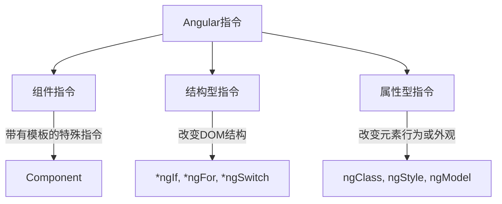

**图表文本版**:
```
Angular指令 ──┬── 组件指令 ────"带有模板的特殊指令"──> Component
              │
              ├── 结构型指令 ───"改变DOM结构"──> *ngIf, *ngFor, *ngSwitch
              │
              └── 属性型指令 ───"改变元素行为或外观"──> ngClass, ngStyle, ngModel
```

每种类型的指令都有其特定的用途：

1. **组件指令**：本质上是带有模板的指令，是Angular应用的基本构建块
2. **结构型指令**：通过添加、移除或替换DOM元素来改变DOM布局
3. **属性型指令**：改变元素、组件或其他指令的外观或行为

Angular内置了许多常用指令，同时也允许开发者创建自定义指令来满足特定需求。

## 结构型指令

结构型指令通过添加、删除或操作DOM元素来改变DOM结构。它们通常以星号（*）为前缀，这是Angular对指令微语法的简写。最常见的结构型指令有`*ngIf`、`*ngFor`和`*ngSwitch`。

### ngIf

`*ngIf`条件性地显示或隐藏元素。当表达式为`true`时，元素会被渲染到DOM中；当表达式为`false`时，元素会从DOM中完全移除，而不仅仅是隐藏。

```typescript
// 基本用法
@Component({
  selector: 'app-ngif-demo',
  template: `
    <div *ngIf="isVisible">这个元素只在isVisible为true时显示</div>
    <button (click)="toggleVisibility()">切换显示状态</button>
    
    <!-- 使用else语句 -->
    <div *ngIf="isLoggedIn; else loginTemplate">
      欢迎回来，{{ username }}！
    </div>
    <ng-template #loginTemplate>
      请先登录
    </ng-template>
    
    <!-- 使用as保存条件结果 -->
    <div *ngIf="user$ | async as user; else loading">
      用户名: {{ user.name }}
    </div>
    <ng-template #loading>
      <p>加载中...</p>
    </ng-template>
  `
})
export class NgIfDemoComponent {
  isVisible = true;
  isLoggedIn = false;
  username = '张三';
  user$ = this.userService.getUser(); // 假设这是一个返回Observable的服务方法
  
  constructor(private userService: UserService) {}
  
  toggleVisibility(): void {
    this.isVisible = !this.isVisible;
  }
}
```

`*ngIf`的工作原理图解：

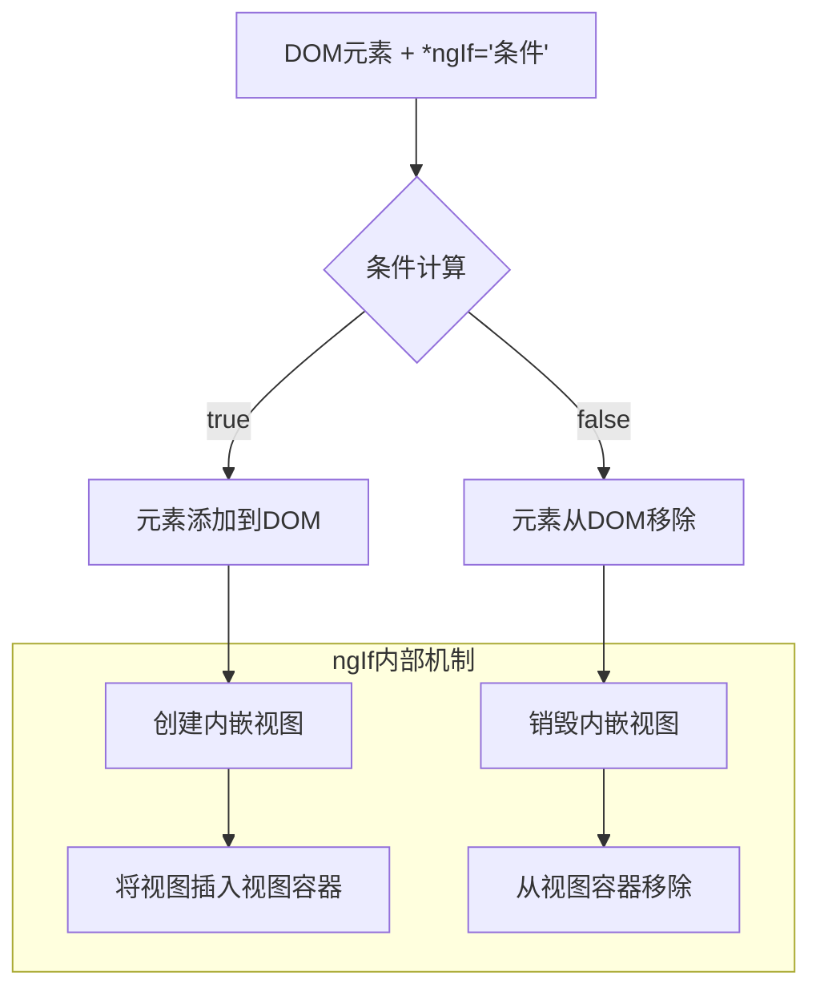

**图表文本版**:
```
DOM元素 + *ngIf='条件' ──> 条件计算 ┬──"true"──> 元素添加到DOM ──> 创建内嵌视图 ──> 将视图插入视图容器
                                    │
                                    └──"false"─> 元素从DOM移除 ──> 销毁内嵌视图 ──> 从视图容器移除
```

需要注意的是，由于`*ngIf`会完全移除或添加元素，所以它会触发组件的创建和销毁生命周期。这对性能有一定影响，但确保了不可见元素不会消耗资源。

### ngFor

`*ngFor`用于循环渲染列表数据，是Angular中最常用的结构型指令之一。它基于数组或可迭代对象创建一组相同模板的元素。

```typescript
@Component({
  selector: 'app-ngfor-demo',
  template: `
    <!-- 基本用法 -->
    <ul>
      <li *ngFor="let item of items">{{ item.name }}</li>
    </ul>
    
    <!-- 使用索引变量 -->
    <ul>
      <li *ngFor="let item of items; let i = index">
        {{ i + 1 }}. {{ item.name }}
      </li>
    </ul>
    
    <!-- 使用其他导出变量 -->
    <ul>
      <li *ngFor="let item of items; 
                  let i = index; 
                  let first = first; 
                  let last = last; 
                  let even = even; 
                  let odd = odd"
          [class.first]="first"
          [class.last]="last"
          [class.even]="even"
          [class.odd]="odd">
        {{ i + 1 }}. {{ item.name }}
      </li>
    </ul>
    
    <!-- 使用trackBy提高性能 -->
    <ul>
      <li *ngFor="let item of items; trackBy: trackByFn">
        {{ item.name }}
      </li>
    </ul>
  `
})
export class NgForDemoComponent {
  items = [
    { id: 1, name: '张三' },
    { id: 2, name: '李四' },
    { id: 3, name: '王五' }
  ];
  
  // trackBy函数用于提高性能
  trackByFn(index: number, item: any): number {
    return item.id; // 返回唯一标识符
  }
}
```

`*ngFor`的工作原理与性能优化：

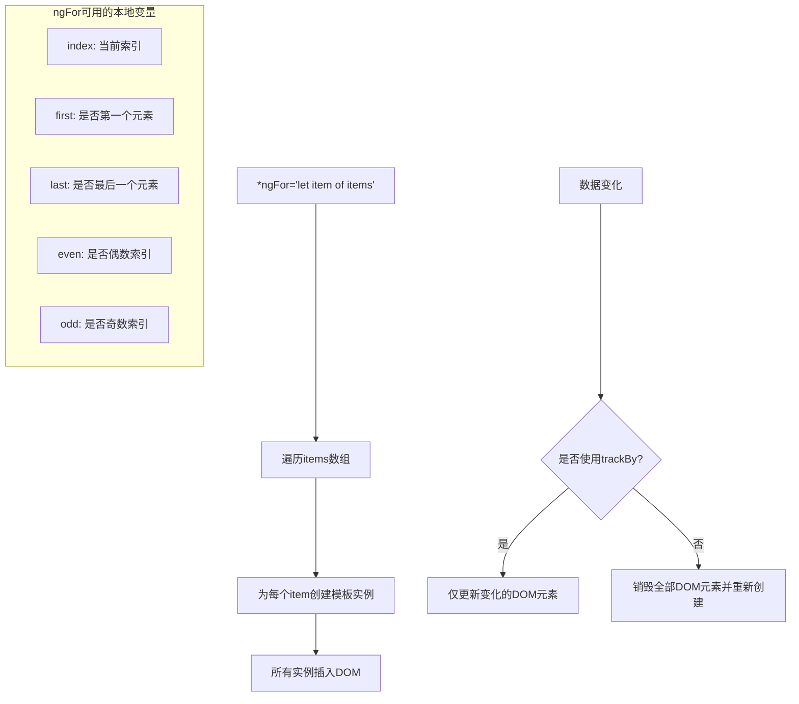

**图表文本版**:
```
*ngFor='let item of items' ──> 遍历items数组 ──> 为每个item创建模板实例 ──> 所有实例插入DOM

数据变化 ──> 是否使用trackBy? ┬──"是"──> 仅更新变化的DOM元素
                              │
                              └──"否"──> 销毁全部DOM元素并重新创建

ngFor可用的本地变量:
- index: 当前索引
- first: 是否第一个元素
- last: 是否最后一个元素
- even: 是否偶数索引
- odd: 是否奇数索引
```

**性能优化提示**：
- 对于大型列表，务必使用`trackBy`函数。这让Angular能够跟踪每个项的身份，当数据变化时，只更新变化的项而不是重新创建整个列表。
- 考虑使用虚拟滚动（如`@angular/cdk/scrolling`中的`<cdk-virtual-scroll-viewport>`）处理非常长的列表。

### ngSwitch

`*ngSwitch`指令用于条件性地显示一组视图中的一个，类似于编程语言中的switch语句。它由三个指令组成：`[ngSwitch]`、`*ngSwitchCase`和`*ngSwitchDefault`。

```typescript
@Component({
  selector: 'app-ngswitch-demo',
  template: `
    <div>
      <select [(ngModel)]="selectedOption">
        <option value="case1">选项一</option>
        <option value="case2">选项二</option>
        <option value="case3">选项三</option>
      </select>
    </div>
    
    <div [ngSwitch]="selectedOption">
      <div *ngSwitchCase="'case1'">
        <h3>选项一内容</h3>
        <p>这是选项一的详细信息...</p>
      </div>
      <div *ngSwitchCase="'case2'">
        <h3>选项二内容</h3>
        <p>这是选项二的详细信息...</p>
      </div>
      <div *ngSwitchCase="'case3'">
        <h3>选项三内容</h3>
        <p>这是选项三的详细信息...</p>
      </div>
      <div *ngSwitchDefault>
        <h3>默认选项</h3>
        <p>请选择一个选项查看详细信息</p>
      </div>
    </div>
  `
})
export class NgSwitchDemoComponent {
  selectedOption = 'case1';
}
```

`*ngSwitch`的工作原理：

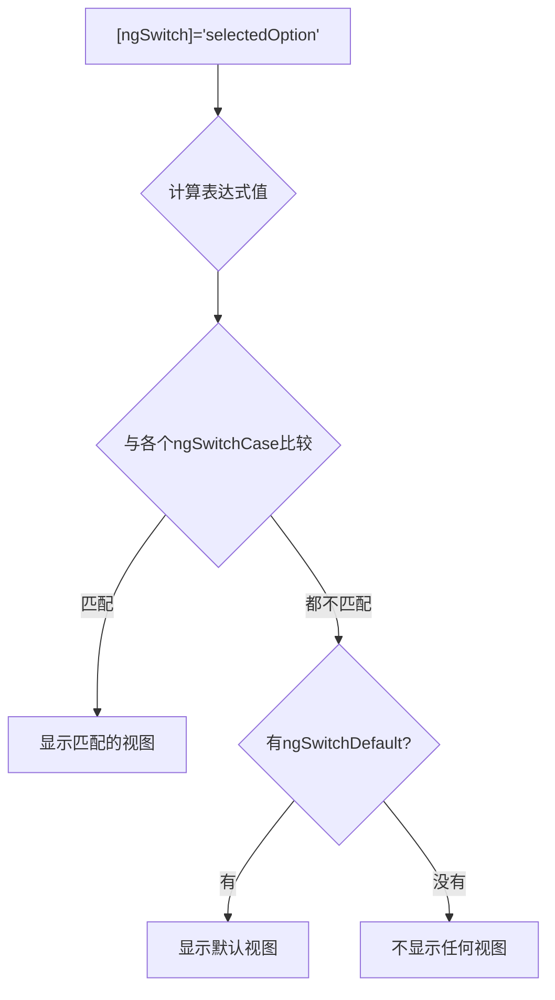

**图表文本版**:
```
[ngSwitch]='selectedOption' ──> 计算表达式值 ──> 与各个ngSwitchCase比较 ┬──"匹配"──> 显示匹配的视图
                                                                       │
                                                                       └──"都不匹配"──> 有ngSwitchDefault? ┬──"有"──> 显示默认视图
                                                                                                          │
                                                                                                          └──"没有"──> 不显示任何视图
```

**最佳实践**：
- 当有多个互斥条件时，使用`ngSwitch`比多个`ngIf`更清晰和高效。
- 确保为复杂场景提供一个`*ngSwitchDefault`来处理未匹配的情况。

### 微语法

结构型指令使用Angular的"微语法"，这是一种特殊的简写语法。所有以`*`开头的指令（如`*ngIf`）实际上是一种语法糖，会被Angular编译器转换为更复杂的形式，使用`<ng-template>`。

例如，以下两种写法是等价的：

```html
<!-- 简写形式（微语法） -->
<div *ngIf="condition">内容</div>

<!-- 完整形式 -->
<ng-template [ngIf]="condition">
  <div>内容</div>
</ng-template>
```

同样，`*ngFor`的展开形式为：

```html
<!-- 简写形式 -->
<div *ngFor="let item of items">{{ item.name }}</div>

<!-- 完整形式 -->
<ng-template ngFor let-item [ngForOf]="items">
  <div>{{ item.name }}</div>
</ng-template>
```

微语法的解析过程：

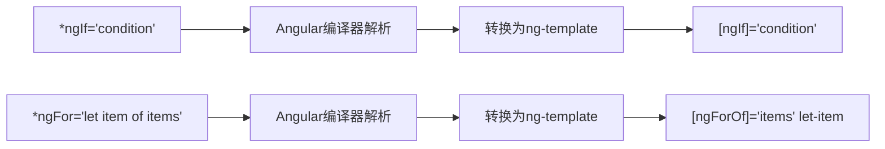

**图表文本版**:
```
*ngIf='condition' ──> Angular编译器解析 ──> 转换为ng-template ──> [ngIf]='condition'

*ngFor='let item of items' ──> Angular编译器解析 ──> 转换为ng-template ──> [ngForOf]='items' let-item
```

理解微语法对于创建自定义结构指令非常重要，因为它揭示了结构型指令的实际工作原理。

## 属性型指令

属性型指令用于改变DOM元素的外观、行为或布局，但不会改变DOM结构。这些指令作为HTML元素的属性应用，通常以方括号语法`[]`使用。Angular内置了几个常用的属性型指令，如`ngClass`、`ngStyle`和`ngModel`。

### ngClass

`ngClass`指令用于动态添加或移除CSS类，是最常用的属性型指令之一。它可以根据组件状态灵活地控制元素样式。

```typescript
@Component({
  selector: 'app-ngclass-demo',
  template: `
    <!-- 单个类绑定 -->
    <div [ngClass]="'bold-text'">使用单个CSS类</div>
    
    <!-- 对象语法（最常用）-->
    <div [ngClass]="{'active': isActive, 'disabled': isDisabled, 'hidden': !isVisible}">
      对象语法动态控制多个类
    </div>
    
    <!-- 数组语法 -->
    <div [ngClass]="['bold-text', 'blue-bg', getAdditionalClass()]">
      数组语法添加多个类
    </div>
    
    <!-- 字符串语法 -->
    <div [ngClass]="getClassString()">
      字符串语法（空格分隔多个类）
    </div>
    
    <!-- 切换类按钮 -->
    <button (click)="toggleActive()">切换激活状态</button>
  `,
  styles: [`
    .bold-text { font-weight: bold; }
    .blue-bg { background-color: #e6f7ff; }
    .active { border: 2px solid green; color: green; }
    .disabled { opacity: 0.5; cursor: not-allowed; }
    .hidden { display: none; }
  `]
})
export class NgClassDemoComponent {
  isActive = true;
  isDisabled = false;
  isVisible = true;
  
  getAdditionalClass(): string {
    return this.isActive ? 'active' : '';
  }
  
  getClassString(): string {
    return 'bold-text ' + (this.isActive ? 'active' : '');
  }
  
  toggleActive(): void {
    this.isActive = !this.isActive;
  }
}
```

`ngClass`使用场景图解：

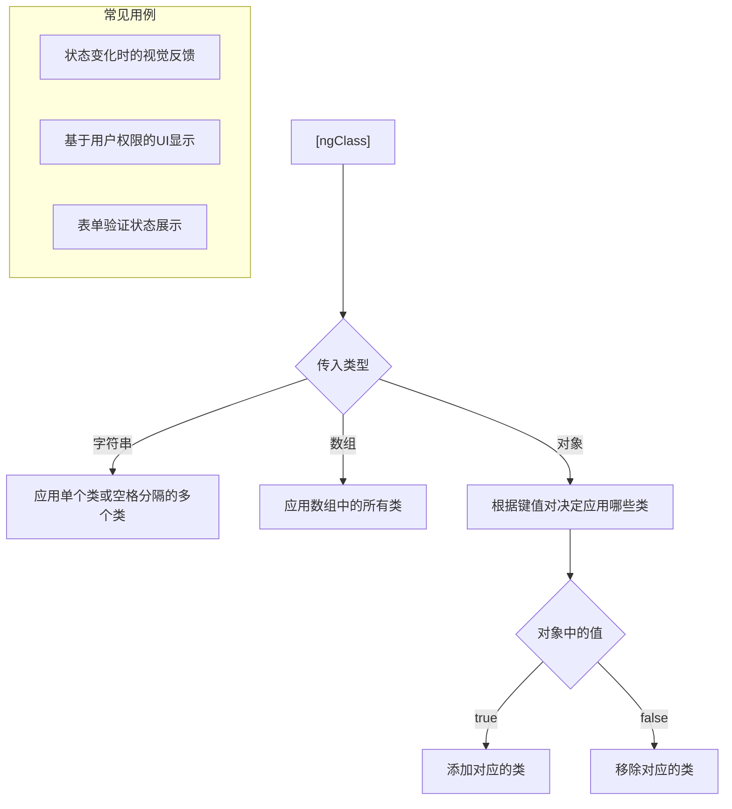

**图表文本版**:
```
[ngClass] ──> 传入类型 ┬──"字符串"──> 应用单个类或空格分隔的多个类
                       │
                       ├──"数组"────> 应用数组中的所有类
                       │
                       └──"对象"────> 根据键值对决定应用哪些类 ──> 对象中的值 ┬──"true"───> 添加对应的类
                                                                          │
                                                                          └──"false"──> 移除对应的类

常见用例:
- 状态变化时的视觉反馈
- 基于用户权限的UI显示
- 表单验证状态展示
```

**性能优化提示**：
- 对于复杂的类计算，使用getter或计算方法，避免模板中的复杂逻辑
- 对象语法中的表达式尽量简单，避免复杂计算

### ngStyle

`ngStyle`指令允许动态设置HTML元素的内联样式。它接受一个键值对对象，其中键是CSS属性名，值是样式值。

```typescript
@Component({
  selector: 'app-ngstyle-demo',
  template: `
    <!-- 对象语法 -->
    <div [ngStyle]="{'color': textColor, 'font-size': fontSize + 'px', 'background-color': bgColor}">
      动态样式文本
    </div>
    
    <!-- 绑定到方法 -->
    <div [ngStyle]="getStyles()">
      根据组件状态计算样式
    </div>
    
    <!-- 控制样式 -->
    <div>
      <input type="color" [(ngModel)]="textColor" placeholder="文字颜色">
      <input type="range" [(ngModel)]="fontSize" min="12" max="32">
      <button (click)="toggleBold()">切换粗体</button>
    </div>
  `
})
export class NgStyleDemoComponent {
  textColor = '#333333';
  bgColor = '#f5f5f5';
  fontSize = 16;
  isBold = false;
  
  getStyles(): {[key: string]: string} {
    return {
      'color': this.textColor,
      'font-size': `${this.fontSize}px`,
      'background-color': this.bgColor,
      'font-weight': this.isBold ? 'bold' : 'normal',
      'padding': '10px',
      'border-radius': '4px',
      'transition': 'all 0.3s ease'
    };
  }
  
  toggleBold(): void {
    this.isBold = !this.isBold;
  }
}
```

`ngStyle`与`ngClass`的比较：

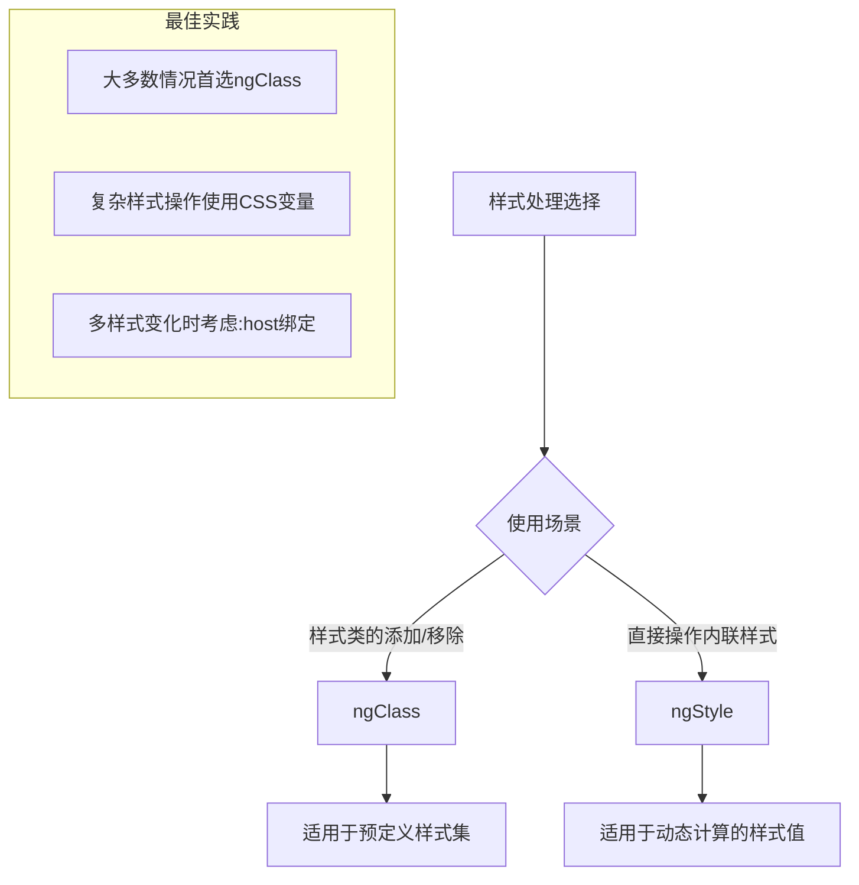

**图表文本版**:
```
样式处理选择 ──> 使用场景 ┬──"样式类的添加/移除"──> ngClass ──> 适用于预定义样式集
                          │
                          └──"直接操作内联样式"──> ngStyle ──> 适用于动态计算的样式值

最佳实践:
- 大多数情况首选ngClass
- 复杂样式操作使用CSS变量
- 多样式变化时考虑:host绑定
```

**使用建议**：
- 在大多数情况下，`ngClass`比`ngStyle`更好，因为它支持更好的样式封装和重用
- 使用`ngStyle`处理那些需要动态计算的样式值，如基于数据的颜色、大小等
- 对于大量动态样式，考虑使用CSS变量结合`:host`绑定，提高性能

### ngModel

`ngModel`指令是Angular表单中最重要的指令之一，用于实现双向数据绑定。它既能从视图（UI）读取值，又能在模型（组件类）更新时更新视图。

> 注意：使用`ngModel`需要导入`FormsModule`。

```typescript
import { NgModule } from '@angular/core';
import { BrowserModule } from '@angular/platform-browser';
import { FormsModule } from '@angular/forms'; // 引入FormsModule
import { AppComponent } from './app.component';

@NgModule({
  declarations: [AppComponent],
  imports: [
    BrowserModule,
    FormsModule // 添加到imports数组
  ],
  bootstrap: [AppComponent]
})
export class AppModule { }
```

```typescript
@Component({
  selector: 'app-ngmodel-demo',
  template: `
    <!-- 基本用法 -->
    <input [(ngModel)]="username" placeholder="用户名">
    <p>你好，{{ username }}！</p>
    
    <!-- 使用ngModel的展开形式 -->
    <input 
      [ngModel]="email" 
      (ngModelChange)="email = $event"
      placeholder="邮箱">
    <p>邮箱：{{ email }}</p>
    
    <!-- 自定义处理值变化 -->
    <input 
      [ngModel]="phone"
      (ngModelChange)="formatPhone($event)"
      placeholder="手机号">
    <p>格式化后的手机号：{{ phone }}</p>
    
    <!-- 表单状态跟踪 -->
    <input 
      [(ngModel)]="password" 
      #pwd="ngModel"
      required
      minlength="6"
      placeholder="密码">
    
    <div *ngIf="pwd.touched && pwd.invalid" style="color: red">
      <div *ngIf="pwd.errors?.['required']">密码不能为空</div>
      <div *ngIf="pwd.errors?.['minlength']">密码长度不能少于6位</div>
    </div>
  `
})
export class NgModelDemoComponent {
  username = '张三';
  email = 'zhangsan@example.com';
  phone = '';
  password = '';
  
  formatPhone(value: string): void {
    // 移除非数字字符
    const cleaned = value.replace(/\D/g, '');
    // 限制长度并格式化
    if (cleaned.length <= 11) {
      if (cleaned.length > 7) {
        this.phone = `${cleaned.slice(0, 3)}-${cleaned.slice(3, 7)}-${cleaned.slice(7)}`;
      } else if (cleaned.length > 3) {
        this.phone = `${cleaned.slice(0, 3)}-${cleaned.slice(3)}`;
      } else {
        this.phone = cleaned;
      }
    }
  }
}
```

`ngModel`的工作原理：

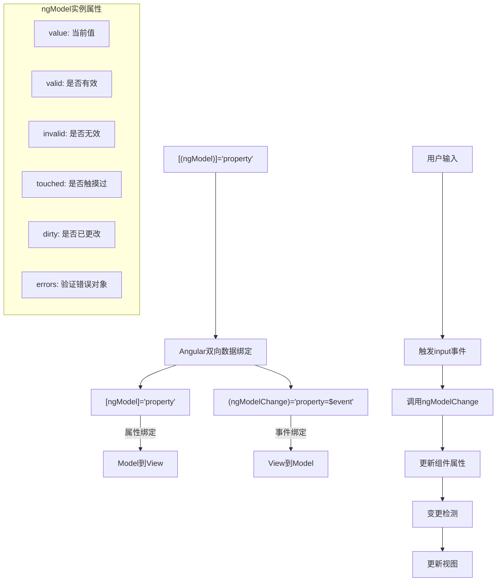

**ngModel最佳实践**：
- 对于简单的表单元素，使用`[(ngModel)]`简写形式
- 对于需要自定义处理输入值的场景，使用展开形式：`[ngModel]`和`(ngModelChange)`
- 结合模板引用变量（如`#myInput="ngModel"`）访问表单状态，实现验证反馈
- 对于更复杂的表单，考虑使用响应式表单（ReactiveFormsModule）

## 自定义指令开发

Angular提供了创建自定义指令的能力，让开发者可以扩展HTML的行为，实现特定的业务需求。创建自定义指令使用`@Directive`装饰器，其过程类似于创建组件，但不需要模板。

### 属性指令创建

创建自定义属性指令的基本步骤：

1. 使用Angular CLI创建指令：`ng generate directive highlight`
2. 实现指令逻辑
3. 在模块中声明
4. 在模板中使用

下面是一个简单的高亮指令示例：

```typescript
// highlight.directive.ts
import { Directive, ElementRef, HostListener, Input } from '@angular/core';

@Directive({
  selector: '[appHighlight]' // 选择器使用方括号表示属性选择器
})
export class HighlightDirective {
  @Input() appHighlight = ''; // 默认高亮颜色
  @Input() defaultColor = 'yellow'; // 默认颜色
  
  constructor(private el: ElementRef) {}
  
  @HostListener('mouseenter') onMouseEnter() {
    this.highlight(this.appHighlight || this.defaultColor);
  }
  
  @HostListener('mouseleave') onMouseLeave() {
    this.highlight('');
  }
  
  private highlight(color: string) {
    this.el.nativeElement.style.backgroundColor = color;
  }
}
```

```typescript
// app.module.ts
import { NgModule } from '@angular/core';
import { BrowserModule } from '@angular/platform-browser';
import { AppComponent } from './app.component';
import { HighlightDirective } from './highlight.directive';

@NgModule({
  declarations: [
    AppComponent,
    HighlightDirective // 在模块中声明指令
  ],
  imports: [BrowserModule],
  bootstrap: [AppComponent]
})
export class AppModule { }
```

```typescript
// app.component.ts
@Component({
  selector: 'app-root',
  template: `
    <!-- 基本用法 -->
    <p appHighlight>鼠标悬停时使用默认颜色高亮</p>
    
    <!-- 传入参数 -->
    <p [appHighlight]="'lightblue'">鼠标悬停时使用浅蓝色高亮</p>
    
    <!-- 使用多个输入属性 -->
    <p [appHighlight]="'pink'" [defaultColor]="'lightgreen'">
      使用自定义默认颜色
    </p>
  `
})
export class AppComponent {}
```

自定义属性指令的开发流程：

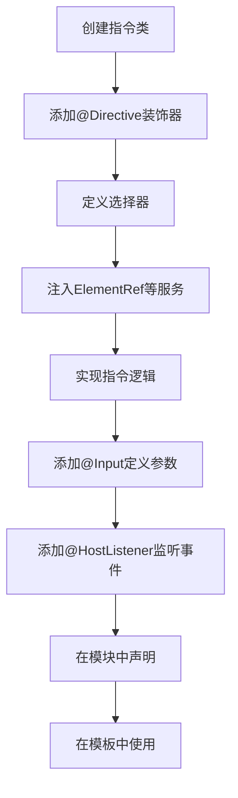

**图表文本版**:
```
创建指令类 ──> 添加@Directive装饰器 ──> 定义选择器 ──> 注入ElementRef等服务 ──> 实现指令逻辑 ──> 添加@Input定义参数 ──> 添加@HostListener监听事件 ──> 在模块中声明 ──> 在模板中使用
```

### 结构指令创建

创建自定义结构指令比属性指令更复杂，因为它需要操作DOM结构。我们需要使用`TemplateRef`和`ViewContainerRef`来操作模板视图。

下面是一个自定义`*appUnless`结构指令的示例，它的行为与`*ngIf`相反：

```typescript
// unless.directive.ts
import { Directive, Input, TemplateRef, ViewContainerRef } from '@angular/core';

@Directive({
  selector: '[appUnless]'
})
export class UnlessDirective {
  private hasView = false;

  // 设置appUnless属性时会调用此setter
  @Input() set appUnless(condition: boolean) {
    if (!condition && !this.hasView) {
      // 条件为false且视图未创建时，创建视图
      this.viewContainer.createEmbeddedView(this.templateRef);
      this.hasView = true;
    } else if (condition && this.hasView) {
      // 条件为true且视图已创建时，清除视图
      this.viewContainer.clear();
      this.hasView = false;
    }
  }
  
  constructor(
    private templateRef: TemplateRef<any>, // 引用宿主元素内的模板
    private viewContainer: ViewContainerRef // 视图容器，模板将被插入到这里
  ) {}
}
```

```typescript
// app.module.ts
import { NgModule } from '@angular/core';
import { BrowserModule } from '@angular/platform-browser';
import { AppComponent } from './app.component';
import { UnlessDirective } from './unless.directive';

@NgModule({
  declarations: [
    AppComponent,
    UnlessDirective // 声明自定义结构指令
  ],
  imports: [BrowserModule],
  bootstrap: [AppComponent]
})
export class AppModule { }
```

```typescript
// app.component.ts
@Component({
  selector: 'app-root',
  template: `
    <h2>自定义结构指令示例</h2>
    
    <button (click)="condition = !condition">
      切换条件 (当前: {{ condition ? '真' : '假' }})
    </button>
    
    <p *appUnless="condition">
      当条件为**假**时显示这段文本 (与*ngIf相反)
    </p>
    
    <p *ngIf="condition">
      当条件为**真**时显示这段文本 (常规ngIf)
    </p>
  `
})
export class AppComponent {
  condition = false;
}
```

结构指令与微语法:

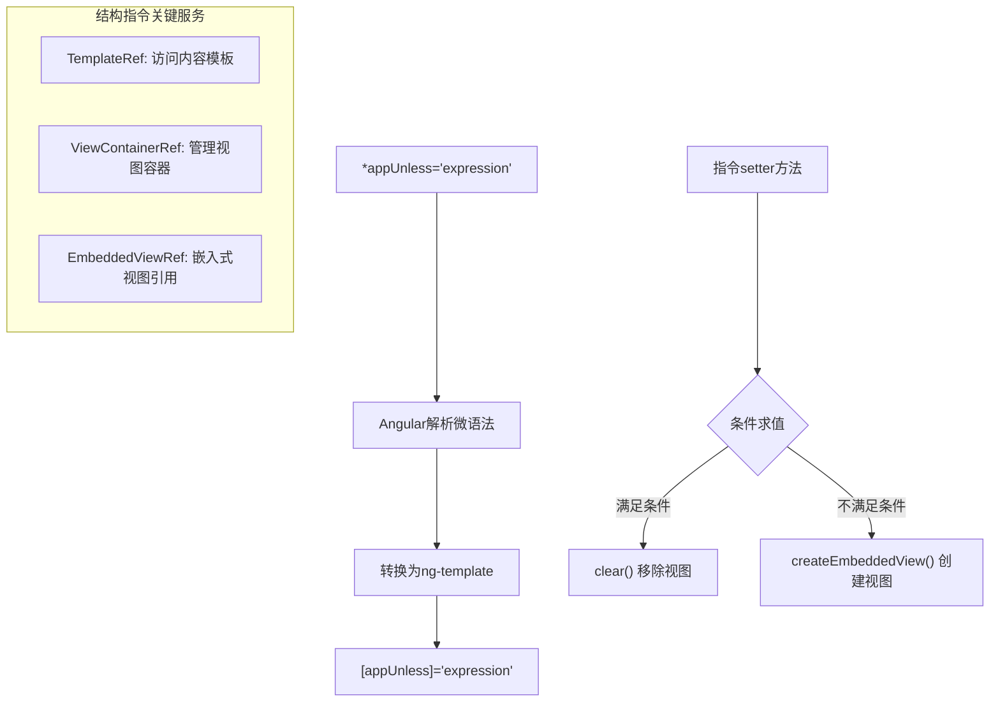

**图表文本版**:
```
*appUnless='expression' ──> Angular解析微语法 ──> 转换为ng-template ──> [appUnless]='expression'

指令setter方法 ──> 条件求值 ┬──"满足条件"──> clear() 移除视图
                           │
                           └──"不满足条件"──> createEmbeddedView() 创建视图

结构指令关键服务:
- TemplateRef: 访问内容模板
- ViewContainerRef: 管理视图容器
- EmbeddedViewRef: 嵌入式视图引用
```

**自定义结构指令最佳实践**：
- 理解微语法的展开过程
- 使用setter方法响应输入属性变化
- 谨慎管理视图的创建和销毁
- 考虑添加额外的上下文变量（类似ngFor的index等）

### 指令通信

指令可以通过多种方式与宿主元素或其他指令进行通信：

#### 1. 输入属性（@Input）

最基本的通信方式是通过输入属性传递数据：

```typescript
@Directive({
  selector: '[appTooltip]'
})
export class TooltipDirective {
  @Input() appTooltip = ''; // 工具提示内容
  @Input() tooltipColor = 'black'; // 文字颜色
  @Input() tooltipBackground = 'white'; // 背景颜色
  
  // 实现细节省略...
}
```

使用：
```html
<div [appTooltip]="'这是提示文本'" [tooltipColor]="'red'">
  鼠标悬停查看提示
</div>
```

#### 2. 宿主监听器（@HostListener）

通过`@HostListener`装饰器监听宿主元素上的事件：

```typescript
@Directive({
  selector: '[appClickOutside]'
})
export class ClickOutsideDirective {
  @Output() appClickOutside = new EventEmitter<void>();
  
  constructor(private el: ElementRef) {}
  
  @HostListener('document:click', ['$event'])
  onClick(event: MouseEvent) {
    // 检查点击是否发生在元素外部
    const clickedInside = this.el.nativeElement.contains(event.target);
    if (!clickedInside) {
      this.appClickOutside.emit();
    }
  }
}
```

使用：
```html
<div (appClickOutside)="closeDropdown()">
  下拉菜单内容
</div>
```

#### 3. 宿主绑定（@HostBinding）

通过`@HostBinding`装饰器直接绑定到宿主元素的属性：

```typescript
@Directive({
  selector: '[appDraggable]'
})
export class DraggableDirective {
  @HostBinding('class.draggable') isDraggable = true;
  @HostBinding('style.cursor') get cursor() { return this.isDragging ? 'grabbing' : 'grab'; }
  
  private isDragging = false;
  
  @HostListener('mousedown') onMouseDown() {
    this.isDragging = true;
  }
  
  @HostListener('document:mouseup') onMouseUp() {
    this.isDragging = false;
  }
  
  // 实现拖拽逻辑...
}
```

### 宿主监听器

宿主监听器是一种强大的机制，允许指令监听宿主元素上的DOM事件，并执行相应的操作。使用`@HostListener`装饰器可以轻松实现这一功能。

```typescript
@Directive({
  selector: '[appResizable]'
})
export class ResizableDirective {
  @Input() minWidth = 100;
  @Input() minHeight = 100;
  
  @HostBinding('style.width.px') width = 200;
  @HostBinding('style.height.px') height = 200;
  @HostBinding('style.position') position = 'relative';
  
  private startX = 0;
  private startY = 0;
  private startWidth = 0;
  private startHeight = 0;
  private resizing = false;
  
  constructor(private el: ElementRef, private renderer: Renderer2) {
    // 创建调整大小的手柄
    const handle = renderer.createElement('div');
    renderer.setStyle(handle, 'width', '10px');
    renderer.setStyle(handle, 'height', '10px');
    renderer.setStyle(handle, 'background', 'gray');
    renderer.setStyle(handle, 'position', 'absolute');
    renderer.setStyle(handle, 'right', '0');
    renderer.setStyle(handle, 'bottom', '0');
    renderer.setStyle(handle, 'cursor', 'se-resize');
    
    renderer.appendChild(el.nativeElement, handle);
    
    // 监听调整大小手柄上的事件
    renderer.listen(handle, 'mousedown', (event: MouseEvent) => {
      this.resizing = true;
      this.startX = event.clientX;
      this.startY = event.clientY;
      this.startWidth = this.width;
      this.startHeight = this.height;
      event.preventDefault();
    });
  }
  
  @HostListener('document:mousemove', ['$event'])
  onMouseMove(event: MouseEvent) {
    if (this.resizing) {
      const newWidth = this.startWidth + (event.clientX - this.startX);
      const newHeight = this.startHeight + (event.clientY - this.startY);
      
      this.width = Math.max(this.minWidth, newWidth);
      this.height = Math.max(this.minHeight, newHeight);
    }
  }
  
  @HostListener('document:mouseup')
  onMouseUp() {
    this.resizing = false;
  }
}
```

使用：
```html
<div appResizable [minWidth]="150" [minHeight]="150">
  可调整大小的容器
</div>
```

## 高级指令技术

### 视图容器操作

`ViewContainerRef`是Angular中用于操作视图的核心API，尤其在结构指令中广泛使用。它提供了创建、移动和销毁视图的方法。

```typescript
@Directive({
  selector: '[appDynamicContent]'
})
export class DynamicContentDirective implements OnInit {
  @Input() appDynamicContent: Type<any>; // 组件类型
  @Input() context: any; // 组件的数据上下文
  
  constructor(
    private viewContainer: ViewContainerRef,
    private componentFactoryResolver: ComponentFactoryResolver
  ) {}
  
  ngOnInit() {
    this.loadComponent();
  }
  
  loadComponent() {
    // 清除现有内容
    this.viewContainer.clear();
    
    if (this.appDynamicContent) {
      // 创建组件工厂
      const factory = this.componentFactoryResolver.resolveComponentFactory(
        this.appDynamicContent
      );
      
      // 创建组件
      const componentRef = this.viewContainer.createComponent(factory);
      
      // 设置组件输入
      if (this.context) {
        Object.assign(componentRef.instance, this.context);
      }
    }
  }
}
```

`ViewContainerRef`的主要方法：

- `clear()`: 移除所有视图
- `createComponent()`: 创建组件视图
- `createEmbeddedView()`: 从TemplateRef创建视图
- `insert()`: 在指定位置插入视图
- `detach()`: 分离视图但不销毁
- `remove()`: 移除并销毁视图
- `move()`: 移动视图到新位置

### 模板操作

在自定义结构指令中，`TemplateRef`用于引用`<ng-template>`元素中的内容，可以与`ViewContainerRef`结合使用，创建动态内容。

```typescript
@Directive({
  selector: '[appDelay]'
})
export class DelayDirective implements OnInit {
  @Input() appDelay: number; // 延迟时间（毫秒）
  
  constructor(
    private templateRef: TemplateRef<any>,
    private viewContainer: ViewContainerRef
  ) {}
  
  ngOnInit() {
    // 延迟后渲染模板
    setTimeout(() => {
      this.viewContainer.createEmbeddedView(this.templateRef);
    }, this.appDelay || 0);
  }
}
```

使用：
```html
<div *appDelay="3000">
  这个内容将在3秒后显示
</div>
```

复杂一点的例子，创建一个支持上下文的循环指令：

```typescript
@Directive({
  selector: '[appRepeat]'
})
export class RepeatDirective {
  @Input() set appRepeat(count: number) {
    this.viewContainer.clear();
    
    for (let i = 0; i < count; i++) {
      // 创建嵌入式视图并传递上下文
      this.viewContainer.createEmbeddedView(this.templateRef, {
        $implicit: `Item ${i + 1}`,
        index: i
      });
    }
  }
  
  constructor(
    private templateRef: TemplateRef<any>,
    private viewContainer: ViewContainerRef
  ) {}
}
```

使用：
```html
<div *appRepeat="5; let item; let idx = index">
  {{ idx }}: {{ item }}
</div>
```

### 指令生命周期

指令与组件共享相同的生命周期钩子，可以通过实现相应的接口来使用这些钩子：

```typescript
@Directive({
  selector: '[appLifecycle]'
})
export class LifecycleDirective implements OnInit, OnChanges, DoCheck, 
                                           AfterViewInit, OnDestroy {
  @Input() appLifecycle: string;
  
  constructor() {
    console.log('构造函数被调用');
  }
  
  ngOnChanges(changes: SimpleChanges) {
    console.log('ngOnChanges', changes);
  }
  
  ngOnInit() {
    console.log('ngOnInit');
  }
  
  ngDoCheck() {
    console.log('ngDoCheck');
  }
  
  ngAfterViewInit() {
    console.log('ngAfterViewInit');
  }
  
  ngOnDestroy() {
    console.log('ngOnDestroy - 清理操作');
  }
}
```

指令生命周期流程：

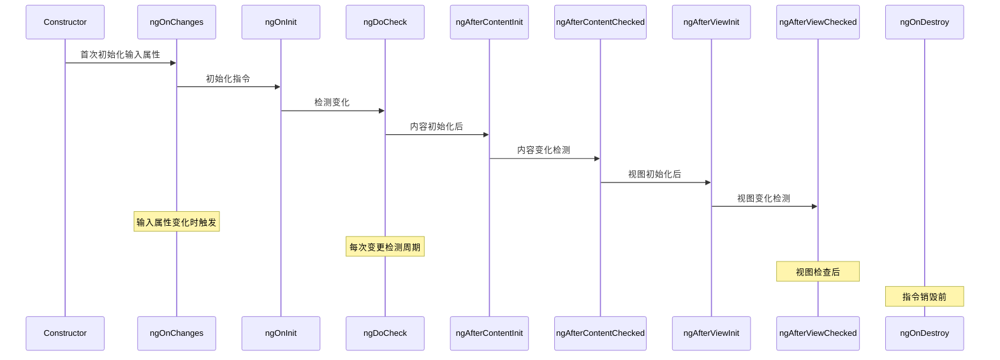

**图表文本版**:
```
Constructor → ngOnChanges(首次初始化输入属性) → ngOnInit(初始化指令) → ngDoCheck(检测变化) 
  → ngAfterContentInit(内容初始化后) → ngAfterContentChecked(内容变化检测)
  → ngAfterViewInit(视图初始化后) → ngAfterViewChecked(视图变化检测)

特殊情况:
- ngOnChanges: 输入属性变化时触发
- ngDoCheck: 每次变更检测周期执行
- ngAfterViewChecked: 视图检查后执行
- ngOnDestroy: 指令销毁前执行
```

在指令中，最常用的生命周期钩子是：

- `ngOnInit`: 初始化指令状态
- `ngOnChanges`: 响应输入属性的变化
- `ngOnDestroy`: 执行清理工作，如取消订阅observable

## 最佳实践与性能优化

### 指令命名约定

- 指令选择器使用camelCase，前缀为应用或特性简写
- 选择器应该使用方括号表示属性指令
- 导出的指令类名应以Directive结尾

```typescript
// 良好的命名
@Directive({
  selector: '[appHighlight]' // 以app前缀开始，使用方括号表示属性
})
export class HighlightDirective { } // 以Directive结尾

// 不推荐的命名
@Directive({
  selector: 'highlight' // 没有方括号，与组件选择器混淆
})
export class Highlight { } // 没有后缀
```

### 指令职责划分

遵循单一职责原则（SRP），每个指令应该只做一件事并做好：

```typescript
// 不推荐：一个指令做太多事情
@Directive({
  selector: '[appSuperDirective]'
})
export class SuperDirective {
  // 处理拖拽
  // 处理点击
  // 处理样式
  // 处理验证
  // ...太多职责
}

// 推荐：职责单一，可组合使用
@Directive({ selector: '[appDraggable]' })
export class DraggableDirective { /* 只处理拖拽 */ }

@Directive({ selector: '[appClickable]' })
export class ClickableDirective { /* 只处理点击 */ }

@Directive({ selector: '[appStyle]' })
export class StyleDirective { /* 只处理样式 */ }

@Directive({ selector: '[appValidate]' })
export class ValidateDirective { /* 只处理验证 */ }
```

使用：
```html
<!-- 通过组合多个单一职责指令实现复杂功能 -->
<div 
  appDraggable
  appClickable
  appStyle
  appValidate>
  这个元素具有多个行为，但每个行为由独立指令管理
</div>
```

### 性能优化技巧

1. **避免过度使用宿主监听器**

```typescript
// 不推荐：监听过多事件
@Directive({
  selector: '[appOverListening]'
})
export class OverListeningDirective {
  @HostListener('mouseenter') onMouseEnter() { /* ... */ }
  @HostListener('mouseleave') onMouseLeave() { /* ... */ }
  @HostListener('mousemove') onMouseMove() { /* ... */ } // 频繁触发
  @HostListener('click') onClick() { /* ... */ }
  @HostListener('dblclick') onDblClick() { /* ... */ }
  // ... 更多事件
}

// 推荐：只监听必要事件，合并处理
@Directive({
  selector: '[appOptimized]'
})
export class OptimizedDirective implements OnInit, OnDestroy {
  private eventHandler: () => void;
  
  constructor(private el: ElementRef, private renderer: Renderer2) {}
  
  ngOnInit() {
    // 合并多个事件到一个处理程序
    this.eventHandler = this.renderer.listen(
      this.el.nativeElement, 
      'mousemove', 
      this.throttle(() => this.handleMouseMove(), 16) // 约60fps
    );
  }
  
  ngOnDestroy() {
    // 清理事件监听
    if (this.eventHandler) {
      this.eventHandler();
    }
  }
  
  // 节流函数实现
  private throttle(callback: Function, limit: number): () => void {
    let waiting = false;
    return () => {
      if (!waiting) {
        callback();
        waiting = true;
        setTimeout(() => {
          waiting = false;
        }, limit);
      }
    };
  }
  
  private handleMouseMove() {
    // 处理鼠标移动...
  }
}
```

2. **使用Renderer2而非直接操作DOM**

```typescript
// 不推荐：直接操作DOM
@Directive({
  selector: '[appUnsafe]'
})
export class UnsafeDirective {
  constructor(private el: ElementRef) {
    // 直接访问DOM
    this.el.nativeElement.style.backgroundColor = 'yellow';
    this.el.nativeElement.addEventListener('click', () => {
      console.log('点击');
    });
  }
}

// 推荐：使用Renderer2
@Directive({
  selector: '[appSafe]'
})
export class SafeDirective {
  constructor(
    private el: ElementRef,
    private renderer: Renderer2
  ) {
    // 通过Renderer2间接操作DOM
    this.renderer.setStyle(
      this.el.nativeElement, 
      'backgroundColor', 
      'yellow'
    );
    
    this.renderer.listen(
      this.el.nativeElement, 
      'click', 
      () => console.log('点击')
    );
  }
}
```

3. **OnPush变更检测策略**

对于包含指令的组件，考虑使用OnPush变更检测策略：

```typescript
@Component({
  selector: 'app-directive-container',
  template: `
    <div appHighlight [color]="highlightColor">
      使用指令的内容
    </div>
    <button (click)="changeColor()">改变颜色</button>
  `,
  changeDetection: ChangeDetectionStrategy.OnPush // 使用OnPush策略
})
export class DirectiveContainerComponent {
  highlightColor = 'yellow';
  
  constructor(private cdRef: ChangeDetectorRef) {}
  
  changeColor() {
    this.highlightColor = this.getRandomColor();
    // 手动触发变更检测
    this.cdRef.markForCheck();
  }
  
  private getRandomColor(): string {
    const letters = '0123456789ABCDEF';
    let color = '#';
    for (let i = 0; i < 6; i++) {
      color += letters[Math.floor(Math.random() * 16)];
    }
    return color;
  }
}
```

4. **延迟初始化**

对于复杂逻辑，使用`NgZone.runOutsideAngular`延迟初始化：

```typescript
@Directive({
  selector: '[appHeavy]'
})
export class HeavyDirective implements OnInit {
  constructor(
    private el: ElementRef, 
    private ngZone: NgZone
  ) {}
  
  ngOnInit() {
    // 在Angular区域外执行初始化
    this.ngZone.runOutsideAngular(() => {
      // 复杂初始化逻辑，不触发变更检测
      setTimeout(() => {
        // 需要更新UI时，重新进入Angular区域
        this.ngZone.run(() => {
          // 这里的代码会触发变更检测
        });
      }, 0);
    });
  }
}
```

## 常见问题解决方案

### 1. 多个结构性指令冲突

**问题**：在同一元素上应用多个结构性指令会导致冲突，如：

```html
<!-- 错误：同一元素上使用多个结构指令 -->
<div *ngIf="isVisible" *ngFor="let item of items">
  {{ item.name }}
</div>
```

**解决方案**：使用ng-container包装结构性指令：

```html
<!-- 正确：使用ng-container嵌套结构指令 -->
<ng-container *ngIf="isVisible">
  <div *ngFor="let item of items">
    {{ item.name }}
  </div>
</ng-container>
```

### 2. 指令中处理异步操作

**问题**：在指令中需要处理异步操作，如HTTP请求或事件流。

**解决方案**：使用RxJS并妥善管理订阅：

```typescript
@Directive({
  selector: '[appAsync]'
})
export class AsyncDirective implements OnInit, OnDestroy {
  private destroy$ = new Subject<void>();
  
  constructor(
    private dataService: DataService,
    private el: ElementRef,
    private renderer: Renderer2
  ) {}
  
  ngOnInit() {
    // 使用takeUntil自动取消订阅
    this.dataService.getData()
      .pipe(
        takeUntil(this.destroy$),
        tap(data => {
          // 使用数据更新UI
          this.renderer.setProperty(
            this.el.nativeElement, 
            'textContent', 
            `数据: ${data}`
          );
        }),
        catchError(err => {
          console.error('获取数据失败', err);
          return EMPTY;
        })
      )
      .subscribe();
      
    // 处理事件流
    fromEvent(this.el.nativeElement, 'click')
      .pipe(
        takeUntil(this.destroy$),
        debounceTime(300)
      )
      .subscribe(() => console.log('点击处理'));
  }
  
  ngOnDestroy() {
    // 取消所有订阅
    this.destroy$.next();
    this.destroy$.complete();
  }
}
```

### 3. 与第三方库集成

**问题**：需要将Angular指令与第三方库（如jQuery插件）集成。

**解决方案**：使用ElementRef和Renderer2安全地操作DOM：

```typescript
@Directive({
  selector: '[appJqueryPlugin]'
})
export class JqueryPluginDirective implements AfterViewInit, OnDestroy {
  @Input() options: any = {};
  
  constructor(
    private el: ElementRef,
    private renderer: Renderer2
  ) {}
  
  ngAfterViewInit() {
    // 确保jQuery可用
    if (window['$']) {
      // 初始化jQuery插件
      window['$'](this.el.nativeElement).somePlugin(this.options);
    } else {
      console.warn('jQuery未加载，插件无法初始化');
    }
  }
  
  ngOnDestroy() {
    // 清理jQuery插件
    if (window['$']) {
      window['$'](this.el.nativeElement).somePlugin('destroy');
    }
  }
}
```

### 4. 内容动态变化时的处理

**问题**：当绑定到指令的内容动态变化时，需要重新应用指令逻辑。

**解决方案**：监听输入属性变化和使用MutationObserver：

```typescript
@Directive({
  selector: '[appContentWatch]'
})
export class ContentWatchDirective implements OnInit, OnChanges, OnDestroy {
  @Input() appContentWatch: any;
  
  private observer: MutationObserver;
  
  constructor(private el: ElementRef) {}
  
  ngOnInit() {
    // 设置MutationObserver监听DOM变化
    this.observer = new MutationObserver(mutations => {
      // 响应DOM变化
      this.applyDirectiveLogic();
    });
    
    // 配置observer
    this.observer.observe(this.el.nativeElement, {
      childList: true,
      subtree: true,
      characterData: true
    });
    
    // 初始应用逻辑
    this.applyDirectiveLogic();
  }
  
  ngOnChanges(changes: SimpleChanges) {
    // 输入属性变化时重新应用逻辑
    if (changes.appContentWatch) {
      this.applyDirectiveLogic();
    }
  }
  
  ngOnDestroy() {
    // 断开observer
    if (this.observer) {
      this.observer.disconnect();
    }
  }
  
  private applyDirectiveLogic() {
    // 指令逻辑实现
    console.log('内容已更新，重新应用指令逻辑');
    // ...
  }
}
```

## 实际应用案例

### 权限控制指令

企业应用中常见的权限控制指令，用于根据用户权限显示或隐藏UI元素：

```typescript
// has-permission.directive.ts
import { Directive, Input, OnInit, TemplateRef, ViewContainerRef } from '@angular/core';
import { AuthService } from './auth.service';

@Directive({
  selector: '[appHasPermission]'
})
export class HasPermissionDirective implements OnInit {
  @Input() appHasPermission: string[] = [];
  
  private hasView = false;
  
  constructor(
    private templateRef: TemplateRef<any>,
    private viewContainer: ViewContainerRef,
    private authService: AuthService
  ) {}
  
  ngOnInit() {
    this.updateView();
    
    // 监听权限变化（如用户切换）
    this.authService.permissionsChanged
      .subscribe(() => this.updateView());
  }
  
  private updateView() {
    this.authService.hasPermissions(this.appHasPermission)
      .subscribe(hasPermission => {
        if (hasPermission && !this.hasView) {
          this.viewContainer.createEmbeddedView(this.templateRef);
          this.hasView = true;
        } else if (!hasPermission && this.hasView) {
          this.viewContainer.clear();
          this.hasView = false;
        }
      });
  }
}
```

使用：
```html
<!-- 只有具有"ADMIN"权限的用户才能看到 -->
<button *appHasPermission="['ADMIN']">管理员操作</button>

<!-- 需要多个权限 -->
<div *appHasPermission="['EDIT_USERS', 'DELETE_USERS']">
  用户管理区域
</div>
```

### 延迟加载指令

针对大型应用，实现延迟加载组件的指令：

```typescript
// lazy-load.directive.ts
import { Directive, ElementRef, Input, OnInit, ViewContainerRef } from '@angular/core';

@Directive({
  selector: '[appLazyLoad]'
})
export class LazyLoadDirective implements OnInit {
  @Input() appLazyLoad: () => Promise<any>;
  @Input() loadingTemplate: TemplateRef<any>;
  
  private isLoaded = false;
  
  constructor(
    private el: ElementRef,
    private viewContainer: ViewContainerRef
  ) {}
  
  ngOnInit() {
    // 创建IntersectionObserver
    const observer = new IntersectionObserver(entries => {
      entries.forEach(entry => {
        // 当元素进入视口
        if (entry.isIntersecting && !this.isLoaded) {
          this.isLoaded = true;
          this.loadComponent();
          // 取消观察
          observer.unobserve(this.el.nativeElement);
        }
      });
    });
    
    // 开始观察元素
    observer.observe(this.el.nativeElement);
  }
  
  private async loadComponent() {
    // 显示加载模板
    if (this.loadingTemplate) {
      this.viewContainer.createEmbeddedView(this.loadingTemplate);
    }
    
    try {
      // 动态加载组件
      const componentModule = await this.appLazyLoad();
      
      // 获取组件
      const component = componentModule.default || componentModule;
      
      // 清除加载模板
      this.viewContainer.clear();
      
      // 创建组件
      this.viewContainer.createComponent(component);
    } catch (err) {
      console.error('加载组件失败', err);
    }
  }
}
```

使用：
```typescript
@Component({
  selector: 'app-root',
  template: `
    <!-- 当滚动到该区域时才加载重型组件 -->
    <div appLazyLoad="[loadHeavyComponent]" [loadingTemplate]="loading">
      <!-- 组件将在这里渲染 -->
    </div>
    
    <ng-template #loading>
      <div class="loading">加载中...</div>
    </ng-template>
  `
})
export class AppComponent {
  loadHeavyComponent() {
    return import('./heavy.component').then(m => m.HeavyComponent);
  }
}
```

### 表单验证指令

自定义表单验证指令示例，用于实现特定的业务验证规则：

```typescript
// password-strength.directive.ts
import { Directive } from '@angular/core';
import { AbstractControl, NG_VALIDATORS, Validator } from '@angular/forms';

@Directive({
  selector: '[appPasswordStrength]',
  providers: [
    {
      provide: NG_VALIDATORS,
      useExisting: PasswordStrengthDirective,
      multi: true
    }
  ]
})
export class PasswordStrengthDirective implements Validator {
  validate(control: AbstractControl): {[key: string]: any} | null {
    const value = control.value;
    
    if (!value) {
      return null; // 空值由required验证器处理
    }
    
    const hasUpperCase = /[A-Z]/.test(value);
    const hasLowerCase = /[a-z]/.test(value);
    const hasNumeric = /[0-9]/.test(value);
    const hasSpecial = /[!@#$%^&*(),.?":{}|<>]/.test(value);
    
    const passwordValid = hasUpperCase && hasLowerCase && 
                         hasNumeric && hasSpecial && 
                         value.length >= 8;
    
    return passwordValid ? null : {
      passwordStrength: {
        hasUpperCase,
        hasLowerCase,
        hasNumeric,
        hasSpecial,
        minLength: value.length >= 8
      }
    };
  }
}
```

使用：
```html
<form [formGroup]="form">
  <div>
    <label for="password">密码</label>
    <input 
      id="password" 
      type="password" 
      formControlName="password"
      appPasswordStrength>
      
    <div *ngIf="form.get('password').hasError('passwordStrength')">
      <p>密码必须包含：</p>
      <ul>
        <li [class.valid]="!form.get('password').errors?.passwordStrength?.hasUpperCase">
          大写字母
        </li>
        <li [class.valid]="!form.get('password').errors?.passwordStrength?.hasLowerCase">
          小写字母
        </li>
        <li [class.valid]="!form.get('password').errors?.passwordStrength?.hasNumeric">
          数字
        </li>
        <li [class.valid]="!form.get('password').errors?.passwordStrength?.hasSpecial">
          特殊字符
        </li>
        <li [class.valid]="!form.get('password').errors?.passwordStrength?.minLength">
          至少8个字符
        </li>
      </ul>
    </div>
  </div>
  
  <button [disabled]="form.invalid">提交</button>
</form>
```

## 相关资源

### 官方文档

- [Angular官方指南 - 指令](https://angular.io/guide/attribute-directives)
- [Angular API参考 - Directive](https://angular.io/api/core/Directive)
- [Angular示例 - 结构型指令](https://angular.io/guide/structural-directives)

### 工具和库

- [Angular CDK](https://material.angular.io/cdk/categories) - 提供了许多有用的指令和工具
- [ngx-permissions](https://github.com/AlexKhymenko/ngx-permissions) - 用于权限控制的指令库
- [ng-zorro-antd](https://ng.ant.design/components/overview/zh) - 包含丰富自定义指令的UI组件库

### 学习资源

- [Angular In Depth](https://indepth.dev/angular/) - 深入探讨Angular指令的高级技术
- [egghead.io Angular课程](https://egghead.io/courses/build-angular-directives)
- [Pluralsight Angular指令课程](https://www.pluralsight.com/courses/angular-directives-in-depth)

### 进阶学习

- [Angular组件与模板](./components-templates.md) - 了解组件与指令的关系
- [Angular依赖注入](./dependency-injection.md) - 学习如何在指令中使用依赖注入
- [Angular表单处理](./forms.md) - 与表单相关的指令应用