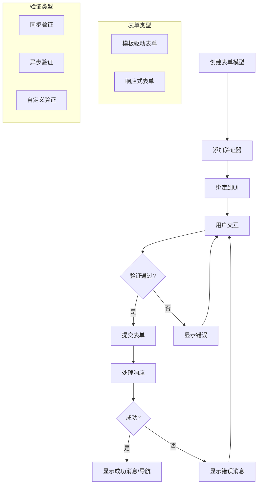

# Angular表单处理

## 目录

- [模板驱动表单](#模板驱动表单)
  - [基本用法](#基本用法)
  - [NgModel指令](#ngmodel指令)
  - [表单状态跟踪](#表单状态跟踪)
  - [嵌套表单组](#嵌套表单组)
  - [模板驱动表单的优缺点](#模板驱动表单的优缺点)
- [响应式表单](#响应式表单)
  - [核心概念](#核心概念)
  - [基本用法](#响应式表单基本用法)
  - [表单嵌套](#表单嵌套)
  - [动态表单控件](#动态表单控件)
- [表单验证](#表单验证)
- [动态表单](#动态表单)
- [复杂业务表单设计](#复杂业务表单设计)
- [表单性能优化](#表单性能优化)
- [最佳实践与常见问题](#最佳实践与常见问题)
- [表单可视化](#表单可视化)
- [总结](#总结)

## 模板驱动表单

模板驱动表单是Angular提供的一种简单直观的表单处理方式，它主要依赖于Angular的指令系统，表单控件直接绑定到数据模型。通过导入`FormsModule`，我们可以使用指令如`ngModel`、`ngForm`和`ngModelGroup`来创建和管理表单。

### 基本用法

首先需要在模块中导入`FormsModule`：

```typescript
import { NgModule } from '@angular/core';
import { BrowserModule } from '@angular/platform-browser';
import { FormsModule } from '@angular/forms';
import { AppComponent } from './app.component';

@NgModule({
  imports: [
    BrowserModule,
    FormsModule  // 导入FormsModule以使用模板驱动表单
  ],
  declarations: [AppComponent],
  bootstrap: [AppComponent]
})
export class AppModule { }
```

一个简单的模板驱动表单示例：

```typescript
import { Component } from '@angular/core';

@Component({
  selector: 'app-user-form',
  template: `
    <form #userForm="ngForm" (ngSubmit)="onSubmit(userForm.value)">
      <div>
        <label for="name">姓名</label>
        <input type="text" id="name" name="name" [(ngModel)]="user.name" required>
      </div>
      
      <div>
        <label for="email">邮箱</label>
        <input type="email" id="email" name="email" [(ngModel)]="user.email" required email>
      </div>
      
      <button type="submit" [disabled]="!userForm.valid">提交</button>
    </form>
    
    <div *ngIf="submitted">
      <h2>提交的数据：</h2>
      <p>姓名：{{ user.name }}</p>
      <p>邮箱：{{ user.email }}</p>
    </div>
  `
})
export class UserFormComponent {
  user = {
    name: '',
    email: ''
  };
  submitted = false;
  
  onSubmit(formValue: any) {
    console.log('表单提交：', formValue);
    this.submitted = true;
  }
}
```

### NgModel指令

`NgModel`指令是模板驱动表单的核心，它创建了一个`FormControl`实例来管理表单控件的状态。

```html
<!-- 单向绑定 -->
<input [ngModel]="user.name" name="name">

<!-- 单向输出事件 -->
<input [ngModel]="user.name" (ngModelChange)="user.name = $event" name="name">

<!-- 双向绑定（语法糖） -->
<input [(ngModel)]="user.name" name="name">
```

`NgModel`指令会为其所在的元素创建和管理一个`FormControl`实例，并根据输入属性值设置表单控件的初始值，同时监听控件的变化，并在发生变化时更新值。

### 表单状态跟踪

模板驱动表单自动跟踪表单状态：

```html
<form #myForm="ngForm" (ngSubmit)="onSubmit()">
  <div>
    <label for="username">用户名</label>
    <input type="text" id="username" name="username" 
           [(ngModel)]="model.username" #username="ngModel" required>
    
    <div *ngIf="username.invalid && (username.dirty || username.touched)">
      <div *ngIf="username.errors?.['required']">用户名是必填项</div>
    </div>
  </div>
  
  <div>
    <label for="password">密码</label>
    <input type="password" id="password" name="password" 
           [(ngModel)]="model.password" #password="ngModel" required minlength="6">
    
    <div *ngIf="password.invalid && (password.dirty || password.touched)">
      <div *ngIf="password.errors?.['required']">密码是必填项</div>
      <div *ngIf="password.errors?.['minlength']">密码必须至少6个字符</div>
    </div>
  </div>
  
  <button type="submit" [disabled]="myForm.invalid">登录</button>
  
  <!-- 表单状态指示器 -->
  <div>
    <p>表单有效性: {{ myForm.valid }}</p>
    <p>表单已提交: {{ myForm.submitted }}</p>
    <p>表单是否有修改: {{ myForm.dirty }}</p>
    <p>表单是否被访问: {{ myForm.touched }}</p>
  </div>
</form>
```

### 嵌套表单组

使用`ngModelGroup`指令可以创建嵌套的表单组：

```html
<form #profileForm="ngForm" (ngSubmit)="onSubmit()">
  <div ngModelGroup="personalInfo" #personalInfo="ngModelGroup">
    <h2>个人信息</h2>
    <div>
      <label for="firstName">名</label>
      <input type="text" id="firstName" name="firstName" [(ngModel)]="profile.personalInfo.firstName" required>
    </div>
    <div>
      <label for="lastName">姓</label>
      <input type="text" id="lastName" name="lastName" [(ngModel)]="profile.personalInfo.lastName" required>
    </div>
    
    <!-- 显示组验证状态 -->
    <div *ngIf="personalInfo.invalid && (personalInfo.dirty || personalInfo.touched)">
      请完成所有必填字段
    </div>
  </div>
  
  <div ngModelGroup="contactInfo">
    <h2>联系方式</h2>
    <div>
      <label for="email">电子邮箱</label>
      <input type="email" id="email" name="email" [(ngModel)]="profile.contactInfo.email" required email>
    </div>
    <div>
      <label for="phone">电话</label>
      <input type="tel" id="phone" name="phone" [(ngModel)]="profile.contactInfo.phone">
    </div>
  </div>
  
  <button type="submit" [disabled]="!profileForm.valid">提交</button>
</form>
```

相应的组件代码：

```typescript
@Component({
  selector: 'app-profile-editor',
  templateUrl: './profile-editor.component.html'
})
export class ProfileEditorComponent {
  // 嵌套结构的数据模型
  profile = {
    personalInfo: {
      firstName: '',
      lastName: ''
    },
    contactInfo: {
      email: '',
      phone: ''
    }
  };
  
  onSubmit() {
    console.log('提交的配置文件：', this.profile);
  }
}
```

### 模板驱动表单的优缺点

**优点：**
- 简单易用，适合小型表单
- 减少了编写代码的量
- 自动跟踪表单状态
- 直观的双向数据绑定

**缺点：**
- 对于复杂表单场景，结构不够清晰
- 难以进行单元测试
- 在模板中处理验证逻辑，可能导致模板过于复杂
- 对于动态表单不够灵活

## 响应式表单

响应式表单提供了一种显式的、基于模型驱动的方法来处理表单输入，它更适合处理复杂的表单场景。响应式表单使用一个显式的、可不变的方法来管理表单在特定时间点的状态。

### 核心概念

响应式表单基于几个关键类：

1. **FormControl**：管理单个表单控件的值和验证状态。
2. **FormGroup**：管理一组FormControl的集合，跟踪其子控件的状态。
3. **FormArray**：管理FormControl、FormGroup或其他FormArray实例的动态列表，可以动态添加和删除控件。
4. **FormBuilder**：提供了便捷的方法来创建表单控件实例。

首先需要在模块中导入`ReactiveFormsModule`：

```typescript
import { NgModule } from '@angular/core';
import { BrowserModule } from '@angular/platform-browser';
import { ReactiveFormsModule } from '@angular/forms';
import { AppComponent } from './app.component';

@NgModule({
  imports: [
    BrowserModule,
    ReactiveFormsModule  // 导入ReactiveFormsModule以使用响应式表单
  ],
  declarations: [AppComponent],
  bootstrap: [AppComponent]
})
export class AppModule { }
```

### 响应式表单基本用法

创建一个简单的响应式表单：

```typescript
import { Component, OnInit } from '@angular/core';
import { FormBuilder, FormGroup, Validators } from '@angular/forms';

@Component({
  selector: 'app-reactive-form',
  template: `
    <form [formGroup]="loginForm" (ngSubmit)="onSubmit()">
      <div>
        <label for="username">用户名</label>
        <input type="text" id="username" formControlName="username">
        
        <div *ngIf="username.invalid && (username.dirty || username.touched)">
          <div *ngIf="username.errors?.['required']">用户名是必填项</div>
        </div>
      </div>
      
      <div>
        <label for="password">密码</label>
        <input type="password" id="password" formControlName="password">
        
        <div *ngIf="password.invalid && (password.dirty || password.touched)">
          <div *ngIf="password.errors?.['required']">密码是必填项</div>
          <div *ngIf="password.errors?.['minlength']">密码必须至少6个字符</div>
        </div>
      </div>
      
      <button type="submit" [disabled]="loginForm.invalid">登录</button>
    </form>
  `
})
export class ReactiveFormComponent implements OnInit {
  loginForm!: FormGroup;
  
  constructor(private fb: FormBuilder) { }
  
  ngOnInit() {
    this.loginForm = this.fb.group({
      username: ['', Validators.required],
      password: ['', [Validators.required, Validators.minLength(6)]]
    });
  }
  
  // 便捷的访问器属性
  get username() { return this.loginForm.get('username')!; }
  get password() { return this.loginForm.get('password')!; }
  
  onSubmit() {
    if (this.loginForm.valid) {
      console.log('表单提交：', this.loginForm.value);
    }
  }
}
```

### 表单嵌套

响应式表单可以轻松创建嵌套的表单结构：

```typescript
import { Component, OnInit } from '@angular/core';
import { FormBuilder, FormGroup, Validators } from '@angular/forms';

@Component({
  selector: 'app-nested-form',
  template: `
    <form [formGroup]="userForm" (ngSubmit)="onSubmit()">
      <div formGroupName="personalInfo">
        <h3>个人信息</h3>
        <div>
          <label for="firstName">名</label>
          <input type="text" id="firstName" formControlName="firstName">
          
          <div *ngIf="personalInfo.get('firstName')?.invalid && 
                     (personalInfo.get('firstName')?.dirty || personalInfo.get('firstName')?.touched)">
            <div *ngIf="personalInfo.get('firstName')?.errors?.['required']">名字是必填项</div>
          </div>
        </div>
        
        <div>
          <label for="lastName">姓</label>
          <input type="text" id="lastName" formControlName="lastName">
          
          <div *ngIf="personalInfo.get('lastName')?.invalid && 
                     (personalInfo.get('lastName')?.dirty || personalInfo.get('lastName')?.touched)">
            <div *ngIf="personalInfo.get('lastName')?.errors?.['required']">姓氏是必填项</div>
          </div>
        </div>
      </div>
      
      <div formGroupName="contactInfo">
        <h3>联系方式</h3>
        <div>
          <label for="email">邮箱</label>
          <input type="email" id="email" formControlName="email">
          
          <div *ngIf="contactInfo.get('email')?.invalid && 
                     (contactInfo.get('email')?.dirty || contactInfo.get('email')?.touched)">
            <div *ngIf="contactInfo.get('email')?.errors?.['required']">邮箱是必填项</div>
            <div *ngIf="contactInfo.get('email')?.errors?.['email']">请输入有效的邮箱地址</div>
          </div>
        </div>
        
        <div>
          <label for="phone">电话</label>
          <input type="tel" id="phone" formControlName="phone">
        </div>
      </div>
      
      <button type="submit" [disabled]="userForm.invalid">提交</button>
    </form>
  `
})
export class NestedFormComponent implements OnInit {
  userForm!: FormGroup;
  
  constructor(private fb: FormBuilder) { }
  
  ngOnInit() {
    this.userForm = this.fb.group({
      personalInfo: this.fb.group({
        firstName: ['', Validators.required],
        lastName: ['', Validators.required]
      }),
      contactInfo: this.fb.group({
        email: ['', [Validators.required, Validators.email]],
        phone: ['']
      })
    });
  }
  
  // 便捷的访问器属性
  get personalInfo() { return this.userForm.get('personalInfo')! as FormGroup; }
  get contactInfo() { return this.userForm.get('contactInfo')! as FormGroup; }
  
  onSubmit() {
    if (this.userForm.valid) {
      console.log('表单提交：', this.userForm.value);
    }
  }
}
```

### 动态表单控件

使用`FormArray`可以动态添加和删除表单控件：

```typescript
import { Component, OnInit } from '@angular/core';
import { FormBuilder, FormGroup, FormArray, Validators } from '@angular/forms';

@Component({
  selector: 'app-dynamic-form-controls',
  template: `
    <form [formGroup]="productForm" (ngSubmit)="onSubmit()">
      <div>
        <label for="name">产品名称</label>
        <input id="name" type="text" formControlName="name">
      </div>
      
      <div>
        <label for="description">产品描述</label>
        <textarea id="description" formControlName="description"></textarea>
      </div>
      
      <div>
        <h3>产品规格 <button type="button" (click)="addSpec()">添加规格</button></h3>
        
        <div formArrayName="specifications">
          <div *ngFor="let spec of specifications.controls; let i = index">
            <div [formGroupName]="i">
              <input placeholder="规格名称" formControlName="name">
              <input placeholder="规格值" formControlName="value">
              <button type="button" (click)="removeSpec(i)">删除</button>
            </div>
          </div>
        </div>
      </div>
      
      <button type="submit" [disabled]="productForm.invalid">保存产品</button>
    </form>
    
    <div *ngIf="submitted">
      <h2>保存的产品</h2>
      <pre>{{ productForm.value | json }}</pre>
    </div>
  `
})
export class DynamicFormControlsComponent implements OnInit {
  productForm!: FormGroup;
  submitted = false;
  
  constructor(private fb: FormBuilder) { }
  
  ngOnInit() {
    this.productForm = this.fb.group({
      name: ['', Validators.required],
      description: [''],
      specifications: this.fb.array([])
    });
    
    // 初始添加一个空规格
    this.addSpec();
  }
  
  get specifications() {
    return this.productForm.get('specifications') as FormArray;
  }
  
  addSpec() {
    const specGroup = this.fb.group({
      name: ['', Validators.required],
      value: ['', Validators.required]
    });
    
    this.specifications.push(specGroup);
  }
  
  removeSpec(index: number) {
    this.specifications.removeAt(index);
  }
  
  onSubmit() {
    if (this.productForm.valid) {
      console.log('产品表单提交：', this.productForm.value);
      this.submitted = true;
    } else {
      // 标记所有控件为已触摸，触发验证显示
      this.markFormGroupTouched(this.productForm);
    }
  }
  
  // 递归标记所有控件为已触摸
  markFormGroupTouched(formGroup: FormGroup | FormArray) {
    Object.keys(formGroup.controls).forEach(key => {
      const control = formGroup.get(key);
      
      if (control instanceof FormGroup || control instanceof FormArray) {
        this.markFormGroupTouched(control);
      } else {
        control?.markAsTouched();
      }
    });
  }
}
```

## 表单验证

Angular提供了强大的表单验证机制，支持内置验证器和自定义验证器，适用于模板驱动表单和响应式表单。

### 内置验证器

Angular提供了一系列内置验证器：

| 验证器 | 描述 |
| --- | --- |
| `required` | 要求字段非空 |
| `minlength` | 要求字段的最小字符长度 |
| `maxlength` | 限制字段的最大字符长度 |
| `pattern` | 要求字段匹配正则表达式 |
| `email` | 验证电子邮件格式 |
| `min` | 验证数值的最小值 |
| `max` | 验证数值的最大值 |

### 响应式表单中的验证

在响应式表单中，验证器直接添加到FormControl定义中：

```typescript
import { Component } from '@angular/core';
import { FormBuilder, Validators, FormGroup } from '@angular/forms';

@Component({
  selector: 'app-validation-form',
  template: `
    <form [formGroup]="registerForm" (ngSubmit)="onSubmit()">
      <div>
        <label for="username">用户名</label>
        <input id="username" formControlName="username">
        <div *ngIf="username.invalid && (username.dirty || username.touched)">
          <div *ngIf="username.errors?.['required']">用户名是必填项</div>
          <div *ngIf="username.errors?.['minlength']">用户名至少需要4个字符</div>
          <div *ngIf="username.errors?.['pattern']">用户名只能包含字母、数字和下划线</div>
        </div>
      </div>
      
      <div>
        <label for="email">邮箱</label>
        <input id="email" type="email" formControlName="email">
        <div *ngIf="email.invalid && (email.dirty || email.touched)">
          <div *ngIf="email.errors?.['required']">邮箱是必填项</div>
          <div *ngIf="email.errors?.['email']">请输入有效的邮箱地址</div>
        </div>
      </div>
      
      <div>
        <label for="password">密码</label>
        <input id="password" type="password" formControlName="password">
        <div *ngIf="password.invalid && (password.dirty || password.touched)">
          <div *ngIf="password.errors?.['required']">密码是必填项</div>
          <div *ngIf="password.errors?.['minlength']">密码至少需要8个字符</div>
          <div *ngIf="password.errors?.['pattern']">
            密码需要包含至少一个大写字母、一个小写字母、一个数字和一个特殊字符
          </div>
        </div>
      </div>
      
      <div>
        <label for="confirmPassword">确认密码</label>
        <input id="confirmPassword" type="password" formControlName="confirmPassword">
        <div *ngIf="confirmPassword.invalid && (confirmPassword.dirty || confirmPassword.touched)">
          <div *ngIf="confirmPassword.errors?.['required']">请确认密码</div>
          <div *ngIf="confirmPassword.errors?.['passwordMismatch']">两次输入的密码不匹配</div>
        </div>
      </div>
      
      <button type="submit" [disabled]="registerForm.invalid">注册</button>
    </form>
  `
})
export class ValidationFormComponent {
  registerForm: FormGroup;
  
  constructor(private fb: FormBuilder) {
    this.registerForm = this.fb.group({
      username: ['', [
        Validators.required,
        Validators.minLength(4),
        Validators.pattern(/^[a-zA-Z0-9_]+$/)
      ]],
      email: ['', [
        Validators.required,
        Validators.email
      ]],
      password: ['', [
        Validators.required,
        Validators.minLength(8),
        Validators.pattern(/^(?=.*[a-z])(?=.*[A-Z])(?=.*\d)(?=.*[@$!%*?&])[A-Za-z\d@$!%*?&]+$/)
      ]],
      confirmPassword: ['', Validators.required]
    }, {
      validators: this.passwordMatchValidator
    });
  }
  
  get username() { return this.registerForm.get('username')!; }
  get email() { return this.registerForm.get('email')!; }
  get password() { return this.registerForm.get('password')!; }
  get confirmPassword() { return this.registerForm.get('confirmPassword')!; }
  
  // 自定义表单组验证器
  passwordMatchValidator(form: FormGroup) {
    const password = form.get('password')?.value;
    const confirmPassword = form.get('confirmPassword')?.value;
    
    if (password !== confirmPassword) {
      form.get('confirmPassword')?.setErrors({ passwordMismatch: true });
      return { passwordMismatch: true };
    }
    
    return null;
  }
  
  onSubmit() {
    if (this.registerForm.valid) {
      console.log('注册数据:', this.registerForm.value);
    }
  }
}
```

### 自定义验证器

创建自定义验证器以满足特定业务需求：

```typescript
import { AbstractControl, ValidationErrors, ValidatorFn } from '@angular/forms';

// 单一控件验证器
export function forbiddenNameValidator(forbiddenName: RegExp): ValidatorFn {
  return (control: AbstractControl): ValidationErrors | null => {
    const forbidden = forbiddenName.test(control.value);
    return forbidden ? { forbiddenName: { value: control.value } } : null;
  };
}

// 异步验证器示例 - 用户名可用性检查
export function usernameAvailabilityValidator(userService: UserService): AsyncValidatorFn {
  return (control: AbstractControl): Observable<ValidationErrors | null> => {
    return userService.checkUsernameAvailability(control.value).pipe(
      map(isAvailable => isAvailable ? null : { usernameExists: true }),
      catchError(() => of({ serverError: true })),
      // 防止用户每敲一个键就发送请求
      debounceTime(300)
    );
  };
}

// 表单组验证器
export function dateRangeValidator(): ValidatorFn {
  return (formGroup: AbstractControl): ValidationErrors | null => {
    const startDate = formGroup.get('startDate')?.value;
    const endDate = formGroup.get('endDate')?.value;
    
    if (startDate && endDate && new Date(startDate) > new Date(endDate)) {
      // 将错误设置到特定控件上
      formGroup.get('endDate')?.setErrors({ dateRange: true });
      // 同时返回表单组级别的错误
      return { dateRange: true };
    }
    
    // 清除特定控件上的此类错误
    const endDateControl = formGroup.get('endDate');
    if (endDateControl?.errors) {
      const errors = { ...endDateControl.errors };
      delete errors['dateRange'];
      
      if (Object.keys(errors).length === 0) {
        endDateControl.setErrors(null);
      } else {
        endDateControl.setErrors(errors);
      }
    }
    
    return null;
  };
}
```

使用自定义验证器：

```typescript
this.dateRangeForm = this.fb.group({
  startDate: ['', Validators.required],
  endDate: ['', Validators.required]
}, {
  validators: dateRangeValidator()
});

this.registerForm = this.fb.group({
  username: [
    '', 
    [
      Validators.required, 
      forbiddenNameValidator(/admin/i) // 禁止使用'admin'作为用户名
    ],
    [
      usernameAvailabilityValidator(this.userService) // 异步检查用户名是否已存在
    ]
  ],
  // ...其他控件
});
```

### 模板驱动表单中的验证

在模板驱动表单中，验证器作为指令应用到表单控件：

```html
<form #registrationForm="ngForm" (ngSubmit)="onSubmit(registrationForm)">
  <div>
    <label for="username">用户名</label>
    <input 
      type="text" 
      id="username" 
      name="username" 
      [(ngModel)]="user.username" 
      #username="ngModel"
      required 
      minlength="4" 
      pattern="^[a-zA-Z0-9_]+$"
      [appForbiddenName]="'admin'"> <!-- 自定义验证器指令 -->
    
    <div *ngIf="username.invalid && (username.dirty || username.touched)">
      <div *ngIf="username.errors?.['required']">用户名是必填项</div>
      <div *ngIf="username.errors?.['minlength']">用户名至少需要4个字符</div>
      <div *ngIf="username.errors?.['pattern']">用户名只能包含字母、数字和下划线</div>
      <div *ngIf="username.errors?.['forbiddenName']">此用户名不允许使用</div>
    </div>
  </div>
  
  <!-- 其他表单字段 -->
  
  <button type="submit" [disabled]="registrationForm.invalid">注册</button>
</form>
```

对应的自定义验证器指令实现：

```typescript
import { Directive, Input } from '@angular/core';
import { AbstractControl, NG_VALIDATORS, Validator, ValidatorFn } from '@angular/forms';

// 验证器函数
export function forbiddenNameValidator(nameRe: string | RegExp): ValidatorFn {
  return (control: AbstractControl): {[key: string]: any} | null => {
    const forbidden = typeof nameRe === 'string' 
      ? new RegExp(nameRe, 'i').test(control.value)
      : nameRe.test(control.value);
    return forbidden ? { forbiddenName: { value: control.value } } : null;
  };
}

// 验证器指令
@Directive({
  selector: '[appForbiddenName]',
  providers: [
    { 
      provide: NG_VALIDATORS, 
      useExisting: ForbiddenNameDirective, 
      multi: true 
    }
  ]
})
export class ForbiddenNameDirective implements Validator {
  @Input('appForbiddenName') forbiddenName: string | RegExp = '';
  
  validate(control: AbstractControl): {[key: string]: any} | null {
    return this.forbiddenName 
      ? forbiddenNameValidator(this.forbiddenName)(control)
      : null;
  }
}
```

### 错误处理与展示

建立统一的错误处理组件，改进用户体验：

```typescript
// error-message.component.ts
import { Component, Input } from '@angular/core';
import { AbstractControl } from '@angular/forms';

@Component({
  selector: 'app-error-message',
  template: `
    <div *ngIf="control && control.invalid && (control.dirty || control.touched)" class="error-container">
      <div *ngFor="let error of errorMessages" class="error-message">
        {{ error }}
      </div>
    </div>
  `,
  styles: [`
    .error-container {
      color: #d9534f;
      margin-top: 5px;
      font-size: 0.9em;
    }
    .error-message {
      margin-bottom: 3px;
    }
  `]
})
export class ErrorMessageComponent {
  @Input() control!: AbstractControl | null;
  @Input() errorMessages: {[key: string]: string} = {};
  
  get errorMessage(): string[] {
    if (!this.control || !this.control.errors || !(this.control.dirty || this.control.touched)) {
      return [];
    }
    
    return Object.keys(this.control.errors)
      .filter(key => this.errorMessages[key])
      .map(key => this.errorMessages[key]);
  }
}
```

使用错误消息组件：

```html
<div>
  <label for="email">邮箱</label>
  <input id="email" type="email" formControlName="email">
  <app-error-message 
    [control]="email" 
    [errorMessages]="{
      required: '邮箱是必填项',
      email: '请输入有效的邮箱地址'
    }">
  </app-error-message>
</div>
```

## 动态表单

动态表单是指可以根据配置、后端数据或用户交互动态生成的表单。这种表单允许我们创建灵活和可配置的表单系统，适用于复杂的企业应用场景。

### 基于配置的动态表单

创建一个基于配置生成表单的系统：

```typescript
// 定义表单控件配置接口
interface FormControlConfig {
  type: 'input' | 'select' | 'textarea' | 'checkbox' | 'radio' | 'date';
  name: string;
  label: string;
  value?: any;
  required?: boolean;
  validators?: any[];
  options?: {label: string, value: any}[]; // 用于select、radio等
  errorMessages?: {[key: string]: string};
  placeholder?: string;
  disabled?: boolean;
  order?: number;
}

// 动态表单组件
@Component({
  selector: 'app-dynamic-form',
  template: `
    <form [formGroup]="form" (ngSubmit)="onSubmit()">
      <div *ngFor="let control of sortedControlConfigs">
        <div [ngSwitch]="control.type">
          <!-- 文本输入 -->
          <div *ngSwitchCase="'input'">
            <label [for]="control.name">{{control.label}}</label>
            <input 
              [type]="control.inputType || 'text'" 
              [id]="control.name" 
              [formControlName]="control.name"
              [placeholder]="control.placeholder || ''"
            >
          </div>
          
          <!-- 下拉选择 -->
          <div *ngSwitchCase="'select'">
            <label [for]="control.name">{{control.label}}</label>
            <select [id]="control.name" [formControlName]="control.name">
              <option value="">请选择</option>
              <option *ngFor="let opt of control.options" [value]="opt.value">
                {{opt.label}}
              </option>
            </select>
          </div>
          
          <!-- 文本域 -->
          <div *ngSwitchCase="'textarea'">
            <label [for]="control.name">{{control.label}}</label>
            <textarea 
              [id]="control.name" 
              [formControlName]="control.name"
              [placeholder]="control.placeholder || ''"
              rows="4"
            ></textarea>
          </div>
          
          <!-- 添加更多控件类型... -->
        </div>
        
        <!-- 错误信息 -->
        <app-error-message 
          [control]="form.get(control.name)" 
          [errorMessages]="control.errorMessages || {}">
        </app-error-message>
      </div>
      
      <button type="submit" [disabled]="form.invalid">提交</button>
    </form>
  `
})
export class DynamicFormComponent implements OnInit {
  @Input() formConfig: FormControlConfig[] = [];
  form!: FormGroup;
  
  constructor(private fb: FormBuilder) {}
  
  ngOnInit() {
    this.createForm();
  }
  
  // 根据配置创建表单
  createForm() {
    const formGroupConfig: {[key: string]: any} = {};
    
    this.formConfig.forEach(config => {
      formGroupConfig[config.name] = [
        { value: config.value || '', disabled: config.disabled },
        config.validators || []
      ];
    });
    
    this.form = this.fb.group(formGroupConfig);
  }
  
  // 获取已排序的控件配置
  get sortedControlConfigs(): FormControlConfig[] {
    return [...this.formConfig].sort((a, b) => (a.order || 0) - (b.order || 0));
  }
  
  // 表单提交
  onSubmit() {
    if (this.form.valid) {
      // 发出表单值
      this.formSubmitted.emit(this.form.value);
    }
  }
  
  // 表单提交事件
  @Output() formSubmitted = new EventEmitter<any>();
}
```

使用动态表单组件：

```typescript
// 在父组件中
@Component({
  selector: 'app-user-registration',
  template: `
    <h2>用户注册</h2>
    <app-dynamic-form 
      [formConfig]="userFormConfig"
      (formSubmitted)="handleFormSubmit($event)">
    </app-dynamic-form>
  `
})
export class UserRegistrationComponent {
  userFormConfig: FormControlConfig[] = [
    {
      type: 'input',
      name: 'username',
      label: '用户名',
      required: true,
      validators: [Validators.required, Validators.minLength(4)],
      errorMessages: {
        required: '请输入用户名',
        minlength: '用户名至少需要4个字符'
      },
      order: 1
    },
    {
      type: 'input',
      name: 'email',
      label: '邮箱',
      required: true,
      validators: [Validators.required, Validators.email],
      errorMessages: {
        required: '请输入邮箱',
        email: '请输入有效的邮箱地址'
      },
      order: 2
    },
    {
      type: 'select',
      name: 'role',
      label: '用户角色',
      options: [
        { label: '管理员', value: 'admin' },
        { label: '编辑', value: 'editor' },
        { label: '普通用户', value: 'user' }
      ],
      validators: [Validators.required],
      errorMessages: {
        required: '请选择用户角色'
      },
      order: 3
    },
    // 更多表单控件...
  ];
  
  handleFormSubmit(formData: any) {
    console.log('用户表单数据:', formData);
    // 处理表单提交逻辑
  }
}
```

## 复杂业务表单设计

企业级应用通常需要处理复杂的业务表单，包括多步骤表单、条件性字段、嵌套数据结构等。本节将介绍如何设计和实现这些复杂表单场景。

### 多步骤表单

多步骤表单将复杂表单分成多个步骤，提高用户体验：

```typescript
import { Component, OnInit } from '@angular/core';
import { FormBuilder, FormGroup, Validators } from '@angular/forms';

@Component({
  selector: 'app-multi-step-form',
  template: `
    <div class="stepper">
      <div class="step" 
        *ngFor="let step of steps; let i = index"
        [class.active]="currentStep === i"
        [class.completed]="currentStep > i"
        (click)="canNavigateToStep(i) && goToStep(i)">
        <div class="step-number">{{ i + 1 }}</div>
        <div class="step-title">{{ step.title }}</div>
      </div>
    </div>
    
    <form [formGroup]="registrationForm">
      <!-- 步骤1：个人信息 -->
      <div *ngIf="currentStep === 0">
        <h3>个人信息</h3>
        <div formGroupName="personalInfo">
          <div>
            <label for="firstName">名</label>
            <input id="firstName" formControlName="firstName">
            <div *ngIf="personalInfo.get('firstName')?.invalid && personalInfo.get('firstName')?.touched">
              请输入您的名字
            </div>
          </div>
          
          <div>
            <label for="lastName">姓</label>
            <input id="lastName" formControlName="lastName">
            <div *ngIf="personalInfo.get('lastName')?.invalid && personalInfo.get('lastName')?.touched">
              请输入您的姓氏
            </div>
          </div>
          
          <div>
            <label for="birthDate">出生日期</label>
            <input id="birthDate" type="date" formControlName="birthDate">
          </div>
        </div>
        
        <div class="buttons">
          <button type="button" (click)="nextStep()" [disabled]="personalInfo.invalid">下一步</button>
        </div>
      </div>
      
      <!-- 步骤2：联系方式 -->
      <div *ngIf="currentStep === 1">
        <h3>联系方式</h3>
        <div formGroupName="contactInfo">
          <div>
            <label for="email">邮箱</label>
            <input id="email" type="email" formControlName="email">
            <div *ngIf="contactInfo.get('email')?.invalid && contactInfo.get('email')?.touched">
              <span *ngIf="contactInfo.get('email')?.errors?.['required']">请输入邮箱</span>
              <span *ngIf="contactInfo.get('email')?.errors?.['email']">请输入有效的邮箱地址</span>
            </div>
          </div>
          
          <div>
            <label for="phone">电话</label>
            <input id="phone" formControlName="phone">
            <div *ngIf="contactInfo.get('phone')?.invalid && contactInfo.get('phone')?.touched">
              请输入有效的电话号码
            </div>
          </div>
          
          <div>
            <label for="address">地址</label>
            <textarea id="address" formControlName="address"></textarea>
          </div>
        </div>
        
        <div class="buttons">
          <button type="button" (click)="previousStep()">上一步</button>
          <button type="button" (click)="nextStep()" [disabled]="contactInfo.invalid">下一步</button>
        </div>
      </div>
      
      <!-- 步骤3：账号设置 -->
      <div *ngIf="currentStep === 2">
        <h3>账号设置</h3>
        <div formGroupName="accountSetup">
          <div>
            <label for="username">用户名</label>
            <input id="username" formControlName="username">
            <div *ngIf="accountSetup.get('username')?.invalid && accountSetup.get('username')?.touched">
              用户名至少需要4个字符
            </div>
          </div>
          
          <div>
            <label for="password">密码</label>
            <input id="password" type="password" formControlName="password">
            <div *ngIf="accountSetup.get('password')?.invalid && accountSetup.get('password')?.touched">
              密码至少需要8个字符
            </div>
          </div>
          
          <div>
            <label for="confirmPassword">确认密码</label>
            <input id="confirmPassword" type="password" formControlName="confirmPassword">
            <div *ngIf="accountSetup.get('confirmPassword')?.invalid && accountSetup.get('confirmPassword')?.touched">
              <span *ngIf="accountSetup.get('confirmPassword')?.errors?.['required']">请确认密码</span>
              <span *ngIf="accountSetup.get('confirmPassword')?.errors?.['passwordMismatch']">
                两次输入的密码不匹配
              </span>
            </div>
          </div>
        </div>
        
        <div class="buttons">
          <button type="button" (click)="previousStep()">上一步</button>
          <button type="button" (click)="submit()" [disabled]="registrationForm.invalid">提交</button>
        </div>
      </div>
      
      <!-- 摘要步骤（可选）- 在提交前显示所有信息 -->
      <div *ngIf="currentStep === 3">
        <h3>确认信息</h3>
        <div class="summary">
          <h4>个人信息</h4>
          <p>姓名: {{ registrationForm.get('personalInfo.firstName')?.value }} {{ registrationForm.get('personalInfo.lastName')?.value }}</p>
          <p>出生日期: {{ registrationForm.get('personalInfo.birthDate')?.value | date }}</p>
          
          <h4>联系方式</h4>
          <p>邮箱: {{ registrationForm.get('contactInfo.email')?.value }}</p>
          <p>电话: {{ registrationForm.get('contactInfo.phone')?.value }}</p>
          <p>地址: {{ registrationForm.get('contactInfo.address')?.value }}</p>
          
          <h4>账号设置</h4>
          <p>用户名: {{ registrationForm.get('accountSetup.username')?.value }}</p>
        </div>
        
        <div class="buttons">
          <button type="button" (click)="previousStep()">上一步</button>
          <button type="button" (click)="finalSubmit()">确认提交</button>
        </div>
      </div>
    </form>
    
    <!-- 提交成功后显示 -->
    <div *ngIf="submitted" class="success-message">
      <h3>注册成功！</h3>
      <p>您的账号已创建成功，请查收激活邮件。</p>
    </div>
  `,
  styles: [`
    .stepper {
      display: flex;
      margin-bottom: 20px;
    }
    .step {
      display: flex;
      align-items: center;
      margin-right: 10px;
      padding: 5px 10px;
      cursor: pointer;
    }
    .step.active {
      font-weight: bold;
      color: #007bff;
    }
    .step.completed {
      color: #28a745;
    }
    .step-number {
      width: 24px;
      height: 24px;
      border-radius: 50%;
      background-color: #e9ecef;
      display: flex;
      align-items: center;
      justify-content: center;
      margin-right: 8px;
    }
    .active .step-number {
      background-color: #007bff;
      color: white;
    }
    .completed .step-number {
      background-color: #28a745;
      color: white;
    }
    .buttons {
      margin-top: 20px;
      display: flex;
      justify-content: space-between;
    }
    .success-message {
      margin-top: 20px;
      padding: 15px;
      background-color: #d4edda;
      border: 1px solid #c3e6cb;
      border-radius: 4px;
      color: #155724;
    }
  `]
})
export class MultiStepFormComponent implements OnInit {
  registrationForm!: FormGroup;
  currentStep = 0;
  submitted = false;
  
  steps = [
    { title: '个人信息', formGroup: 'personalInfo' },
    { title: '联系方式', formGroup: 'contactInfo' },
    { title: '账号设置', formGroup: 'accountSetup' },
    { title: '确认信息' }
  ];
  
  constructor(private fb: FormBuilder) {}
  
  ngOnInit() {
    this.registrationForm = this.fb.group({
      personalInfo: this.fb.group({
        firstName: ['', Validators.required],
        lastName: ['', Validators.required],
        birthDate: ['']
      }),
      contactInfo: this.fb.group({
        email: ['', [Validators.required, Validators.email]],
        phone: ['', [Validators.required, Validators.pattern(/^\d{11}$/)]],
        address: ['']
      }),
      accountSetup: this.fb.group({
        username: ['', [Validators.required, Validators.minLength(4)]],
        password: ['', [Validators.required, Validators.minLength(8)]],
        confirmPassword: ['', Validators.required]
      }, { validators: this.passwordMatchValidator })
    });
  }
  
  // 访问器属性，简化模板访问
  get personalInfo() { return this.registrationForm.get('personalInfo') as FormGroup; }
  get contactInfo() { return this.registrationForm.get('contactInfo') as FormGroup; }
  get accountSetup() { return this.registrationForm.get('accountSetup') as FormGroup; }
  
  // 密码匹配验证器
  passwordMatchValidator(group: FormGroup) {
    const password = group.get('password')?.value;
    const confirmPassword = group.get('confirmPassword')?.value;
    
    if (password !== confirmPassword) {
      group.get('confirmPassword')?.setErrors({ passwordMismatch: true });
      return { passwordMismatch: true };
    }
    
    return null;
  }
  
  // 检查是否可以导航到指定步骤
  canNavigateToStep(stepIndex: number): boolean {
    // 只允许导航到已完成的步骤或下一个步骤
    if (stepIndex <= this.currentStep || stepIndex === this.currentStep + 1) {
      // 检查前一步是否有效
      if (stepIndex > 0 && !this.isStepValid(stepIndex - 1)) {
        return false;
      }
      return true;
    }
    return false;
  }
  
  // 检查特定步骤是否有效
  isStepValid(stepIndex: number): boolean {
    const formGroupName = this.steps[stepIndex].formGroup;
    if (!formGroupName) return true;
    
    const formGroup = this.registrationForm.get(formGroupName) as FormGroup;
    return formGroup.valid;
  }
  
  // 导航到特定步骤
  goToStep(stepIndex: number) {
    if (this.canNavigateToStep(stepIndex)) {
      this.currentStep = stepIndex;
    }
  }
  
  // 下一步
  nextStep() {
    if (this.currentStep < this.steps.length - 1) {
      const currentStepFormGroup = this.steps[this.currentStep].formGroup;
      
      if (currentStepFormGroup) {
        const formGroup = this.registrationForm.get(currentStepFormGroup) as FormGroup;
        
        if (formGroup.valid) {
          this.currentStep++;
        } else {
          // 标记所有控件为已触摸，显示验证错误
          Object.keys(formGroup.controls).forEach(key => {
            const control = formGroup.get(key);
            control?.markAsTouched();
          });
        }
      } else {
        this.currentStep++;
      }
    }
  }
  
  // 上一步
  previousStep() {
    if (this.currentStep > 0) {
      this.currentStep--;
    }
  }
  
  // 提交表单
  submit() {
    // 检查表单整体有效性
    if (this.registrationForm.valid) {
      // 可以直接提交或进入确认步骤
      this.currentStep = 3; // 进入确认步骤
    } else {
      // 标记所有控件为已触摸，显示验证错误
      this.markFormGroupTouched(this.registrationForm);
    }
  }
  
  // 最终提交
  finalSubmit() {
    console.log('注册数据：', this.registrationForm.value);
    
    // 这里可以发送API请求进行注册
    // this.userService.register(this.registrationForm.value).subscribe(...)
    
    // 显示成功消息
    this.submitted = true;
  }
  
  // 递归标记表单组中所有控件为已触摸
  markFormGroupTouched(formGroup: FormGroup) {
    Object.keys(formGroup.controls).forEach(key => {
      const control = formGroup.get(key);
      
      if (control instanceof FormGroup) {
        this.markFormGroupTouched(control);
      } else {
        control?.markAsTouched();
      }
    });
  }
}

### 条件性表单字段

根据用户输入或选择动态显示或隐藏特定表单字段：

```typescript
import { Component, OnInit } from '@angular/core';
import { FormBuilder, FormGroup, Validators } from '@angular/forms';

@Component({
  selector: 'app-conditional-form',
  template: `
    <form [formGroup]="deliveryForm" (ngSubmit)="onSubmit()">
      <h3>配送方式</h3>
      
      <div>
        <label>配送类型</label>
        <div class="radio-group">
          <label>
            <input type="radio" formControlName="deliveryType" value="standard">
            标准配送
          </label>
          <label>
            <input type="radio" formControlName="deliveryType" value="express">
            快速配送
          </label>
          <label>
            <input type="radio" formControlName="deliveryType" value="pickup">
            自提
          </label>
        </div>
      </div>
      
      <!-- 标准或快速配送时的配送地址 -->
      <div *ngIf="deliveryForm.get('deliveryType')?.value === 'standard' || 
                  deliveryForm.get('deliveryType')?.value === 'express'"
           formGroupName="address">
        <h4>配送地址</h4>
        
        <div>
          <label for="street">街道</label>
          <input id="street" formControlName="street">
        </div>
        
        <div>
          <label for="city">城市</label>
          <input id="city" formControlName="city">
        </div>
        
        <div>
          <label for="zipCode">邮编</label>
          <input id="zipCode" formControlName="zipCode">
        </div>
        
        <!-- 快速配送时的额外电话 -->
        <div *ngIf="deliveryForm.get('deliveryType')?.value === 'express'">
          <label for="phone">电话号码（用于快递员联系）</label>
          <input id="phone" formControlName="phone">
        </div>
      </div>
      
      <!-- 自提时的自提点选择 -->
      <div *ngIf="deliveryForm.get('deliveryType')?.value === 'pickup'" formGroupName="pickupDetails">
        <h4>自提信息</h4>
        
        <div>
          <label for="pickupLocation">自提点</label>
          <select id="pickupLocation" formControlName="pickupLocation">
            <option value="">请选择自提点</option>
            <option *ngFor="let location of pickupLocations" [value]="location.id">
              {{ location.name }} - {{ location.address }}
            </option>
          </select>
        </div>
        
        <div>
          <label for="pickupDate">自提日期</label>
          <input id="pickupDate" type="date" formControlName="pickupDate">
        </div>
        
        <div>
          <label for="pickupTime">自提时间</label>
          <select id="pickupTime" formControlName="pickupTime">
            <option value="">请选择时间</option>
            <option value="morning">上午 (9:00-12:00)</option>
            <option value="afternoon">下午 (13:00-17:00)</option>
            <option value="evening">晚上 (18:00-20:00)</option>
          </select>
        </div>
      </div>
      
      <div>
        <label for="comments">备注</label>
        <textarea id="comments" formControlName="comments"></textarea>
      </div>
      
      <button type="submit" [disabled]="deliveryForm.invalid">提交订单</button>
    </form>
  `
})
export class ConditionalFormComponent implements OnInit {
  deliveryForm!: FormGroup;
  
  // 模拟自提点数据
  pickupLocations = [
    { id: '1', name: '北京门店', address: '北京市海淀区中关村大街1号' },
    { id: '2', name: '上海门店', address: '上海市浦东新区陆家嘴1号' },
    { id: '3', name: '广州门店', address: '广州市天河区天河路1号' }
  ];
  
  constructor(private fb: FormBuilder) {}
  
  ngOnInit() {
    this.deliveryForm = this.fb.group({
      deliveryType: ['standard', Validators.required],
      address: this.fb.group({
        street: [''],
        city: [''],
        zipCode: [''],
        phone: ['']
      }),
      pickupDetails: this.fb.group({
        pickupLocation: [''],
        pickupDate: [''],
        pickupTime: ['']
      }),
      comments: ['']
    });
    
    // 监听配送类型变化，更新验证规则
    this.deliveryForm.get('deliveryType')?.valueChanges.subscribe(type => {
      this.updateValidators(type);
    });
    
    // 初始化验证规则
    this.updateValidators(this.deliveryForm.get('deliveryType')?.value);
  }
  
  // 根据配送类型更新验证规则
  updateValidators(deliveryType: string) {
    const addressGroup = this.deliveryForm.get('address') as FormGroup;
    const pickupGroup = this.deliveryForm.get('pickupDetails') as FormGroup;
    
    if (deliveryType === 'standard' || deliveryType === 'express') {
      // 配送地址必填
      addressGroup.get('street')?.setValidators([Validators.required]);
      addressGroup.get('city')?.setValidators([Validators.required]);
      addressGroup.get('zipCode')?.setValidators([Validators.required, Validators.pattern(/^\d{6}$/)]);
      
      // 快速配送需要电话
      if (deliveryType === 'express') {
        addressGroup.get('phone')?.setValidators([Validators.required, Validators.pattern(/^\d{11}$/)]);
      } else {
        addressGroup.get('phone')?.clearValidators();
      }
      
      // 清除自提验证
      pickupGroup.get('pickupLocation')?.clearValidators();
      pickupGroup.get('pickupDate')?.clearValidators();
      pickupGroup.get('pickupTime')?.clearValidators();
    } else if (deliveryType === 'pickup') {
      // 自提信息必填
      pickupGroup.get('pickupLocation')?.setValidators([Validators.required]);
      pickupGroup.get('pickupDate')?.setValidators([Validators.required]);
      pickupGroup.get('pickupTime')?.setValidators([Validators.required]);
      
      // 清除地址验证
      addressGroup.get('street')?.clearValidators();
      addressGroup.get('city')?.clearValidators();
      addressGroup.get('zipCode')?.clearValidators();
      addressGroup.get('phone')?.clearValidators();
    }
    
    // 更新验证状态
    addressGroup.get('street')?.updateValueAndValidity();
    addressGroup.get('city')?.updateValueAndValidity();
    addressGroup.get('zipCode')?.updateValueAndValidity();
    addressGroup.get('phone')?.updateValueAndValidity();
    
    pickupGroup.get('pickupLocation')?.updateValueAndValidity();
    pickupGroup.get('pickupDate')?.updateValueAndValidity();
    pickupGroup.get('pickupTime')?.updateValueAndValidity();
  }
  
  onSubmit() {
    if (this.deliveryForm.valid) {
      console.log('配送订单数据:', this.deliveryForm.value);
      
      // 可以将不需要的字段删除后再提交
      const formData = { ...this.deliveryForm.value };
      if (formData.deliveryType !== 'pickup') {
        delete formData.pickupDetails;
      }
      if (formData.deliveryType !== 'standard' && formData.deliveryType !== 'express') {
        delete formData.address;
      }
      
      console.log('清理后的数据:', formData);
    }
  }
}

### 大型嵌套表单管理

在企业级应用中，我们经常需要处理复杂的大型表单，拆分表单可以更容易管理和维护：

```typescript
// 使用组件分离复杂表单
@Component({
  selector: 'app-complex-form',
  template: `
    <form [formGroup]="mainForm" (ngSubmit)="onSubmit()">
      <app-personal-info-form [parentForm]="mainForm"></app-personal-info-form>
      
      <app-address-form [parentForm]="mainForm"></app-address-form>
      
      <app-payment-info-form 
        [parentForm]="mainForm"
        [showCreditCardFields]="mainForm.get('paymentType')?.value === 'credit'">
      </app-payment-info-form>
      
      <button type="submit" [disabled]="mainForm.invalid">提交</button>
    </form>
  `
})
export class ComplexFormComponent implements OnInit {
  mainForm!: FormGroup;
  
  constructor(private fb: FormBuilder) {}
  
  ngOnInit() {
    this.mainForm = this.fb.group({
      // 主表单中定义顶级结构
      personalInfo: this.fb.group({}), // 将在子组件中填充
      address: this.fb.group({}),      // 将在子组件中填充
      paymentType: ['credit'],
      paymentInfo: this.fb.group({})   // 将在子组件中填充
    });
  }
  
  onSubmit() {
    if (this.mainForm.valid) {
      console.log('表单数据:', this.mainForm.value);
    }
  }
}

// 个人信息子表单
@Component({
  selector: 'app-personal-info-form',
  template: `
    <div [formGroup]="parentForm">
      <div formGroupName="personalInfo">
        <h3>个人信息</h3>
        
        <div>
          <label for="firstName">名</label>
          <input id="firstName" formControlName="firstName">
        </div>
        
        <div>
          <label for="lastName">姓</label>
          <input id="lastName" formControlName="lastName">
        </div>
        
        <!-- 其他个人信息字段 -->
      </div>
    </div>
  `
})
export class PersonalInfoFormComponent implements OnInit {
  @Input() parentForm!: FormGroup;
  
  constructor(private fb: FormBuilder) {}
  
  ngOnInit() {
    // 获取个人信息表单组
    const personalInfoGroup = this.parentForm.get('personalInfo') as FormGroup;
    
    // 添加控件到表单组
    personalInfoGroup.addControl('firstName', this.fb.control('', Validators.required));
    personalInfoGroup.addControl('lastName', this.fb.control('', Validators.required));
    // 添加更多控件...
  }
}

// 类似地实现其他子表单组件...
```

## 表单性能优化

在处理大型复杂表单时，性能优化变得尤为重要。本节介绍多种优化表单性能的技术。

### 变更检测优化

Angular表单中的主要性能问题之一是频繁的变更检测：

```typescript
import { Component, OnInit, ChangeDetectionStrategy } from '@angular/core';
import { FormBuilder, FormGroup } from '@angular/forms';

@Component({
  selector: 'app-optimized-form',
  changeDetection: ChangeDetectionStrategy.OnPush, // 使用OnPush策略
  template: `
    <form [formGroup]="form">
      <!-- 表单控件 -->
    </form>
  `
})
export class OptimizedFormComponent implements OnInit {
  form!: FormGroup;
  
  constructor(private fb: FormBuilder) {}
  
  ngOnInit() {
    this.form = this.fb.group({
      // 表单控件定义
    });
    
    // 使用valueChanges而不是在模板中绑定
    this.form.valueChanges.subscribe(value => {
      // 处理值变化，避免每次都触发变更检测
      console.log('表单值变化:', value);
    });
  }
}
```

### 延迟验证与去抖动

对于复杂验证，可以使用延迟验证避免性能问题：

```typescript
import { Component, OnInit } from '@angular/core';
import { FormControl } from '@angular/forms';
import { debounceTime, distinctUntilChanged } from 'rxjs/operators';

@Component({
  selector: 'app-search-form',
  template: `
    <input type="text" [formControl]="searchControl">
    <div *ngIf="isLoading">正在搜索...</div>
    <div *ngIf="results.length > 0">
      <div *ngFor="let result of results">{{ result }}</div>
    </div>
  `
})
export class SearchFormComponent implements OnInit {
  searchControl = new FormControl('');
  results: string[] = [];
  isLoading = false;
  
  constructor(private searchService: SearchService) {}
  
  ngOnInit() {
    // 使用去抖动减少验证和请求频率
    this.searchControl.valueChanges.pipe(
      debounceTime(300), // 300ms内无新输入才触发
      distinctUntilChanged() // 仅当值变化时才触发
    ).subscribe(term => {
      if (term) {
        this.isLoading = true;
        this.searchService.search(term).subscribe(results => {
          this.results = results;
          this.isLoading = false;
        });
      } else {
        this.results = [];
      }
    });
  }
}
```

### 使用updateOn配置

控制表单控件何时进行值更新和验证：

```typescript
this.form = this.fb.group({
  // 默认情况下，每次输入都会更新值和进行验证
  name: ['', Validators.required],
  
  // 只在失去焦点时更新值和验证
  description: ['', {
    validators: [Validators.required, Validators.minLength(10)],
    updateOn: 'blur'
  }],
  
  // 只在提交表单时更新值和验证
  complexField: ['', {
    validators: [Validators.required, this.complexValidator],
    updateOn: 'submit'
  }]
});
```

### 表单状态重置

正确重置表单状态以避免内存泄漏：

```typescript
export class FormComponent implements OnDestroy {
  form!: FormGroup;
  formSubscriptions: Subscription[] = [];
  
  constructor(private fb: FormBuilder) {
    this.initForm();
  }
  
  initForm() {
    this.form = this.fb.group({
      // 表单定义
    });
    
    // 保存订阅引用
    this.formSubscriptions.push(
      this.form.valueChanges.subscribe(val => {
        console.log('值变化:', val);
      })
    );
    
    this.formSubscriptions.push(
      this.form.statusChanges.subscribe(status => {
        console.log('状态变化:', status);
      })
    );
  }
  
  resetForm() {
    // 重置表单值和状态
    this.form.reset();
    
    // 可选：手动设置初始值
    this.form.patchValue({
      name: '',
      email: ''
    });
    
    // 重置验证状态
    Object.keys(this.form.controls).forEach(key => {
      const control = this.form.get(key);
      control?.markAsUntouched();
      control?.markAsPristine();
    });
  }
  
  ngOnDestroy() {
    // 取消所有订阅
    this.formSubscriptions.forEach(sub => sub.unsubscribe());
  }
}
```

## 最佳实践与常见问题

### 表单设计最佳实践

以下是在Angular中设计和实现表单的一些最佳实践：

1. **选择正确的表单方法**
   - 简单表单：使用模板驱动方法
   - 复杂表单：使用响应式方法

2. **结构化表单数据**
   - 使用嵌套FormGroup反映数据结构
   - 将相关字段组织在同一FormGroup中

3. **错误处理策略**
   - 创建一致的错误显示组件
   - 使用统一的错误消息格式
   - 考虑全局表单错误和字段级错误

4. **表单状态管理**
   - 清晰指示表单和字段状态（加载中、已提交等）
   - 使用禁用状态防止重复提交
   - 处理异步验证期间的状态

5. **组件化表单**
   - 将大型表单拆分为子组件
   - 使用Input和Output通信
   - 考虑使用ControlValueAccessor创建可重用的表单控件

```typescript
// 自定义表单控件示例
@Component({
  selector: 'app-rating-input',
  template: `
    <div class="rating">
      <span class="rating-label">{{ label }}:</span>
      <div class="stars">
        <span 
          *ngFor="let star of stars; let i = index" 
          class="star" 
          [class.filled]="value > i"
          (click)="onStarClick(i + 1)">
          ★
        </span>
      </div>
    </div>
  `,
  styles: [`
    .rating {
      display: flex;
      align-items: center;
    }
    .rating-label {
      margin-right: 10px;
    }
    .stars {
      display: flex;
    }
    .star {
      font-size: 24px;
      color: #ddd;
      cursor: pointer;
      padding: 0 2px;
    }
    .star.filled {
      color: #ffc107;
    }
  `],
  providers: [
    {
      provide: NG_VALUE_ACCESSOR,
      useExisting: forwardRef(() => RatingInputComponent),
      multi: true
    }
  ]
})
export class RatingInputComponent implements ControlValueAccessor {
  @Input() label = '评分';
  stars = [1, 2, 3, 4, 5];
  value = 0;
  disabled = false;
  
  onChange: any = () => {};
  onTouched: any = () => {};
  
  onStarClick(rating: number) {
    if (!this.disabled) {
      this.value = rating;
      this.onChange(this.value);
      this.onTouched();
    }
  }
  
  // ControlValueAccessor接口实现
  writeValue(value: number): void {
    this.value = value || 0;
  }
  
  registerOnChange(fn: any): void {
    this.onChange = fn;
  }
  
  registerOnTouched(fn: any): void {
    this.onTouched = fn;
  }
  
  setDisabledState?(isDisabled: boolean): void {
    this.disabled = isDisabled;
  }
}
```

### 常见问题与解决方案

1. **表单值获取与设置**

```typescript
// 获取表单值
const formValue = this.form.value; // 获取整个表单的值
const nameValue = this.form.get('name')?.value; // 获取单个控件的值
const nestedValue = this.form.get('address.city')?.value; // 获取嵌套控件的值

// 设置表单值
this.form.setValue({ // 设置整个表单的值（需要所有字段）
  name: 'John',
  email: 'john@example.com',
  // ...所有其他必需字段
});

this.form.patchValue({ // 部分更新表单值
  name: 'John'
  // 不需要提供所有字段
});

this.form.get('name')?.setValue('John'); // 设置单个控件的值
```

2. **处理动态添加的表单控件**

```typescript
// 动态添加控件
const control = new FormControl('', Validators.required);
(this.form as FormGroup).addControl('dynamicField', control);

// 动态移除控件
(this.form as FormGroup).removeControl('dynamicField');

// 检查控件是否存在
const controlExists = (this.form as FormGroup).contains('dynamicField');
```

3. **表单组件通信**

```typescript
// 父组件
@Component({
  selector: 'app-parent',
  template: `
    <div>
      <app-child-form [parentForm]="parentForm"></app-child-form>
      <button (click)="submit()">提交</button>
    </div>
  `
})
export class ParentComponent implements OnInit {
  parentForm!: FormGroup;
  
  ngOnInit() {
    this.parentForm = new FormGroup({});
  }
  
  submit() {
    console.log(this.parentForm.value);
  }
}

// 子组件
@Component({
  selector: 'app-child-form',
  template: `
    <div [formGroup]="childForm">
      <input formControlName="childField">
    </div>
  `
})
export class ChildFormComponent implements OnInit {
  @Input() parentForm!: FormGroup;
  childForm!: FormGroup;
  
  ngOnInit() {
    this.childForm = new FormGroup({
      childField: new FormControl('')
    });
    
    this.parentForm.addControl('childFormGroup', this.childForm);
  }
  
  ngOnDestroy() {
    this.parentForm.removeControl('childFormGroup');
  }
}
```

4. **处理表单数组中的验证**

```typescript
// 对整个FormArray应用验证
this.form = this.fb.group({
  items: this.fb.array([], Validators.minLength(1)) // 至少需要一个项目
});

// FormArray的自定义验证器
function uniqueItemsValidator(): ValidatorFn {
  return (control: AbstractControl): ValidationErrors | null => {
    const array = control as FormArray;
    const values = array.controls.map(c => c.get('name')?.value);
    const hasDuplicates = values.some(
      (value, index) => values.indexOf(value) !== index && value
    );
    
    return hasDuplicates ? { duplicateItems: true } : null;
  };
}

// 应用FormArray验证器
this.itemsArray = this.fb.array([], [Validators.required, uniqueItemsValidator()]);
```

5. **表单状态持久化**

```typescript
// 保存表单状态到localStorage
saveFormState() {
  const formState = {
    values: this.form.value,
    valid: this.form.valid,
    submitted: this.submitted
  };
  
  localStorage.setItem('savedFormState', JSON.stringify(formState));
}

// 从localStorage恢复表单状态
loadFormState() {
  const savedState = localStorage.getItem('savedFormState');
  
  if (savedState) {
    const formState = JSON.parse(savedState);
    this.form.patchValue(formState.values);
    this.submitted = formState.submitted;
    
    // 如果需要触发验证
    if (formState.submitted) {
      Object.keys(this.form.controls).forEach(key => {
        this.form.get(key)?.markAsTouched();
      });
    }
  }
}
```

### 表单与状态管理的集成

在大型应用中，表单状态可能需要与应用状态管理集成：

```typescript
// 使用NgRx集成表单
@Component({
  selector: 'app-ngrx-form',
  template: `
    <form [formGroup]="form" (ngSubmit)="onSubmit()">
      <!-- 表单字段 -->
      <button type="submit" [disabled]="form.invalid || (loading$ | async)">
        {{ (loading$ | async) ? '提交中...' : '提交' }}
      </button>
    </form>
    
    <div *ngIf="error$ | async as error" class="error">
      {{ error }}
    </div>
  `
})
export class NgrxFormComponent implements OnInit, OnDestroy {
  form!: FormGroup;
  
  // 从Store中选择状态
  loading$ = this.store.select(selectFormLoading);
  error$ = this.store.select(selectFormError);
  
  constructor(
    private fb: FormBuilder,
    private store: Store
  ) {}
  
  ngOnInit() {
    this.form = this.fb.group({
      name: ['', Validators.required],
      email: ['', [Validators.required, Validators.email]]
    });
    
    // 从Store加载初始数据
    this.store.select(selectFormData).pipe(
      take(1),
      filter(data => !!data)
    ).subscribe(data => {
      this.form.patchValue(data);
    });
    
    // 监听表单变化，更新Store
    this.form.valueChanges.pipe(
      debounceTime(300),
      distinctUntilChanged((a, b) => JSON.stringify(a) === JSON.stringify(b))
    ).subscribe(value => {
      this.store.dispatch(updateFormData({ data: value }));
    });
  }
  
  onSubmit() {
    if (this.form.valid) {
      this.store.dispatch(submitForm({ data: this.form.value }));
    }
  }
  
  ngOnDestroy() {
    // 可选：清除表单状态
    this.store.dispatch(resetFormState());
  }
}
```

## 表单可视化

下面是Angular表单处理的流程图，帮助理解表单的处理过程：



**图表文本版**:
```
创建表单模型 --> 添加验证器 --> 绑定到UI --> 用户交互 --> 验证通过?
                                                |        |
                                                |        |-- 是 --> 提交表单 --> 处理响应 --> 成功?
                                                |                                        |      |
                                                |                                        |      |-- 是 --> 显示成功消息/导航
                                                |                                        |
                                                |                                        |-- 否 --> 显示错误消息 --+
                                                |                                                                |
                                                |-- 否 --> 显示错误 -------------------------------------------+
                                                                                                             |
                                                                                                             v
                                                                                                         用户交互

表单类型:
- 模板驱动表单
- 响应式表单

验证类型:
- 同步验证
- 异步验证
- 自定义验证
```

## 总结

Angular的表单系统提供了强大而灵活的数据收集和验证功能。无论是简单的联系表单还是复杂的企业级应用表单，Angular都提供了适当的工具和技术来处理。

关键要点：

1. 选择正确的表单方法（模板驱动或响应式）取决于表单的复杂性和需求
2. 合理组织复杂表单的结构，使用嵌套表单组和表单数组
3. 实现适当的验证策略，包括同步、异步和自定义验证
4. 优化表单性能，特别是在处理大型复杂表单时
5. 遵循最佳实践，如组件化、错误处理一致性和正确管理表单状态

通过深入理解和应用这些概念，开发者可以创建高效、用户友好且可维护的表单，满足企业级应用的各种需求。

